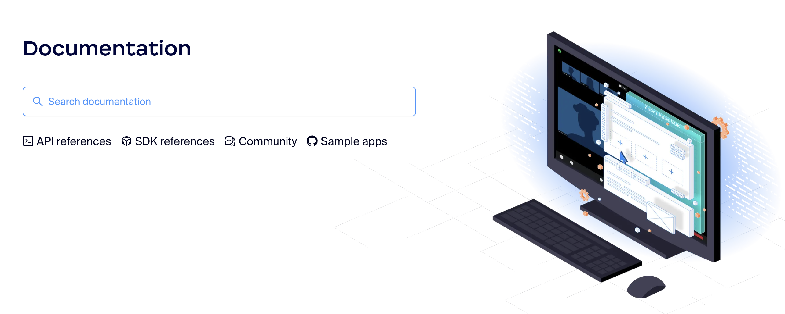

<div align="center">

[](https://zoom.us&#x2F;)

# [Zoom](https://zoom.us&#x2F;)<a id="zoom"></a>

The Zoom Meeting APIs let developers to access information from Zoom. 

</div>

## Table of Contents<a id="table-of-contents"></a>

<!-- toc -->

- [Installation](#installation)
- [Getting Started](#getting-started)
- [Reference](#reference)
  * [`zoommeeting.archiving.getStatistics`](#zoommeetingarchivinggetstatistics)
  * [`zoommeeting.archiving.meetingFilesDelete`](#zoommeetingarchivingmeetingfilesdelete)
  * [`zoommeeting.archiving.meetingFilesList`](#zoommeetingarchivingmeetingfileslist)
  * [`zoommeeting.archiving.meetingFilesList_0`](#zoommeetingarchivingmeetingfileslist_0)
  * [`zoommeeting.archiving.updateAutoDeleteStatus`](#zoommeetingarchivingupdateautodeletestatus)
  * [`zoommeeting.cloudRecording.createRegistrant`](#zoommeetingcloudrecordingcreateregistrant)
  * [`zoommeeting.cloudRecording.deleteMeetingRecordings`](#zoommeetingcloudrecordingdeletemeetingrecordings)
  * [`zoommeeting.cloudRecording.deleteRecording`](#zoommeetingcloudrecordingdeleterecording)
  * [`zoommeeting.cloudRecording.details`](#zoommeetingcloudrecordingdetails)
  * [`zoommeeting.cloudRecording.getMeetingRecordings`](#zoommeetingcloudrecordinggetmeetingrecordings)
  * [`zoommeeting.cloudRecording.getSettings`](#zoommeetingcloudrecordinggetsettings)
  * [`zoommeeting.cloudRecording.listRecordings`](#zoommeetingcloudrecordinglistrecordings)
  * [`zoommeeting.cloudRecording.listRegistrants`](#zoommeetingcloudrecordinglistregistrants)
  * [`zoommeeting.cloudRecording.listRegistrationQuestions`](#zoommeetingcloudrecordinglistregistrationquestions)
  * [`zoommeeting.cloudRecording.recoverRecordingStatus`](#zoommeetingcloudrecordingrecoverrecordingstatus)
  * [`zoommeeting.cloudRecording.recoverStatus`](#zoommeetingcloudrecordingrecoverstatus)
  * [`zoommeeting.cloudRecording.summary`](#zoommeetingcloudrecordingsummary)
  * [`zoommeeting.cloudRecording.updateRegistrantStatus`](#zoommeetingcloudrecordingupdateregistrantstatus)
  * [`zoommeeting.cloudRecording.updateRegistrationQuestions`](#zoommeetingcloudrecordingupdateregistrationquestions)
  * [`zoommeeting.cloudRecording.updateSettings`](#zoommeetingcloudrecordingupdatesettings)
  * [`zoommeeting.devices.assignDeviceZpaAssignment`](#zoommeetingdevicesassigndevicezpaassignment)
  * [`zoommeeting.devices.changeDeviceAssociation`](#zoommeetingdeviceschangedeviceassociation)
  * [`zoommeeting.devices.createNewDevice`](#zoommeetingdevicescreatenewdevice)
  * [`zoommeeting.devices.getDetail`](#zoommeetingdevicesgetdetail)
  * [`zoommeeting.devices.getZpaVersionInfo`](#zoommeetingdevicesgetzpaversioninfo)
  * [`zoommeeting.devices.list`](#zoommeetingdeviceslist)
  * [`zoommeeting.devices.listZdmGroupInfo`](#zoommeetingdeviceslistzdmgroupinfo)
  * [`zoommeeting.devices.removeDeviceZMD`](#zoommeetingdevicesremovedevicezmd)
  * [`zoommeeting.devices.removeZpaDeviceByVendorAndMacAddress`](#zoommeetingdevicesremovezpadevicebyvendorandmacaddress)
  * [`zoommeeting.devices.updateDeviceName`](#zoommeetingdevicesupdatedevicename)
  * [`zoommeeting.devices.upgradeZpaOsApp`](#zoommeetingdevicesupgradezpaosapp)
  * [`zoommeeting.h323Devices.createDevice`](#zoommeetingh323devicescreatedevice)
  * [`zoommeeting.h323Devices.deleteDevice`](#zoommeetingh323devicesdeletedevice)
  * [`zoommeeting.h323Devices.listDevices`](#zoommeetingh323deviceslistdevices)
  * [`zoommeeting.h323Devices.updateDeviceInfo`](#zoommeetingh323devicesupdatedeviceinfo)
  * [`zoommeeting.meetings.addRegistrant`](#zoommeetingmeetingsaddregistrant)
  * [`zoommeeting.meetings.batchRegistrantsCreate`](#zoommeetingmeetingsbatchregistrantscreate)
  * [`zoommeeting.meetings.controlInMeetingFeatures`](#zoommeetingmeetingscontrolinmeetingfeatures)
  * [`zoommeeting.meetings.createBatchPolls`](#zoommeetingmeetingscreatebatchpolls)
  * [`zoommeeting.meetings.createInviteLinks`](#zoommeetingmeetingscreateinvitelinks)
  * [`zoommeeting.meetings.createMeeting`](#zoommeetingmeetingscreatemeeting)
  * [`zoommeeting.meetings.createPoll`](#zoommeetingmeetingscreatepoll)
  * [`zoommeeting.meetings.createTemplateFromMeeting`](#zoommeetingmeetingscreatetemplatefrommeeting)
  * [`zoommeeting.meetings.deleteMeetingChatMessage`](#zoommeetingmeetingsdeletemeetingchatmessage)
  * [`zoommeeting.meetings.deleteMeetingSurvey`](#zoommeetingmeetingsdeletemeetingsurvey)
  * [`zoommeeting.meetings.deleteRegistrant`](#zoommeetingmeetingsdeleteregistrant)
  * [`zoommeeting.meetings.getDetails`](#zoommeetingmeetingsgetdetails)
  * [`zoommeeting.meetings.getDetails_0`](#zoommeetingmeetingsgetdetails_0)
  * [`zoommeeting.meetings.getInvitationNote`](#zoommeetingmeetingsgetinvitationnote)
  * [`zoommeeting.meetings.getJoinToken`](#zoommeetingmeetingsgetjointoken)
  * [`zoommeeting.meetings.getJoinTokenLocalRecording`](#zoommeetingmeetingsgetjointokenlocalrecording)
  * [`zoommeeting.meetings.getLivestreamDetails`](#zoommeetingmeetingsgetlivestreamdetails)
  * [`zoommeeting.meetings.getMeetingArchiveTokenForLocalArchiving`](#zoommeetingmeetingsgetmeetingarchivetokenforlocalarchiving)
  * [`zoommeeting.meetings.getMeetingSummary`](#zoommeetingmeetingsgetmeetingsummary)
  * [`zoommeeting.meetings.getMeetingSurvey`](#zoommeetingmeetingsgetmeetingsurvey)
  * [`zoommeeting.meetings.getMeetingToken`](#zoommeetingmeetingsgetmeetingtoken)
  * [`zoommeeting.meetings.getPastMeetingParticipants`](#zoommeetingmeetingsgetpastmeetingparticipants)
  * [`zoommeeting.meetings.getPoll`](#zoommeetingmeetingsgetpoll)
  * [`zoommeeting.meetings.getRegistrantDetails`](#zoommeetingmeetingsgetregistrantdetails)
  * [`zoommeeting.meetings.getSipUriWithPasscode`](#zoommeetingmeetingsgetsipuriwithpasscode)
  * [`zoommeeting.meetings.listHostScheduled`](#zoommeetingmeetingslisthostscheduled)
  * [`zoommeeting.meetings.listMeetingPolls`](#zoommeetingmeetingslistmeetingpolls)
  * [`zoommeeting.meetings.listMeetingSummaries`](#zoommeetingmeetingslistmeetingsummaries)
  * [`zoommeeting.meetings.listMeetingTemplates`](#zoommeetingmeetingslistmeetingtemplates)
  * [`zoommeeting.meetings.listPastMeetingInstances`](#zoommeetingmeetingslistpastmeetinginstances)
  * [`zoommeeting.meetings.listPastMeetingPolls`](#zoommeetingmeetingslistpastmeetingpolls)
  * [`zoommeeting.meetings.listPastMeetingQA`](#zoommeetingmeetingslistpastmeetingqa)
  * [`zoommeeting.meetings.listRegistrants`](#zoommeetingmeetingslistregistrants)
  * [`zoommeeting.meetings.listRegistrationQuestions`](#zoommeetingmeetingslistregistrationquestions)
  * [`zoommeeting.meetings.listUpcomingMeetings`](#zoommeetingmeetingslistupcomingmeetings)
  * [`zoommeeting.meetings.livestreamStatusUpdate`](#zoommeetingmeetingslivestreamstatusupdate)
  * [`zoommeeting.meetings.pollDelete`](#zoommeetingmeetingspolldelete)
  * [`zoommeeting.meetings.removeMeeting`](#zoommeetingmeetingsremovemeeting)
  * [`zoommeeting.meetings.updateDetails`](#zoommeetingmeetingsupdatedetails)
  * [`zoommeeting.meetings.updateLivestream`](#zoommeetingmeetingsupdatelivestream)
  * [`zoommeeting.meetings.updateMeetingPoll`](#zoommeetingmeetingsupdatemeetingpoll)
  * [`zoommeeting.meetings.updateMeetingStatus`](#zoommeetingmeetingsupdatemeetingstatus)
  * [`zoommeeting.meetings.updateMessage`](#zoommeetingmeetingsupdatemessage)
  * [`zoommeeting.meetings.updateRegistrantStatus`](#zoommeetingmeetingsupdateregistrantstatus)
  * [`zoommeeting.meetings.updateRegistrationQuestions`](#zoommeetingmeetingsupdateregistrationquestions)
  * [`zoommeeting.meetings.updateSurvey`](#zoommeetingmeetingsupdatesurvey)
  * [`zoommeeting.pAC.listAccounts`](#zoommeetingpaclistaccounts)
  * [`zoommeeting.reports.getActiveInactiveHostReports`](#zoommeetingreportsgetactiveinactivehostreports)
  * [`zoommeeting.reports.getBillingDepartmentReports`](#zoommeetingreportsgetbillingdepartmentreports)
  * [`zoommeeting.reports.getBillingInvoices`](#zoommeetingreportsgetbillinginvoices)
  * [`zoommeeting.reports.getCloudRecordingUsageReport`](#zoommeetingreportsgetcloudrecordingusagereport)
  * [`zoommeeting.reports.getDailyUsageReport`](#zoommeetingreportsgetdailyusagereport)
  * [`zoommeeting.reports.getMeetingDetailReports`](#zoommeetingreportsgetmeetingdetailreports)
  * [`zoommeeting.reports.getMeetingParticipantReports`](#zoommeetingreportsgetmeetingparticipantreports)
  * [`zoommeeting.reports.getMeetingPollReports`](#zoommeetingreportsgetmeetingpollreports)
  * [`zoommeeting.reports.getMeetingQaReport`](#zoommeetingreportsgetmeetingqareport)
  * [`zoommeeting.reports.getMeetingReports`](#zoommeetingreportsgetmeetingreports)
  * [`zoommeeting.reports.getMeetingSurveyReport`](#zoommeetingreportsgetmeetingsurveyreport)
  * [`zoommeeting.reports.getOperationLogsReport`](#zoommeetingreportsgetoperationlogsreport)
  * [`zoommeeting.reports.getTelephoneReports`](#zoommeetingreportsgettelephonereports)
  * [`zoommeeting.reports.getWebinarDetailsReport`](#zoommeetingreportsgetwebinardetailsreport)
  * [`zoommeeting.reports.getWebinarPollReports`](#zoommeetingreportsgetwebinarpollreports)
  * [`zoommeeting.reports.getWebinarQAReport`](#zoommeetingreportsgetwebinarqareport)
  * [`zoommeeting.reports.getWebinarSurveyReport`](#zoommeetingreportsgetwebinarsurveyreport)
  * [`zoommeeting.reports.listSignInSignOutActivities`](#zoommeetingreportslistsigninsignoutactivities)
  * [`zoommeeting.reports.listUpcomingEventsReport`](#zoommeetingreportslistupcomingeventsreport)
  * [`zoommeeting.reports.webinarParticipantsList`](#zoommeetingreportswebinarparticipantslist)
  * [`zoommeeting.sipPhone.deletePhone`](#zoommeetingsipphonedeletephone)
  * [`zoommeeting.sipPhone.enableUserSipPhone`](#zoommeetingsipphoneenableusersipphone)
  * [`zoommeeting.sipPhone.list`](#zoommeetingsipphonelist)
  * [`zoommeeting.sipPhone.updateSpecificPhone`](#zoommeetingsipphoneupdatespecificphone)
  * [`zoommeeting.tSP.addUserTspAccount`](#zoommeetingtspaddusertspaccount)
  * [`zoommeeting.tSP.deleteUserTspAccount`](#zoommeetingtspdeleteusertspaccount)
  * [`zoommeeting.tSP.getAccountInfo`](#zoommeetingtspgetaccountinfo)
  * [`zoommeeting.tSP.getUserTspAccount`](#zoommeetingtspgetusertspaccount)
  * [`zoommeeting.tSP.listUserTspAccounts`](#zoommeetingtsplistusertspaccounts)
  * [`zoommeeting.tSP.setGlobalDialInUrl`](#zoommeetingtspsetglobaldialinurl)
  * [`zoommeeting.tSP.updateAccountTspInformation`](#zoommeetingtspupdateaccounttspinformation)
  * [`zoommeeting.tSP.updateUserTspAccount`](#zoommeetingtspupdateusertspaccount)
  * [`zoommeeting.trackingField.createField`](#zoommeetingtrackingfieldcreatefield)
  * [`zoommeeting.trackingField.deleteField`](#zoommeetingtrackingfielddeletefield)
  * [`zoommeeting.trackingField.get`](#zoommeetingtrackingfieldget)
  * [`zoommeeting.trackingField.list`](#zoommeetingtrackingfieldlist)
  * [`zoommeeting.trackingField.update`](#zoommeetingtrackingfieldupdate)
  * [`zoommeeting.webinars.addPanelists`](#zoommeetingwebinarsaddpanelists)
  * [`zoommeeting.webinars.addRegistrant`](#zoommeetingwebinarsaddregistrant)
  * [`zoommeeting.webinars.createBatchRegistrants`](#zoommeetingwebinarscreatebatchregistrants)
  * [`zoommeeting.webinars.createBrandingNameTag`](#zoommeetingwebinarscreatebrandingnametag)
  * [`zoommeeting.webinars.createInviteLinks`](#zoommeetingwebinarscreateinvitelinks)
  * [`zoommeeting.webinars.createPoll`](#zoommeetingwebinarscreatepoll)
  * [`zoommeeting.webinars.createWebinar`](#zoommeetingwebinarscreatewebinar)
  * [`zoommeeting.webinars.createWebinarTemplate`](#zoommeetingwebinarscreatewebinartemplate)
  * [`zoommeeting.webinars.deleteBrandingNameTag`](#zoommeetingwebinarsdeletebrandingnametag)
  * [`zoommeeting.webinars.deleteBrandingVirtualBackground`](#zoommeetingwebinarsdeletebrandingvirtualbackground)
  * [`zoommeeting.webinars.deleteBrandingWallpaper`](#zoommeetingwebinarsdeletebrandingwallpaper)
  * [`zoommeeting.webinars.deleteMessageById`](#zoommeetingwebinarsdeletemessagebyid)
  * [`zoommeeting.webinars.deletePoll`](#zoommeetingwebinarsdeletepoll)
  * [`zoommeeting.webinars.deleteRegistrant`](#zoommeetingwebinarsdeleteregistrant)
  * [`zoommeeting.webinars.deleteSurvey`](#zoommeetingwebinarsdeletesurvey)
  * [`zoommeeting.webinars.getDetails`](#zoommeetingwebinarsgetdetails)
  * [`zoommeeting.webinars.getJoinTokenLocalRecording`](#zoommeetingwebinarsgetjointokenlocalrecording)
  * [`zoommeeting.webinars.getLiveStreamDetails`](#zoommeetingwebinarsgetlivestreamdetails)
  * [`zoommeeting.webinars.getMeetingArchiveTokenForLocalArchiving`](#zoommeetingwebinarsgetmeetingarchivetokenforlocalarchiving)
  * [`zoommeeting.webinars.getPollDetails`](#zoommeetingwebinarsgetpolldetails)
  * [`zoommeeting.webinars.getSessionBranding`](#zoommeetingwebinarsgetsessionbranding)
  * [`zoommeeting.webinars.getSipUriWithPasscode`](#zoommeetingwebinarsgetsipuriwithpasscode)
  * [`zoommeeting.webinars.getSurvey`](#zoommeetingwebinarsgetsurvey)
  * [`zoommeeting.webinars.getWebinarToken`](#zoommeetingwebinarsgetwebinartoken)
  * [`zoommeeting.webinars.joinTokenLiveStreaming`](#zoommeetingwebinarsjointokenlivestreaming)
  * [`zoommeeting.webinars.listAbsentees`](#zoommeetingwebinarslistabsentees)
  * [`zoommeeting.webinars.listPanelists`](#zoommeetingwebinarslistpanelists)
  * [`zoommeeting.webinars.listParticipants`](#zoommeetingwebinarslistparticipants)
  * [`zoommeeting.webinars.listPastInstances`](#zoommeetingwebinarslistpastinstances)
  * [`zoommeeting.webinars.listPastWebinarQa`](#zoommeetingwebinarslistpastwebinarqa)
  * [`zoommeeting.webinars.listPollResults`](#zoommeetingwebinarslistpollresults)
  * [`zoommeeting.webinars.listPolls`](#zoommeetingwebinarslistpolls)
  * [`zoommeeting.webinars.listRegistrants`](#zoommeetingwebinarslistregistrants)
  * [`zoommeeting.webinars.listRegistrationQuestions`](#zoommeetingwebinarslistregistrationquestions)
  * [`zoommeeting.webinars.listTrackingSources`](#zoommeetingwebinarslisttrackingsources)
  * [`zoommeeting.webinars.listWebinarTemplates`](#zoommeetingwebinarslistwebinartemplates)
  * [`zoommeeting.webinars.listWebinars`](#zoommeetingwebinarslistwebinars)
  * [`zoommeeting.webinars.registrantDetails`](#zoommeetingwebinarsregistrantdetails)
  * [`zoommeeting.webinars.removePanelist`](#zoommeetingwebinarsremovepanelist)
  * [`zoommeeting.webinars.removePanelists`](#zoommeetingwebinarsremovepanelists)
  * [`zoommeeting.webinars.removeWebinar`](#zoommeetingwebinarsremovewebinar)
  * [`zoommeeting.webinars.setDefaultBrandingVirtualBackground`](#zoommeetingwebinarssetdefaultbrandingvirtualbackground)
  * [`zoommeeting.webinars.updateBrandingNameTag`](#zoommeetingwebinarsupdatebrandingnametag)
  * [`zoommeeting.webinars.updateLiveStream`](#zoommeetingwebinarsupdatelivestream)
  * [`zoommeeting.webinars.updateLiveStreamStatus`](#zoommeetingwebinarsupdatelivestreamstatus)
  * [`zoommeeting.webinars.updatePoll`](#zoommeetingwebinarsupdatepoll)
  * [`zoommeeting.webinars.updateRegistrantStatus`](#zoommeetingwebinarsupdateregistrantstatus)
  * [`zoommeeting.webinars.updateRegistrationQuestions`](#zoommeetingwebinarsupdateregistrationquestions)
  * [`zoommeeting.webinars.updateScheduledWebinar`](#zoommeetingwebinarsupdatescheduledwebinar)
  * [`zoommeeting.webinars.updateStatus`](#zoommeetingwebinarsupdatestatus)
  * [`zoommeeting.webinars.updateSurvey`](#zoommeetingwebinarsupdatesurvey)
  * [`zoommeeting.webinars.uploadBrandingVirtualBackground`](#zoommeetingwebinarsuploadbrandingvirtualbackground)
  * [`zoommeeting.webinars.uploadBrandingWallpaper`](#zoommeetingwebinarsuploadbrandingwallpaper)

<!-- tocstop -->

## Installation<a id="installation"></a>
<div align="center">
  <a href="https://konfigthis.com/sdk-sign-up?company=Zoom&serviceName=Meeting&language=TypeScript">
    
  </a>
</div>

## Getting Started<a id="getting-started"></a>

```typescript
import { ZoomMeeting } from "zoom-meeting-typescript-sdk";

const zoommeeting = new ZoomMeeting({
  // Defining the base path is optional and defaults to https://api.zoom.us/v2
  // basePath: "https://api.zoom.us/v2",
  apiKey: "API_KEY",
});

const getStatisticsResponse = await zoommeeting.archiving.getStatistics({
  from: "2021-03-11T05:41:36Z",
  to: "2021-03-18T05:41:36Z",
});

console.log(getStatisticsResponse);
```

## Reference<a id="reference"></a>


### `zoommeeting.archiving.getStatistics`<a id="zoommeetingarchivinggetstatistics"></a>

Get statistics about an account's archived meeting or webinar files. 

 Zoom's [archiving solution](https://support.zoom.us/hc/en-us/articles/360050431572-Archiving-indicators) lets account administrators set up an automated mechanism to record, collect, and archive meeting data to a third-party platform of their choice to satisfy FINRA and other compliance requirements. 

 **Prerequisites:** 
* The [**Meeting and Webinar Archiving** feature](https://support.zoom.us/hc/en-us/articles/4405656451213--Archiving-for-meetings-and-webinars) enabled for your account by [Zoom Support](https://support.zoom.us/hc/en-us/articles/201362003).

**Scopes:** `recording:read:admin`

**[Rate Limit Label](https://marketplace.zoom.us/docs/api-reference/rate-limits#rate-limits):** `Medium`

#### 🛠️ Usage<a id="🛠️-usage"></a>

```typescript
const getStatisticsResponse = await zoommeeting.archiving.getStatistics({
  from: "2021-03-11T05:41:36Z",
  to: "2021-03-18T05:41:36Z",
});
```

#### ⚙️ Parameters<a id="⚙️-parameters"></a>

##### from: `string`<a id="from-string"></a>

The query start date, `yyyy-MM-dd\'T\'HH:mm:ssZ` format. This value and the `to` query parameter value cannot exceed seven days.

##### to: `string`<a id="to-string"></a>

The query end date, in `yyyy-MM-dd\'T\'HH:mm:ssZ` format. This value and the `from` query parameter value cannot exceed seven days.

#### 🔄 Return<a id="🔄-return"></a>

[ArchivingGetStatisticsResponse](./models/archiving-get-statistics-response.ts)

#### 🌐 Endpoint<a id="🌐-endpoint"></a>

`/archive_files/statistics` `GET`

[🔙 **Back to Table of Contents**](#table-of-contents)

---


### `zoommeeting.archiving.meetingFilesDelete`<a id="zoommeetingarchivingmeetingfilesdelete"></a>

Use this API to delete all of a meeting's archived files. 

 **Prerequisites:** 
* The [**Meeting and Webinar Archiving** feature](https://support.zoom.us/hc/en-us/articles/4405656451213--Archiving-for-meetings-and-webinars) enabled for your account by [Zoom Support](https://support.zoom.us/hc/en-us/articles/201362003).

**Scopes:** `recording:write:admin`,`recording:write`

**[Rate Limit Label](https://marketplace.zoom.us/docs/api-reference/rate-limits#rate-limits):** `Light`

#### 🛠️ Usage<a id="🛠️-usage"></a>

```typescript
const meetingFilesDeleteResponse =
  await zoommeeting.archiving.meetingFilesDelete({
    meetingUUID: "4444AAAiAAAAAiAiAiiAii==",
  });
```

#### ⚙️ Parameters<a id="⚙️-parameters"></a>

##### meetingUUID: `string`<a id="meetinguuid-string"></a>

The meeting\'s universally unique identifier (UUID). Each meeting instance generates a UUID. For example, after a meeting ends, a new UUID is generated for the next meeting instance.  If the meeting UUID begins with a `/` character or contains a `//` character, you **must** [double encode](https://marketplace.zoom.us/docs/api-reference/using-zoom-apis/#meeting-id-and-uuid) the meeting UUID when using the meeting UUID for other API calls.

#### 🌐 Endpoint<a id="🌐-endpoint"></a>

`/past_meetings/{meetingUUID}/archive_files` `DELETE`

[🔙 **Back to Table of Contents**](#table-of-contents)

---


### `zoommeeting.archiving.meetingFilesList`<a id="zoommeetingarchivingmeetingfileslist"></a>

Get an account's archived meeting or webinar files. 

 Zoom's [archiving solution](https://support.zoom.us/hc/en-us/articles/360050431572-Archiving-indicators) lets account administrators set up an automated mechanism to record, collect, and archive meeting data to a third-party platform of their choice to satisfy FINRA or other compliance requirements. 

 **Prerequisites:** 
* The [**Meeting and Webinar Archiving** feature](https://support.zoom.us/hc/en-us/articles/4405656451213--Archiving-for-meetings-and-webinars) enabled for your account by [Zoom Support](https://support.zoom.us/hc/en-us/articles/201362003).

**Scopes:** `recording:read:admin`

**[Rate Limit Label](https://marketplace.zoom.us/docs/api-reference/rate-limits#rate-limits):** `MEDIUM`

#### 🛠️ Usage<a id="🛠️-usage"></a>

```typescript
const meetingFilesListResponse = await zoommeeting.archiving.meetingFilesList({
  pageSize: 30,
  nextPageToken: "IAfJX3jsOLW7w3dokmFl84zOa0MAVGyMEB2",
  from: "2021-03-11T05:41:36Z",
  to: "2021-03-18T05:41:36Z",
  queryDateType: "meeting_start_time",
  groupId: "pvFIYKSDTum9iCDOOtQL4w",
});
```

#### ⚙️ Parameters<a id="⚙️-parameters"></a>

##### pageSize: `number`<a id="pagesize-number"></a>

The number of records returned within a single API call.

##### nextPageToken: `string`<a id="nextpagetoken-string"></a>

Use the next page token to paginate through large result sets. A next page token is returned whenever the set of available results exceeds the current page size. This token\'s expiration period is 15 minutes.

##### from: `string`<a id="from-string"></a>

The query start date, in `yyyy-MM-dd\'T\'HH:mm:ssZ` format. This value and the `to` query parameter value cannot exceed seven days.

##### to: `string`<a id="to-string"></a>

The query end date, in `yyyy-MM-dd\'T\'HH:mm:ssZ` format. This value and the `from` query parameter value cannot exceed seven days.

##### queryDateType: `'meeting_start_time' | 'archive_complete_time'`<a id="querydatetype-meeting_start_time--archive_complete_time"></a>

The type of query date. * `meeting_start_time`  * `archive_complete_time`    This value defaults to `meeting_start_time`.

##### groupId: `string`<a id="groupid-string"></a>

The group ID. To get a group ID, use the [List groups](https://developers.zoom.us/docs/api/rest/reference/scim-api/methods/#operation/groupSCIM2List) API.

#### 🔄 Return<a id="🔄-return"></a>

[ArchivingMeetingFilesListResponse](./models/archiving-meeting-files-list-response.ts)

#### 🌐 Endpoint<a id="🌐-endpoint"></a>

`/archive_files` `GET`

[🔙 **Back to Table of Contents**](#table-of-contents)

---


### `zoommeeting.archiving.meetingFilesList_0`<a id="zoommeetingarchivingmeetingfileslist_0"></a>

Return a specific meeting instance's [archived files](https://support.zoom.us/hc/en-us/articles/360050431572-Archiving-indicators). 

 **Prerequisites:** 
* The [**Meeting and Webinar Archiving** feature](https://support.zoom.us/hc/en-us/articles/4405656451213--Archiving-for-meetings-and-webinars) enabled for your account by [Zoom Support](https://support.zoom.us/hc/en-us/articles/201362003).

**Scopes:** `recording:read`

**[Rate Limit Label](https://marketplace.zoom.us/docs/api-reference/rate-limits#rate-limits):** `LIGHT`

#### 🛠️ Usage<a id="🛠️-usage"></a>

```typescript
const meetingFilesList_0Response =
  await zoommeeting.archiving.meetingFilesList_0({
    meetingUUID: "4444AAAiAAAAAiAiAiiAii==",
  });
```

#### ⚙️ Parameters<a id="⚙️-parameters"></a>

##### meetingUUID: `string`<a id="meetinguuid-string"></a>

The meeting\'s universally unique identifier (UUID). Each meeting instance generates a UUID. After a meeting ends, a new UUID is generated for the next meeting instance.  If the meeting UUID begins with a `/` character or contains a `//` character, you **must** [double encode](https://developers.zoom.us/docs/api/rest/using-zoom-apis/#meeting-id-and-uuid) the meeting UUID when using the meeting UUID for other API calls.

#### 🔄 Return<a id="🔄-return"></a>

[ArchivingMeetingFilesList200Response](./models/archiving-meeting-files-list200-response.ts)

#### 🌐 Endpoint<a id="🌐-endpoint"></a>

`/past_meetings/{meetingUUID}/archive_files` `GET`

[🔙 **Back to Table of Contents**](#table-of-contents)

---


### `zoommeeting.archiving.updateAutoDeleteStatus`<a id="zoommeetingarchivingupdateautodeletestatus"></a>

Update an archived file's auto-delete status. 

 **Prerequisites:** 
* [Zoom Support](https://support.zoom.us/hc/en-us/articles/201362003) must enable the [**Meeting and Webinar Archiving** feature](https://support.zoom.us/hc/en-us/articles/4405656451213--Archiving-for-meetings-and-webinars) for your account.
* Open the disabling auto-delete feature in OP. Contact [Zoom Support](https://support.zoom.us/hc/en-us/articles/201362003) to open.

**Scopes:** `recording:write`,`recording:write:admin`

**[Rate Limit Label](https://marketplace.zoom.us/docs/api-reference/rate-limits#rate-limits):** `LIGHT`

#### 🛠️ Usage<a id="🛠️-usage"></a>

```typescript
const updateAutoDeleteStatusResponse =
  await zoommeeting.archiving.updateAutoDeleteStatus({
    auto_delete: true,
  });
```

#### ⚙️ Parameters<a id="⚙️-parameters"></a>

##### auto_delete: `boolean`<a id="auto_delete-boolean"></a>

Whether to auto-delete the archived file.

##### fileId: `string`<a id="fileid-string"></a>

#### 🌐 Endpoint<a id="🌐-endpoint"></a>

`/archive_files/{fileId}` `PATCH`

[🔙 **Back to Table of Contents**](#table-of-contents)

---


### `zoommeeting.cloudRecording.createRegistrant`<a id="zoommeetingcloudrecordingcreateregistrant"></a>

Cloud Recordings of past Zoom Meetings can be made [on-demand](https://support.zoom.us/hc/en-us/articles/360000488283-On-demand-Recordings). Users should be [registered](https://developers.zoom.us) to view these recordings.

Use this API to register a user to gain access to **On-demand Cloud Recordings** of a past meeting.  
 


**Scopes:** `recording:write:admin`,`recording:write`

**[Rate Limit Label](https://marketplace.zoom.us/docs/api-reference/rate-limits#rate-limits):** `Light`

#### 🛠️ Usage<a id="🛠️-usage"></a>

```typescript
const createRegistrantResponse =
  await zoommeeting.cloudRecording.createRegistrant({
    meetingId: 85746065,
    address: "1800 Amphibious Blvd.",
    city: "Mountain View",
    comments: "Looking forward to the discussion.",
    country: "US",
    email: "jchill@example.com",
    first_name: "Jill",
    industry: "Food",
    job_title: "Chef",
    last_name: "Chill",
    no_of_employees: "1-20",
    org: "Cooking Org",
    phone: "5550100",
    purchasing_time_frame: "1-3 months",
    role_in_purchase_process: "Influencer",
    state: "CA",
    status: "approved",
    zip: "94045",
  });
```

#### ⚙️ Parameters<a id="⚙️-parameters"></a>

##### email: `string`<a id="email-string"></a>

The registrant\\\'s email address. See [Email address display rules](https://marketplace.zoom.us/docs/api-reference/using-zoom-apis#email-address) for return value details.

##### first_name: `string`<a id="first_name-string"></a>

The registrant\\\'s first name.

##### meetingId: `number`<a id="meetingid-number"></a>

The meeting\'s ID.    When storing this value in your database, you must store it as a long format integer and **not** an integer. Meeting IDs can exceed 10 digits.

##### address: `string`<a id="address-string"></a>

The registrant\\\'s address.

##### city: `string`<a id="city-string"></a>

The registrant\\\'s city.

##### comments: `string`<a id="comments-string"></a>

The registrant\\\'s questions and comments.

##### country: `string`<a id="country-string"></a>

The registrant\\\'s two-letter [country code](https://marketplace.zoom.us/docs/api-reference/other-references/abbreviation-lists#countries).

##### custom_questions: [`CloudRecordingCreateRegistrantRequestCustomQuestionsInner`](./models/cloud-recording-create-registrant-request-custom-questions-inner.ts)[]<a id="custom_questions-cloudrecordingcreateregistrantrequestcustomquestionsinnermodelscloud-recording-create-registrant-request-custom-questions-innerts"></a>

Information about custom questions.

##### industry: `string`<a id="industry-string"></a>

The registrant\\\'s industry.

##### job_title: `string`<a id="job_title-string"></a>

The registrant\\\'s job title.

##### last_name: `string`<a id="last_name-string"></a>

The registrant\\\'s last name.

##### no_of_employees: `string`<a id="no_of_employees-string"></a>

The registrant\\\'s number of employees:  * `1-20`  * `21-50`  * `51-100`  * `101-250`  * `251-500`  * `501-1,000`  * `1,001-5,000`  * `5,001-10,000`  * `More than 10,000`

##### org: `string`<a id="org-string"></a>

The registrant\\\'s organization.

##### phone: `string`<a id="phone-string"></a>

The registrant\\\'s phone number.

##### purchasing_time_frame: `string`<a id="purchasing_time_frame-string"></a>

The registrant\\\'s purchasing time frame:  * `Within a month`  * `1-3 months`  * `4-6 months`  * `More than 6 months`  * `No timeframe`

##### role_in_purchase_process: `string`<a id="role_in_purchase_process-string"></a>

The registrant\\\'s role in the purchase process:  * `Decision Maker`  * `Evaluator/Recommender`  * `Influencer`  * `Not involved`

##### state: `string`<a id="state-string"></a>

The registrant\\\'s state or province.

##### status: `string`<a id="status-string"></a>

The registrant\\\'s status:  * `approved` &mdash; Registrant is approved.  * `denied` &mdash; Registrant is denied.  * `pending` &mdash; Registrant is waiting for approval.

##### zip: `string`<a id="zip-string"></a>

The registrant\\\'s ZIP or postal code.

#### 🔄 Return<a id="🔄-return"></a>

[CloudRecordingCreateRegistrantResponse](./models/cloud-recording-create-registrant-response.ts)

#### 🌐 Endpoint<a id="🌐-endpoint"></a>

`/meetings/{meetingId}/recordings/registrants` `POST`

[🔙 **Back to Table of Contents**](#table-of-contents)

---


### `zoommeeting.cloudRecording.deleteMeetingRecordings`<a id="zoommeetingcloudrecordingdeletemeetingrecordings"></a>

Delete all recording files of a meeting.  
   

 

**Prerequisites**:
* Cloud Recording should be enabled on the user's account.  
 


**Scopes:** `recording:write:admin`,`recording:write`

**[Rate Limit Label](https://marketplace.zoom.us/docs/api-reference/rate-limits#rate-limits):** `Light`

#### 🛠️ Usage<a id="🛠️-usage"></a>

```typescript
const deleteMeetingRecordingsResponse =
  await zoommeeting.cloudRecording.deleteMeetingRecordings({
    meetingId: "atsXxhSEQWit9t+U02HXNQ==",
    action: "trash",
  });
```

#### ⚙️ Parameters<a id="⚙️-parameters"></a>

##### meetingId: `string`<a id="meetingid-string"></a>

To get Cloud Recordings of a meeting, provide the meeting ID or meeting UUID. If the meeting ID is provided instead of UUID,the response will be for the latest meeting instance.   To get Cloud Recordings of a webinar, provide the webinar ID or the webinar UUID. If the webinar ID is provided instead of UUID,the response will be for the latest webinar instance.   If a UUID starts with &quot;/&quot; or contains &quot;//&quot; (example: &quot;/ajXp112QmuoKj4854875==&quot;), you must **[double encode](https://marketplace.zoom.us/docs/api-reference/using-zoom-apis/#meeting-id-and-uuid)** the UUID before making an API request. 

##### action: `'trash' | 'delete'`<a id="action-trash--delete"></a>

The recording delete actions:    `trash` - Move recording to trash.    `delete` - Delete recording permanently.

#### 🌐 Endpoint<a id="🌐-endpoint"></a>

`/meetings/{meetingId}/recordings` `DELETE`

[🔙 **Back to Table of Contents**](#table-of-contents)

---


### `zoommeeting.cloudRecording.deleteRecording`<a id="zoommeetingcloudrecordingdeleterecording"></a>

Delete a specific recording file from a meeting.&lt;p style=&quot;background-color:#e1f5fe; color:#01579b; padding:8px&quot;&gt; &lt;b&gt;Note:&lt;/b&gt; To use this API, you must enable the &lt;b&gt;The host can delete cloud recordings&lt;/b&gt; setting. You can find this setting in the &lt;b&gt;Recording&lt;/b&gt; tab of the &lt;b&gt;Settings&lt;/b&gt; interface in the [Zoom web portal](https://zoom.us/).&lt;/p&gt;


**Scopes:** `recording:write:admin`,`recording:write`

**[Rate Limit Label](https://marketplace.zoom.us/docs/api-reference/rate-limits#rate-limits):** `Light`

#### 🛠️ Usage<a id="🛠️-usage"></a>

```typescript
const deleteRecordingResponse =
  await zoommeeting.cloudRecording.deleteRecording({
    meetingId: "atsXxhSEQWit9t+U02HXNQ==",
    recordingId: "a2f19f96-9294-4f51-8134-6f0eea108eb2",
    action: "trash",
  });
```

#### ⚙️ Parameters<a id="⚙️-parameters"></a>

##### meetingId: `string`<a id="meetingid-string"></a>

To get Cloud Recordings of a meeting, provide the meeting ID or meeting UUID. If the meeting ID is provided instead of UUID,the response will be for the latest meeting instance.   To get Cloud Recordings of a webinar, provide the webinar ID or the webinar UUID. If the webinar ID is provided instead of UUID,the response will be for the latest webinar instance.   If a UUID starts with &quot;/&quot; or contains &quot;//&quot; (example: &quot;/ajXp112QmuoKj4854875==&quot;), you must **[double encode](https://marketplace.zoom.us/docs/api-reference/using-zoom-apis/#meeting-id-and-uuid)** the UUID before making an API request. 

##### recordingId: `string`<a id="recordingid-string"></a>

The recording ID.

##### action: `'trash' | 'delete'`<a id="action-trash--delete"></a>

The recording delete actions:    `trash` - Move recording to trash.    `delete` - Delete recording permanently.

#### 🌐 Endpoint<a id="🌐-endpoint"></a>

`/meetings/{meetingId}/recordings/{recordingId}` `DELETE`

[🔙 **Back to Table of Contents**](#table-of-contents)

---


### `zoommeeting.cloudRecording.details`<a id="zoommeetingcloudrecordingdetails"></a>

Use this API to return a meeting recording's [analytics details](https://support.zoom.us/hc/en-us/articles/205347605-Managing-cloud-recordings#h_0b665029-ce74-4849-9794-d1aa0320d163). **Maximum duration: 1 Month**. To access a password-protected cloud recording, send the user's [OAuth access token](https://developers.zoom.us/docs/integrations/oauth/) as a Bearer token in the Authorization header. For example, 

 `curl -H &quot;Authorization: Bearer &lt;ACCESS_TOKEN&gt;&quot; https://{{base-domain}}/rec/archive/download/xyz` 


 

**Scopes:** `recording:read:admin`,`recording:read`

**[Rate Limit Label](https://marketplace.zoom.us/docs/api-reference/rate-limits#rate-limits):** `Medium`

#### 🛠️ Usage<a id="🛠️-usage"></a>

```typescript
const detailsResponse = await zoommeeting.cloudRecording.details({
  meetingId: "atsXxhSEQWit9t+U02HXNQ==",
  pageSize: 30,
  nextPageToken: "IAfJX3jsOLW7w3dokmFl84zOa0MAVGyMEB2",
  from: "2020-06-30",
  to: "2020-07-30",
  type: "by_view",
});
```

#### ⚙️ Parameters<a id="⚙️-parameters"></a>

##### meetingId: `string`<a id="meetingid-string"></a>

To get Cloud Recordings of a meeting, provide the meeting ID or meeting UUID. If the meeting ID is provided instead of UUID,the response will be for the latest meeting instance.   To get Cloud Recordings of a webinar, provide the webinar ID or the webinar UUID. If the webinar ID is provided instead of UUID,the response will be for the latest webinar instance.   If a UUID starts with &quot;/&quot; or contains &quot;//&quot; (example: &quot;/ajXp112QmuoKj4854875==&quot;), you must **[double encode](https://marketplace.zoom.us/docs/api-reference/using-zoom-apis/#meeting-id-and-uuid)** the UUID before making an API request. 

##### pageSize: `number`<a id="pagesize-number"></a>

The number of records returned within a single API call.

##### nextPageToken: `string`<a id="nextpagetoken-string"></a>

Use the next page token to paginate through large result sets. A next page token is returned whenever the set of available results exceeds the current page size. This token\'s expiration period is 15 minutes.

##### from: `string | Date`<a id="from-string--date"></a>

The start date for the monthly range to query. The maximum range can be a month. If you do not provide this value, this defaults to the current date.

##### to: `string | Date`<a id="to-string--date"></a>

The end date for the monthly range to query. The maximum range can be a month.

##### type: `'by_view' | 'by_download'`<a id="type-by_view--by_download"></a>

The type of analytics details:  * `by_view` &mdash; by_view.  * `by_download` &mdash; by_download.

#### 🔄 Return<a id="🔄-return"></a>

[AnalyticsDetailsResponse](./models/analytics-details-response.ts)

#### 🌐 Endpoint<a id="🌐-endpoint"></a>

`/meetings/{meetingId}/recordings/analytics_details` `GET`

[🔙 **Back to Table of Contents**](#table-of-contents)

---


### `zoommeeting.cloudRecording.getMeetingRecordings`<a id="zoommeetingcloudrecordinggetmeetingrecordings"></a>

Returns all of a meeting's [recordings](https://support.zoom.us/hc/en-us/articles/203741855-Cloud-Recording#h_7420acb5-1897-4061-87b4-5b76e99c03b4).

 Use the `download_url` property listed in the response to download the recording files.  To access a passcode-protected cloud recording, send the user's [OAuth access token](https://developers.zoom.us/docs/integrations/oauth/) as a Bearer token in the Authorization header. 
 
 Example:  `curl -H 'Authorization: Bearer <ACCESS_TOKEN>' https://{{base-domain}}/rec/archive/download/xyz`  

**Scopes:** `recording:read`,`phone_recording:read:admin`

**[Rate Limit Label](https://marketplace.zoom.us/docs/api-reference/rate-limits#rate-limits):** `LIGHT`

#### 🛠️ Usage<a id="🛠️-usage"></a>

```typescript
const getMeetingRecordingsResponse =
  await zoommeeting.cloudRecording.getMeetingRecordings({
    meetingId: "atsXxhSEQWit9t+U02HXNQ==",
    includeFields: "a2f19f96-9294-4f51-8134-6f0eea108eb2",
    ttl: 1,
  });
```

#### ⚙️ Parameters<a id="⚙️-parameters"></a>

##### meetingId: `string`<a id="meetingid-string"></a>

To get a meeting\'s cloud recordings, provide the meeting ID or UUID. If providing the meeting ID instead of UUID, the response will be for the latest meeting instance.   To get a webinar\'s cloud recordings, provide the webinar\'s ID or UUID. If providing the webinar ID instead of UUID, the response will be for the latest webinar instance.   If a UUID starts with `/` or contains `//` (example: `/ajXp112QmuoKj4854875==`), **[double encode](https://developers.zoom.us) the UUID** before making an API request. 

##### includeFields: `string`<a id="includefields-string"></a>

The `download_access_token` value for downloading the meeting\'s recordings.

##### ttl: `number`<a id="ttl-number"></a>

The `download_access_token` Time to Live (TTL) value. This parameter is only valid if the `include_fields` query parameter contains the `download_access_token` value.

#### 🔄 Return<a id="🔄-return"></a>

[CloudRecordingGetMeetingRecordingsResponse](./models/cloud-recording-get-meeting-recordings-response.ts)

#### 🌐 Endpoint<a id="🌐-endpoint"></a>

`/meetings/{meetingId}/recordings` `GET`

[🔙 **Back to Table of Contents**](#table-of-contents)

---


### `zoommeeting.cloudRecording.getSettings`<a id="zoommeetingcloudrecordinggetsettings"></a>

Retrieves settings applied to a meeting's [Cloud Recording](https://support.zoom.us/hc/en-us/articles/203741855-Cloud-Recording).  
   

 


**Scopes:** `recording:read:admin`,`recording:read`

**[Rate Limit Label](https://marketplace.zoom.us/docs/api-reference/rate-limits#rate-limits):** `LIGHT`

#### 🛠️ Usage<a id="🛠️-usage"></a>

```typescript
const getSettingsResponse = await zoommeeting.cloudRecording.getSettings({
  meetingId: "atsXxhSEQWit9t+U02HXNQ==",
});
```

#### ⚙️ Parameters<a id="⚙️-parameters"></a>

##### meetingId: `string`<a id="meetingid-string"></a>

The meeting ID enables you to get cloud recording of a: - Meeting, provide the meeting ID or meeting UUID. If the meeting ID is provided instead of UUID,the response will be for the latest meeting instance.   - Webinar, provide the webinar ID or the webinar UUID. If the webinar ID is provided instead of UUID,the response will be for the latest webinar instance.   If a UUID starts with &quot;/&quot; or contains &quot;//&quot; (example: &quot;/ajXp112QmuoKj4854875==&quot;), you must **double encode** the UUID before making an API request. 

#### 🔄 Return<a id="🔄-return"></a>

[CloudRecordingGetSettingsResponse](./models/cloud-recording-get-settings-response.ts)

#### 🌐 Endpoint<a id="🌐-endpoint"></a>

`/meetings/{meetingId}/recordings/settings` `GET`

[🔙 **Back to Table of Contents**](#table-of-contents)

---


### `zoommeeting.cloudRecording.listRecordings`<a id="zoommeetingcloudrecordinglistrecordings"></a>

Lists all [cloud recordings](https://support.zoom.us/hc/en-us/articles/203741855-Cloud-Recording) for a user.  

For user-level apps, pass the [`me` value](https://developers.zoom.us/docs/api/rest/using-zoom-apis/#the-me-keyword) instead of the `userId` parameter.  To access a user's passcode protected cloud recording, send the user's [OAuth access token](https://developers.zoom.us/docs/integrations/oauth/) as a bearer token in the authorization header.  

Example:  `curl -H "Authorization: Bearer <ACCESS_TOKEN>" https://{{base-domain}}/rec/archive/download/xyz`  

**Prerequisites:**  
* Must have a Pro or a higher plan.  
* Must enable Cloud Recording on the user's account.

**Scopes:** `recording:read:admin`,`recording:read`

**[Rate Limit Label](https://marketplace.zoom.us/docs/api-reference/rate-limits#rate-limits):** `MEDIUM`

#### 🛠️ Usage<a id="🛠️-usage"></a>

```typescript
const listRecordingsResponse = await zoommeeting.cloudRecording.listRecordings({
  userId: "userId_example",
  pageSize: 30,
  nextPageToken: "IAfJX3jsOLW7w3dokmFl84zOa0MAVGyMEB2",
  mc: "false",
  trash: false,
  from: "2020-06-30",
  to: "2020-06-30",
  trashType: "meeting_recordings",
  meetingId: 6840331990,
});
```

#### ⚙️ Parameters<a id="⚙️-parameters"></a>

##### userId: `string`<a id="userid-string"></a>

The user\'s ID or email address. For user-level apps, pass the `me` value.

##### pageSize: `number`<a id="pagesize-number"></a>

The number of records returned within a single API call.

##### nextPageToken: `string`<a id="nextpagetoken-string"></a>

The next page token paginates through a large set of results. A next page token returns whenever the set of available results exceeds the current page size. The expiration period for this token is 15 minutes.

##### mc: `string`<a id="mc-string"></a>

The query metadata of the recording if using an on-premise meeting connector for the meeting.

##### trash: `boolean`<a id="trash-boolean"></a>

The query trash. * `true` - List recordings from trash.   * `false` - Do not list recordings from the trash.    The default value is `false`. If you set it to `true`, you can use the `trash_type` property to indicate the type of Cloud recording that you need to retrieve. 

##### from: `string | Date`<a id="from-string--date"></a>

The start date in \'yyyy-mm-dd\' UTC format for the date range where you would like to retrieve recordings. The maximum range can be a month. If no value is provided for this field, the default will be current date.   For example, if you make the API request on June 30, 2020, without providing the `from` and `to` parameters, by default the value of \'from\' field will be `2020-06-30` and the value of the \'to\' field will be `2020-07-01`.   **Note**: The `trash` files cannot be filtered by date range and thus, the `from` and `to` fields should not be used for trash files.

##### to: `string | Date`<a id="to-string--date"></a>

The end date in \'yyyy-mm-dd\' \'yyyy-mm-dd\' UTC format. 

##### trashType: `string`<a id="trashtype-string"></a>

The type of cloud recording to retrieve from the trash.     *   `meeting_recordings`: List all meeting recordings from the trash.    *  `recording_file`: List all individual recording files from the trash. 

##### meetingId: `number`<a id="meetingid-number"></a>

The meeting ID.

#### 🔄 Return<a id="🔄-return"></a>

[CloudRecordingListRecordingsResponse](./models/cloud-recording-list-recordings-response.ts)

#### 🌐 Endpoint<a id="🌐-endpoint"></a>

`/users/{userId}/recordings` `GET`

[🔙 **Back to Table of Contents**](#table-of-contents)

---


### `zoommeeting.cloudRecording.listRegistrants`<a id="zoommeetingcloudrecordinglistregistrants"></a>

Use this API to list registrants of a past meeting's [on-demand cloud recordings](https://support.zoom.us/hc/en-us/articles/360000488283-On-demand-recordings). Users must [register](https://developers.zoom.us) to view the recordings. 

 

**Scopes:** `recording:read:admin`,`recording:read`

**[Rate Limit Label](https://marketplace.zoom.us/docs/api-reference/rate-limits#rate-limits):** `Medium`

#### 🛠️ Usage<a id="🛠️-usage"></a>

```typescript
const listRegistrantsResponse =
  await zoommeeting.cloudRecording.listRegistrants({
    meetingId: 85746065,
    status: "pending",
    pageSize: 30,
    pageNumber: 1,
    nextPageToken: "IAfJX3jsOLW7w3dokmFl84zOa0MAVGyMEB2",
  });
```

#### ⚙️ Parameters<a id="⚙️-parameters"></a>

##### meetingId: `number`<a id="meetingid-number"></a>

The meeting\'s ID.    When storing this value in your database, you must store it as a long format integer and **not** an integer. Meeting IDs can exceed 10 digits.

##### status: `'pending' | 'approved' | 'denied'`<a id="status-pending--approved--denied"></a>

Query by the registrant\'s status:  * `pending` &mdash; The registration is pending.  * `approved` &mdash; The registrant is approved.  * `denied` &mdash; The registration is denied.

##### pageSize: `number`<a id="pagesize-number"></a>

The number of records returned within a single API call.

##### pageNumber: `number`<a id="pagenumber-number"></a>

**Deprecated.** We will no longer support this field in a future release. Instead, use the `next_page_token` for pagination.

##### nextPageToken: `string`<a id="nextpagetoken-string"></a>

Use the next page token to paginate through large result sets. A next page token is returned whenever the set of available results exceeds the current page size. This token\'s expiration period is 15 minutes.

#### 🔄 Return<a id="🔄-return"></a>

[CloudRecordingListRegistrantsResponse](./models/cloud-recording-list-registrants-response.ts)

#### 🌐 Endpoint<a id="🌐-endpoint"></a>

`/meetings/{meetingId}/recordings/registrants` `GET`

[🔙 **Back to Table of Contents**](#table-of-contents)

---


### `zoommeeting.cloudRecording.listRegistrationQuestions`<a id="zoommeetingcloudrecordinglistregistrationquestions"></a>

For [on-demand](https://support.zoom.us/hc/en-us/articles/360000488283-On-demand-Recordings) meeting recordings, you can include fields with questions that will be shown to registrants when they register to view the recording.

Use this API to retrieve a list of questions that are displayed for users to complete when registering to view the recording of a specific meeting.  
 


**Scopes:** `recording:read:admin`,`recording:read`

**[Rate Limit Label](https://marketplace.zoom.us/docs/api-reference/rate-limits#rate-limits):** `Light`

#### 🛠️ Usage<a id="🛠️-usage"></a>

```typescript
const listRegistrationQuestionsResponse =
  await zoommeeting.cloudRecording.listRegistrationQuestions({
    meetingId: "atsXxhSEQWit9t+U02HXNQ==",
  });
```

#### ⚙️ Parameters<a id="⚙️-parameters"></a>

##### meetingId: `string`<a id="meetingid-string"></a>

To get Cloud Recordings of a meeting, provide the meeting ID or meeting UUID. If the meeting ID is provided instead of UUID,the response will be for the latest meeting instance.   To get Cloud Recordings of a webinar, provide the webinar ID or the webinar UUID. If the webinar ID is provided instead of UUID,the response will be for the latest webinar instance.   If a UUID starts with &quot;/&quot; or contains &quot;//&quot; (example: &quot;/ajXp112QmuoKj4854875==&quot;), you must **[double encode](https://marketplace.zoom.us/docs/api-reference/using-zoom-apis/#meeting-id-and-uuid)** the UUID before making an API request. 

#### 🔄 Return<a id="🔄-return"></a>

[CloudRecordingListRegistrationQuestionsResponse](./models/cloud-recording-list-registration-questions-response.ts)

#### 🌐 Endpoint<a id="🌐-endpoint"></a>

`/meetings/{meetingId}/recordings/registrants/questions` `GET`

[🔙 **Back to Table of Contents**](#table-of-contents)

---


### `zoommeeting.cloudRecording.recoverRecordingStatus`<a id="zoommeetingcloudrecordingrecoverrecordingstatus"></a>

Zoom allows users to recover recordings from trash for up to 30 days from the deletion date. Use this API to recover all deleted [Cloud Recordings](https://support.zoom.us/hc/en-us/articles/203741855-Cloud-Recording) of a specific meeting.  
   

 
**Prerequisites**:  
 
* A Pro user with Cloud Recording enabled.

**Scopes:** `recording:write:admin`,`recording:write`

**[Rate Limit Label](https://marketplace.zoom.us/docs/api-reference/rate-limits#rate-limits):** `Light`

#### 🛠️ Usage<a id="🛠️-usage"></a>

```typescript
const recoverRecordingStatusResponse =
  await zoommeeting.cloudRecording.recoverRecordingStatus({
    meetingUUID: "4444AAAiAAAAAiAiAiiAii==",
    action: "recover",
  });
```

#### ⚙️ Parameters<a id="⚙️-parameters"></a>

##### meetingUUID: `string`<a id="meetinguuid-string"></a>

The meeting\'s universally unique identifier (UUID). Each meeting instance generates a UUID. For example, after a meeting ends, a new UUID is generated for the next meeting instance.  If the meeting UUID begins with a `/` character or contains a `//` character, you **must** [double encode](https://marketplace.zoom.us/docs/api-reference/using-zoom-apis/#meeting-id-and-uuid) the meeting UUID when using the meeting UUID for other API calls.

##### action: `string`<a id="action-string"></a>

#### 🌐 Endpoint<a id="🌐-endpoint"></a>

`/meetings/{meetingUUID}/recordings/status` `PUT`

[🔙 **Back to Table of Contents**](#table-of-contents)

---


### `zoommeeting.cloudRecording.recoverStatus`<a id="zoommeetingcloudrecordingrecoverstatus"></a>

Zoom allows users to recover recordings from trash for up to 30 days from the deletion date. Use this API to recover a single recording file from the meeting.  
 


**Scopes:** `recording:write:admin`,`recording:write`

**[Rate Limit Label](https://marketplace.zoom.us/docs/api-reference/rate-limits#rate-limits):** `Light`

#### 🛠️ Usage<a id="🛠️-usage"></a>

```typescript
const recoverStatusResponse = await zoommeeting.cloudRecording.recoverStatus({
  meetingId: "atsXxhSEQWit9t+U02HXNQ==",
  recordingId: "a2f19f96-9294-4f51-8134-6f0eea108eb2",
  action: "recover",
});
```

#### ⚙️ Parameters<a id="⚙️-parameters"></a>

##### meetingId: `string`<a id="meetingid-string"></a>

To get Cloud Recordings of a meeting, provide the meeting ID or meeting UUID. If the meeting ID is provided instead of UUID,the response will be for the latest meeting instance.   To get Cloud Recordings of a webinar, provide the webinar ID or the webinar UUID. If the webinar ID is provided instead of UUID,the response will be for the latest webinar instance.   If a UUID starts with &quot;/&quot; or contains &quot;//&quot; (example: &quot;/ajXp112QmuoKj4854875==&quot;), you must **[double encode](https://marketplace.zoom.us/docs/api-reference/using-zoom-apis/#meeting-id-and-uuid)** the UUID before making an API request. 

##### recordingId: `string`<a id="recordingid-string"></a>

The recording ID.

##### action: `string`<a id="action-string"></a>

#### 🌐 Endpoint<a id="🌐-endpoint"></a>

`/meetings/{meetingId}/recordings/{recordingId}/status` `PUT`

[🔙 **Back to Table of Contents**](#table-of-contents)

---


### `zoommeeting.cloudRecording.summary`<a id="zoommeetingcloudrecordingsummary"></a>

Use this API to return a meeting recording's [analytics summary](https://support.zoom.us/hc/en-us/articles/205347605-Managing-cloud-recordings#h_0b665029-ce74-4849-9794-d1aa0320d163). **Maximum duration: 1 Month**. To access a password-protected cloud recording, send the user's [OAuth access token](https://developers.zoom.us/docs/integrations/oauth/) as a Bearer token in the Authorization header. For example, 

 `curl -H &quot;Authorization: Bearer &lt;ACCESS_TOKEN&gt;&quot; https://{{base-domain}}/rec/archive/download/xyz` 


 

**Scopes:** `recording:read:admin`,`recording:read`

**[Rate Limit Label](https://marketplace.zoom.us/docs/api-reference/rate-limits#rate-limits):** `Medium`

#### 🛠️ Usage<a id="🛠️-usage"></a>

```typescript
const summaryResponse = await zoommeeting.cloudRecording.summary({
  meetingId: "atsXxhSEQWit9t+U02HXNQ==",
  from: "2020-06-30",
  to: "2020-07-30",
});
```

#### ⚙️ Parameters<a id="⚙️-parameters"></a>

##### meetingId: `string`<a id="meetingid-string"></a>

To get Cloud Recordings of a meeting, provide the meeting ID or meeting UUID. If the meeting ID is provided instead of UUID,the response will be for the latest meeting instance.   To get Cloud Recordings of a webinar, provide the webinar ID or the webinar UUID. If the webinar ID is provided instead of UUID,the response will be for the latest webinar instance.   If a UUID starts with &quot;/&quot; or contains &quot;//&quot; (example: &quot;/ajXp112QmuoKj4854875==&quot;), you must **[double encode](https://marketplace.zoom.us/docs/api-reference/using-zoom-apis/#meeting-id-and-uuid)** the UUID before making an API request. 

##### from: `string | Date`<a id="from-string--date"></a>

The start date for the monthly range to query. The maximum range can be a month. If you do not provide this value, this defaults to the current date.

##### to: `string | Date`<a id="to-string--date"></a>

The end date for the monthly range to query. The maximum range can be a month.

#### 🔄 Return<a id="🔄-return"></a>

[AnalyticsSummaryResponse](./models/analytics-summary-response.ts)

#### 🌐 Endpoint<a id="🌐-endpoint"></a>

`/meetings/{meetingId}/recordings/analytics_summary` `GET`

[🔙 **Back to Table of Contents**](#table-of-contents)

---


### `zoommeeting.cloudRecording.updateRegistrantStatus`<a id="zoommeetingcloudrecordingupdateregistrantstatus"></a>

A registrant can either be approved or denied from viewing the [on-demand](https://support.zoom.us/hc/en-us/articles/360000488283-On-demand-Recordings) recording. 
Use this API to update a registrant's status.


**Scopes:** `recording:write:admin`,`recording:write`

**[Rate Limit Label](https://marketplace.zoom.us/docs/api-reference/rate-limits#rate-limits):** `Medium`

#### 🛠️ Usage<a id="🛠️-usage"></a>

```typescript
const updateRegistrantStatusResponse =
  await zoommeeting.cloudRecording.updateRegistrantStatus({
    meetingId: 85746065,
    action: "approve",
  });
```

#### ⚙️ Parameters<a id="⚙️-parameters"></a>

##### action: `string`<a id="action-string"></a>

##### meetingId: `number`<a id="meetingid-number"></a>

The meeting\'s ID.    When storing this value in your database, you must store it as a long format integer and **not** an integer. Meeting IDs can exceed 10 digits.

##### registrants: [`CloudRecordingUpdateRegistrantStatusRequestRegistrantsInner`](./models/cloud-recording-update-registrant-status-request-registrants-inner.ts)[]<a id="registrants-cloudrecordingupdateregistrantstatusrequestregistrantsinnermodelscloud-recording-update-registrant-status-request-registrants-innerts"></a>

List of registrants

#### 🌐 Endpoint<a id="🌐-endpoint"></a>

`/meetings/{meetingId}/recordings/registrants/status` `PUT`

[🔙 **Back to Table of Contents**](#table-of-contents)

---


### `zoommeeting.cloudRecording.updateRegistrationQuestions`<a id="zoommeetingcloudrecordingupdateregistrationquestions"></a>

For [on-demand](https://support.zoom.us/hc/en-us/articles/360000488283-On-demand-Recordings) meeting recordings, you can include fields with questions that will be shown to registrants when they register to view the recording.

Use this API to update registration questions that are to be answered by users while registering to view a recording.  
 


**Scopes:** `recording:write:admin`,`recording:write`

**[Rate Limit Label](https://marketplace.zoom.us/docs/api-reference/rate-limits#rate-limits):** `Light`

#### 🛠️ Usage<a id="🛠️-usage"></a>

```typescript
const updateRegistrationQuestionsResponse =
  await zoommeeting.cloudRecording.updateRegistrationQuestions({
    meetingId: "atsXxhSEQWit9t+U02HXNQ==",
  });
```

#### ⚙️ Parameters<a id="⚙️-parameters"></a>

##### meetingId: `string`<a id="meetingid-string"></a>

To get Cloud Recordings of a meeting, provide the meeting ID or meeting UUID. If the meeting ID is provided instead of UUID,the response will be for the latest meeting instance.   To get Cloud Recordings of a webinar, provide the webinar ID or the webinar UUID. If the webinar ID is provided instead of UUID,the response will be for the latest webinar instance.   If a UUID starts with &quot;/&quot; or contains &quot;//&quot; (example: &quot;/ajXp112QmuoKj4854875==&quot;), you must **[double encode](https://marketplace.zoom.us/docs/api-reference/using-zoom-apis/#meeting-id-and-uuid)** the UUID before making an API request. 

##### custom_questions: [`CloudRecordingUpdateRegistrationQuestionsRequestCustomQuestionsInner`](./models/cloud-recording-update-registration-questions-request-custom-questions-inner.ts)[]<a id="custom_questions-cloudrecordingupdateregistrationquestionsrequestcustomquestionsinnermodelscloud-recording-update-registration-questions-request-custom-questions-innerts"></a>

Array of Registrant Custom Questions

##### questions: [`CloudRecordingUpdateRegistrationQuestionsRequestQuestionsInner`](./models/cloud-recording-update-registration-questions-request-questions-inner.ts)[]<a id="questions-cloudrecordingupdateregistrationquestionsrequestquestionsinnermodelscloud-recording-update-registration-questions-request-questions-innerts"></a>

Array of Registrant Questions

#### 🌐 Endpoint<a id="🌐-endpoint"></a>

`/meetings/{meetingId}/recordings/registrants/questions` `PATCH`

[🔙 **Back to Table of Contents**](#table-of-contents)

---


### `zoommeeting.cloudRecording.updateSettings`<a id="zoommeetingcloudrecordingupdatesettings"></a>

Updates settings applied to a meeting's [Cloud Recording](https://support.zoom.us/hc/en-us/articles/203741855-Cloud-Recording).      

**Scopes:** `recording:write`,`recording:write:admin`

**[Rate Limit Label](https://marketplace.zoom.us/docs/api-reference/rate-limits#rate-limits):** `LIGHT`

#### 🛠️ Usage<a id="🛠️-usage"></a>

```typescript
const updateSettingsResponse = await zoommeeting.cloudRecording.updateSettings({
  meetingId: "atsXxhSEQWit9t+U02HXNQ==",
  approval_type: 0,
  authentication_domains: "test.com",
  authentication_option: "auth_option",
  on_demand: false,
  password: "975238724",
  recording_authentication: true,
  send_email_to_host: false,
  share_recording: "publicly",
  show_social_share_buttons: true,
  topic: "My Personal Meeting Room",
  viewer_download: true,
});
```

#### ⚙️ Parameters<a id="⚙️-parameters"></a>

##### meetingId: `string`<a id="meetingid-string"></a>

To get Cloud Recordings of a meeting, provide the meeting ID or meeting UUID. If the meeting ID is provided instead of UUID,the response will be for the latest meeting instance.   To get Cloud Recordings of a webinar, provide the webinar ID or the webinar UUID. If the webinar ID is provided instead of UUID,the response will be for the latest webinar instance.   If a UUID starts with &quot;/&quot; or contains &quot;//&quot; (example: &quot;/ajXp112QmuoKj4854875==&quot;), you must **double encode** the UUID before making an API request. 

##### approval_type: `number`<a id="approval_type-number"></a>

The approval type for the registration.     `0`- Automatically approve the registration when a user registers.     `1` - Manually approve or deny the registration of a user.     `2` - No registration required to view the recording.

##### authentication_domains: `string`<a id="authentication_domains-string"></a>

The authentication domains.

##### authentication_option: `string`<a id="authentication_option-string"></a>

The authentication options.

##### on_demand: `boolean`<a id="on_demand-boolean"></a>

This field determines whether the registration is required to view the recording.

##### password: `string`<a id="password-string"></a>

This field enables passcode protection for the recording by setting a passcode.   The passcode must have a minimum of **eight** characters with a mix of numbers, letters and special characters.          **Note:** If the account owner or the admin has set minimum passcode strength requirements for recordings through Account Settings, the passcode value provided here must meet those requirements.         If the requirements are enabled, you can view those requirements by calling either the [**Get user settings**](/api-reference/zoom-api/methods#operation/userSettings) API or the [**Get account settings**](/api-reference/zoom-api/ma#operation/accountSettings) API.

##### recording_authentication: `boolean`<a id="recording_authentication-boolean"></a>

This field indicates that only authenticated users can view.

##### send_email_to_host: `boolean`<a id="send_email_to_host-boolean"></a>

This field sends an email to host when someone registers to view the recording. This setting applies for On-demand recordings only.

##### share_recording: `string`<a id="share_recording-string"></a>

This field determines how the meeting recording is shared.

##### show_social_share_buttons: `boolean`<a id="show_social_share_buttons-boolean"></a>

This field shows social share buttons on registration page. This setting applies for On-demand recordings only.

##### topic: `string`<a id="topic-string"></a>

The name of the recording.

##### viewer_download: `boolean`<a id="viewer_download-boolean"></a>

This field determines whether a viewer can download the recording file or not.

#### 🌐 Endpoint<a id="🌐-endpoint"></a>

`/meetings/{meetingId}/recordings/settings` `PATCH`

[🔙 **Back to Table of Contents**](#table-of-contents)

---


### `zoommeeting.devices.assignDeviceZpaAssignment`<a id="zoommeetingdevicesassigndevicezpaassignment"></a>

Assign a device to a user or common area, or move a device to another user or common area, or remove a device.

**Prerequisites:**
* Device must be enrolled in Zoom Device Management (ZDM).

**Scopes:** `device:write:admin`

**[Rate Limit Label](https://marketplace.zoom.us/docs/api-reference/rate-limits#rate-limits):** `MEDIUM`

#### 🛠️ Usage<a id="🛠️-usage"></a>

```typescript
const assignDeviceZpaAssignmentResponse =
  await zoommeeting.devices.assignDeviceZpaAssignment({
    extension_number: "802",
    mac_address: "64167ffc0ed7",
    vendor: "poly",
  });
```

#### ⚙️ Parameters<a id="⚙️-parameters"></a>

##### mac_address: `string`<a id="mac_address-string"></a>

The device\\\'s mac address.

##### vendor: `string`<a id="vendor-string"></a>

The device\\\'s manufacturer.

##### extension_number: `string`<a id="extension_number-string"></a>

The extension number.

#### 🌐 Endpoint<a id="🌐-endpoint"></a>

`/devices/zpa/assignment` `POST`

[🔙 **Back to Table of Contents**](#table-of-contents)

---


### `zoommeeting.devices.changeDeviceAssociation`<a id="zoommeetingdeviceschangedeviceassociation"></a>

This Device API lets you change device association from one Zoom Room to another. 

**Prerequisites:**
* Device must be enrolled in ZMD (Zoom Device Management) 


**Scopes:** `device:write:admin`

**[Rate Limit Label](https://marketplace.zoom.us/docs/api-reference/rate-limits#rate-limits):** `Medium`

#### 🛠️ Usage<a id="🛠️-usage"></a>

```typescript
const changeDeviceAssociationResponse =
  await zoommeeting.devices.changeDeviceAssociation({
    deviceId: "F1C6E9DF-429E-4FA1-85DA-AC95464F3D18",
    room_id: "qMOLddnySIGGVycz8aX_JQ",
    app_type: "ZR",
  });
```

#### ⚙️ Parameters<a id="⚙️-parameters"></a>

##### deviceId: `string`<a id="deviceid-string"></a>

Unique identifier of the device.

##### room_id: `string`<a id="room_id-string"></a>

The Zoom Room ID which device is being associated to. The `room_id` is required when `assign` is selected for `action` field.

##### app_type: `string`<a id="app_type-string"></a>

Specify one of the following values for this field:  `ZR`: Zoom Room Computer.     `ZRC`: Zoom Room Controller.     `ZRP`: Scheduling Display.     `ZRW`: Companion Whiteboard.

#### 🌐 Endpoint<a id="🌐-endpoint"></a>

`/devices/{deviceId}/assignment` `PATCH`

[🔙 **Back to Table of Contents**](#table-of-contents)

---


### `zoommeeting.devices.createNewDevice`<a id="zoommeetingdevicescreatenewdevice"></a>

Add a new device to Zoom account. 

**Scope:** `device:write:admin`   
 
 **[Rate Limit Label](https://developers.zoom.us/docs/api/rest/rate-limits/):** `Medium`

**Scopes:** `device:write:admin`

**[Rate Limit Label](https://marketplace.zoom.us/docs/api-reference/rate-limits#rate-limits):** `MEDIUM`

#### 🛠️ Usage<a id="🛠️-usage"></a>

```typescript
const createNewDeviceResponse = await zoommeeting.devices.createNewDevice({
  device_name: "My device",
  mac_address: "01-23-45-67-89-AB",
  serial_number: "6NRN2A0",
  vendor: "Poly",
  model: "StudioX30",
  room_id: "72afdc13-a289-40c3-b358-50c8b8de",
  user_email: "test-user@ya.us",
  device_type: 0,
  tag: "personal rooms",
  zdm_group_id: "ff49588c-92c4-4406-99e6-1942d8a61a7b",
  extension_number: "802",
});
```

#### ⚙️ Parameters<a id="⚙️-parameters"></a>

##### device_name: `string`<a id="device_name-string"></a>

The device\\\'s name.

##### mac_address: `string`<a id="mac_address-string"></a>

The device\\\'s mac address.

##### serial_number: `string`<a id="serial_number-string"></a>

The device\\\'s serial number.

##### vendor: `string`<a id="vendor-string"></a>

The device\\\'s manufacturer.

##### model: `string`<a id="model-string"></a>

The device\\\'s model.

##### device_type: `number`<a id="device_type-number"></a>

Device type.    `0` - Zoom Rooms computer.    `1` - Zoom Rooms controller.    `5` - Zoom Phone appliance.

##### room_id: `string`<a id="room_id-string"></a>

The Zoom Room\\\'s ID. Only for Zoom Room devices.

##### user_email: `string`<a id="user_email-string"></a>

User email for assigning the Zoom Phone device. Only for Zoom Phone devices.

##### tag: `string`<a id="tag-string"></a>

The name of the tag.

##### zdm_group_id: `string`<a id="zdm_group_id-string"></a>

The ZDM group ID.

##### extension_number: `string`<a id="extension_number-string"></a>

The extension number.

#### 🌐 Endpoint<a id="🌐-endpoint"></a>

`/devices` `POST`

[🔙 **Back to Table of Contents**](#table-of-contents)

---


### `zoommeeting.devices.getDetail`<a id="zoommeetingdevicesgetdetail"></a>

Retrieve a device's details.

**Scopes:** `device:read:admin`,`device:write:admin`

**[Rate Limit Label](https://marketplace.zoom.us/docs/api-reference/rate-limits#rate-limits):** `HEAVY`

#### 🛠️ Usage<a id="🛠️-usage"></a>

```typescript
const getDetailResponse = await zoommeeting.devices.getDetail({
  deviceId: "F1C6E9DF-429E-4FA1-85DA-AC95464F3D18",
});
```

#### ⚙️ Parameters<a id="⚙️-parameters"></a>

##### deviceId: `string`<a id="deviceid-string"></a>

The device\'s unique identifier.

#### 🔄 Return<a id="🔄-return"></a>

[DevicesGetDetailResponse](./models/devices-get-detail-response.ts)

#### 🌐 Endpoint<a id="🌐-endpoint"></a>

`/devices/{deviceId}` `GET`

[🔙 **Back to Table of Contents**](#table-of-contents)

---


### `zoommeeting.devices.getZpaVersionInfo`<a id="zoommeetingdevicesgetzpaversioninfo"></a>

Get ZPA firmware and app version information that can be upgraded for devices.

**Scopes:** `device:read:admin`

**[Rate Limit Label](https://marketplace.zoom.us/docs/api-reference/rate-limits#rate-limits):** `MEDIUM`

#### 🛠️ Usage<a id="🛠️-usage"></a>

```typescript
const getZpaVersionInfoResponse = await zoommeeting.devices.getZpaVersionInfo({
  zdmGroupId: "ff49588c-92c4-4406-99e6-1942d8a61a7b",
});
```

#### ⚙️ Parameters<a id="⚙️-parameters"></a>

##### zdmGroupId: `string`<a id="zdmgroupid-string"></a>

The Zoom Device Management (ZDM) group ID.

#### 🔄 Return<a id="🔄-return"></a>

[DevicesGetZpaVersionInfoResponse](./models/devices-get-zpa-version-info-response.ts)

#### 🌐 Endpoint<a id="🌐-endpoint"></a>

`/devices/zpa/zdm_groups/{zdmGroupId}/versions` `GET`

[🔙 **Back to Table of Contents**](#table-of-contents)

---


### `zoommeeting.devices.list`<a id="zoommeetingdeviceslist"></a>

This API lets you list devices. 


**Scopes:** `device:read:admin`,`device:write:admin`

**[Rate Limit Label](https://marketplace.zoom.us/docs/api-reference/rate-limits#rate-limits):** `HEAVY`

#### 🛠️ Usage<a id="🛠️-usage"></a>

```typescript
const listResponse = await zoommeeting.devices.list({
  searchText: "poly",
  platformOs: "win",
  isEnrolledInZdm: true,
  deviceType: 0,
  deviceVendor: "poly",
  deviceModel: "ep5",
  deviceStatus: 0,
  pageSize: 30,
  nextPageToken: "IAfJX3jsOLW7w3dokmFl84zOa0MAVGyMEB2",
});
```

#### ⚙️ Parameters<a id="⚙️-parameters"></a>

##### searchText: `string`<a id="searchtext-string"></a>

Filter devices by name or serial number.

##### platformOs: `'win' | 'mac' | 'ipad' | 'iphone' | 'android' | 'linux'`<a id="platformos-win--mac--ipad--iphone--android--linux"></a>

Filter devices by platform operating system.

##### isEnrolledInZdm: `boolean`<a id="isenrolledinzdm-boolean"></a>

Filter devices by enrollment of ZDM (Zoom Device Management).

##### deviceType: `-1 | 0 | 1 | 2 | 3 | 4 | 5 | 6`<a id="devicetype--1--0--1--2--3--4--5--6"></a>

Filter devices by device type.     Device Type:    `-1` - All Zoom Room device(0,1,2,3,4,6).    `0` - Zoom Rooms Computer.    `1` - Zoom Rooms Controller.    `2` - Zoom Rooms Scheduling Display.    `3` - Zoom Rooms Control System.    `4` -  Zoom Rooms Whiteboard.    `5` - Zoom Phone Appliance.    `6` - Zoom Rooms Computer (with Controller).

##### deviceVendor: `string`<a id="devicevendor-string"></a>

Filter devices by vendor.

##### deviceModel: `string`<a id="devicemodel-string"></a>

Filter devices by model.

##### deviceStatus: `-1 | 0 | 1`<a id="devicestatus--1--0--1"></a>

Filter devices by status.      Device Status:    `0` - offline.    `1` - online.    `-1` - unlink

##### pageSize: `number`<a id="pagesize-number"></a>

The number of records returned within a single API call.

##### nextPageToken: `string`<a id="nextpagetoken-string"></a>

Use the next page token to paginate through large result sets. A next page token is returned whenever the set of available results exceeds the current page size. This token\'s expiration period is 15 minutes.

#### 🔄 Return<a id="🔄-return"></a>

[DevicesListResponse](./models/devices-list-response.ts)

#### 🌐 Endpoint<a id="🌐-endpoint"></a>

`/devices` `GET`

[🔙 **Back to Table of Contents**](#table-of-contents)

---


### `zoommeeting.devices.listZdmGroupInfo`<a id="zoommeetingdeviceslistzdmgroupinfo"></a>

Get Zoom Device Manager (ZDM) group information for an account.

**Scopes:** `device:read:admin`

**[Rate Limit Label](https://marketplace.zoom.us/docs/api-reference/rate-limits#rate-limits):** `MEDIUM`

#### 🛠️ Usage<a id="🛠️-usage"></a>

```typescript
const listZdmGroupInfoResponse = await zoommeeting.devices.listZdmGroupInfo({
  pageSize: 30,
  nextPageToken: "BJLYC6PABbAHdjwSkGVQeeR6B1juwHqj3G2",
});
```

#### ⚙️ Parameters<a id="⚙️-parameters"></a>

##### pageSize: `number`<a id="pagesize-number"></a>

The total number of records returned from a single API call. Default - 30. Max -100.

##### nextPageToken: `string`<a id="nextpagetoken-string"></a>

Use the next page token to paginate through large result sets. A next page token is returned whenever the set of available results exceeds the current page size. This token\'s expiration period token is 15 minutes.

#### 🔄 Return<a id="🔄-return"></a>

[DevicesListZdmGroupInfoResponse](./models/devices-list-zdm-group-info-response.ts)

#### 🌐 Endpoint<a id="🌐-endpoint"></a>

`/devices/groups` `GET`

[🔙 **Back to Table of Contents**](#table-of-contents)

---


### `zoommeeting.devices.removeDeviceZMD`<a id="zoommeetingdevicesremovedevicezmd"></a>

Delete a device from a Zoom account. 

**Prerequisites:**
* Device must be enrolled in ZMD (Zoom Device Management)

**Scopes:** `device:write:admin`

**[Rate Limit Label](https://marketplace.zoom.us/docs/api-reference/rate-limits#rate-limits):** `HEAVY`

#### 🛠️ Usage<a id="🛠️-usage"></a>

```typescript
const removeDeviceZMDResponse = await zoommeeting.devices.removeDeviceZMD({
  deviceId: "F1C6E9DF-429E-4FA1-85DA-AC95464F3D18",
});
```

#### ⚙️ Parameters<a id="⚙️-parameters"></a>

##### deviceId: `string`<a id="deviceid-string"></a>

Unique identifier of the device.

#### 🌐 Endpoint<a id="🌐-endpoint"></a>

`/devices/{deviceId}` `DELETE`

[🔙 **Back to Table of Contents**](#table-of-contents)

---


### `zoommeeting.devices.removeZpaDeviceByVendorAndMacAddress`<a id="zoommeetingdevicesremovezpadevicebyvendorandmacaddress"></a>

Remove a ZPA device from the device manager, by vendor and mac address.

**Scopes:** `device:write:admin`

**[Rate Limit Label](https://marketplace.zoom.us/docs/api-reference/rate-limits#rate-limits):** `MEDIUM`

#### 🛠️ Usage<a id="🛠️-usage"></a>

```typescript
const removeZpaDeviceByVendorAndMacAddressResponse =
  await zoommeeting.devices.removeZpaDeviceByVendorAndMacAddress({
    vendor: "Poly",
    macAddress: "64167ffc0ed7",
  });
```

#### ⚙️ Parameters<a id="⚙️-parameters"></a>

##### vendor: `string`<a id="vendor-string"></a>

The device\'s manufacturer.

##### macAddress: `string`<a id="macaddress-string"></a>

The device\'s mac address.

#### 🌐 Endpoint<a id="🌐-endpoint"></a>

`/devices/zpa/vendors/{vendor}/mac_addresses/{macAddress}` `DELETE`

[🔙 **Back to Table of Contents**](#table-of-contents)

---


### `zoommeeting.devices.updateDeviceName`<a id="zoommeetingdevicesupdatedevicename"></a>

Change device name. 

**Prerequisites:**
* Device must be enrolled in ZMD (Zoom Device Management)

**Scopes:** `device:write:admin`

**[Rate Limit Label](https://marketplace.zoom.us/docs/api-reference/rate-limits#rate-limits):** `MEDIUM`

#### 🛠️ Usage<a id="🛠️-usage"></a>

```typescript
const updateDeviceNameResponse = await zoommeeting.devices.updateDeviceName({
  deviceId: "F1C6E9DF-429E-4FA1-85DA-AC95464F3D18",
  device_name: "My device",
  tag: "personal rooms",
  room_id: "72afdc13-a289-40c3-b358-50c8b8de",
  device_type: 1,
});
```

#### ⚙️ Parameters<a id="⚙️-parameters"></a>

##### device_name: `string`<a id="device_name-string"></a>

The name of the device.

##### deviceId: `string`<a id="deviceid-string"></a>

Unique identifier of the device.

##### tag: `string`<a id="tag-string"></a>

The name of the tag.

##### room_id: `string`<a id="room_id-string"></a>

id of the Zoom Room.

##### device_type: `number`<a id="device_type-number"></a>

Device Type:    `0` - Zoom Rooms Computer.    `1` - Zoom Rooms Controller.    `2` - Zoom Rooms Scheduling Display.

#### 🌐 Endpoint<a id="🌐-endpoint"></a>

`/devices/{deviceId}` `PATCH`

[🔙 **Back to Table of Contents**](#table-of-contents)

---


### `zoommeeting.devices.upgradeZpaOsApp`<a id="zoommeetingdevicesupgradezpaosapp"></a>

Upgrade ZPA firmware or app by Zoom Device Manager (ZDM) group ID.

**Scopes:** `device:write:admin`

**[Rate Limit Label](https://marketplace.zoom.us/docs/api-reference/rate-limits#rate-limits):** `HEAVY`

#### 🛠️ Usage<a id="🛠️-usage"></a>

```typescript
const upgradeZpaOsAppResponse = await zoommeeting.devices.upgradeZpaOsApp({
  zdm_group_id: "ff49588c-92c4-4406-99e6-1942d8a61a7b",
  data: null,
});
```

#### ⚙️ Parameters<a id="⚙️-parameters"></a>

##### zdm_group_id: `string`<a id="zdm_group_id-string"></a>

The ZDM group ID.

##### data: [`DevicesUpgradeZpaOsAppRequestData`](./models/devices-upgrade-zpa-os-app-request-data.ts)<a id="data-devicesupgradezpaosapprequestdatamodelsdevices-upgrade-zpa-os-app-request-datats"></a>

#### 🌐 Endpoint<a id="🌐-endpoint"></a>

`/devices/zpa/upgrade` `POST`

[🔙 **Back to Table of Contents**](#table-of-contents)

---


### `zoommeeting.h323Devices.createDevice`<a id="zoommeetingh323devicescreatedevice"></a>

A H.323 or SIP device can make a video call to a [Room Connector](https://support.zoom.us/hc/en-us/articles/201363273-Getting-Started-With-H-323-SIP-Room-Connector) to join a Zoom cloud meeting. A Room Connector can also call out to a H.323 or SIP device to join a Zoom cloud meeting. Use this API to add a H.323/SIP device to your Zoom account  
   

 


**Scopes:** `h323:write:admin`

**[Rate Limit Label](https://marketplace.zoom.us/docs/api-reference/rate-limits#rate-limits):** `Light`

#### 🛠️ Usage<a id="🛠️-usage"></a>

```typescript
const createDeviceResponse = await zoommeeting.h323Devices.createDevice({
  encryption: "auto",
  ip: "127.0.0.1",
  name: "api_test_20190508",
  protocol: "H.323",
});
```

#### ⚙️ Parameters<a id="⚙️-parameters"></a>

##### encryption: `string`<a id="encryption-string"></a>

Device encryption:    `auto` - auto.    `yes` - yes.    `no` - no.

##### ip: `string`<a id="ip-string"></a>

Device IP.

##### name: `string`<a id="name-string"></a>

Device name.

##### protocol: `string`<a id="protocol-string"></a>

Device protocol:    `H.323` - H.323.    `SIP` - SIP.

#### 🔄 Return<a id="🔄-return"></a>

[H323DevicesCreateDeviceResponse](./models/h323-devices-create-device-response.ts)

#### 🌐 Endpoint<a id="🌐-endpoint"></a>

`/h323/devices` `POST`

[🔙 **Back to Table of Contents**](#table-of-contents)

---


### `zoommeeting.h323Devices.deleteDevice`<a id="zoommeetingh323devicesdeletedevice"></a>

A H.323 or SIP device can make a video call to a [Room Connector](https://support.zoom.us/hc/en-us/articles/201363273-Getting-Started-With-H-323-SIP-Room-Connector) to join a Zoom cloud meeting. A Room Connector can also call out to a H.323 or SIP device to join a Zoom cloud meeting. Use this API to delete a H.323/SIP device from your Zoom account.  
   

 


**Scopes:** `h323:write:admin`

**[Rate Limit Label](https://marketplace.zoom.us/docs/api-reference/rate-limits#rate-limits):** `Light`

#### 🛠️ Usage<a id="🛠️-usage"></a>

```typescript
const deleteDeviceResponse = await zoommeeting.h323Devices.deleteDevice({
  deviceId: "abceHewahkrehwiK",
});
```

#### ⚙️ Parameters<a id="⚙️-parameters"></a>

##### deviceId: `string`<a id="deviceid-string"></a>

The device ID.

#### 🌐 Endpoint<a id="🌐-endpoint"></a>

`/h323/devices/{deviceId}` `DELETE`

[🔙 **Back to Table of Contents**](#table-of-contents)

---


### `zoommeeting.h323Devices.listDevices`<a id="zoommeetingh323deviceslistdevices"></a>

A H.323 or SIP device can make a video call to a [Room Connector](https://support.zoom.us/hc/en-us/articles/201363273-Getting-Started-With-H-323-SIP-Room-Connector) to join a Zoom cloud meeting. A Room Connector can also call out to a H.323 or SIP device to join a Zoom cloud meeting. Use this API to list all H.323/SIP Devices on a Zoom account.  
   

 


**Scopes:** `h323:read:admin`

**[Rate Limit Label](https://marketplace.zoom.us/docs/api-reference/rate-limits#rate-limits):** `Medium`

#### 🛠️ Usage<a id="🛠️-usage"></a>

```typescript
const listDevicesResponse = await zoommeeting.h323Devices.listDevices({
  pageSize: 30,
  pageNumber: 1,
  nextPageToken: "IAfJX3jsOLW7w3dokmFl84zOa0MAVGyMEB2",
});
```

#### ⚙️ Parameters<a id="⚙️-parameters"></a>

##### pageSize: `number`<a id="pagesize-number"></a>

The number of records returned within a single API call.

##### pageNumber: `number`<a id="pagenumber-number"></a>

**Deprecated.** We will no longer support this field in a future release. Instead, use the `next_page_token` for pagination.

##### nextPageToken: `string`<a id="nextpagetoken-string"></a>

Use the next page token to paginate through large result sets. A next page token is returned whenever the set of available results exceeds the current page size. This token\'s expiration period is 15 minutes.

#### 🔄 Return<a id="🔄-return"></a>

[H323DevicesListDevicesResponse](./models/h323-devices-list-devices-response.ts)

#### 🌐 Endpoint<a id="🌐-endpoint"></a>

`/h323/devices` `GET`

[🔙 **Back to Table of Contents**](#table-of-contents)

---


### `zoommeeting.h323Devices.updateDeviceInfo`<a id="zoommeetingh323devicesupdatedeviceinfo"></a>

A H.323 or SIP device can make a video call to a [Room Connector](https://support.zoom.us/hc/en-us/articles/201363273-Getting-Started-With-H-323-SIP-Room-Connector) to join a Zoom cloud meeting. A Room Connector can also call out to a H.323 or SIP device to join a Zoom cloud meeting. Use this API to edit information of a H.323/SIP device from your Zoom account.  
   

 


**Scopes:** `h323:write:admin`

**[Rate Limit Label](https://marketplace.zoom.us/docs/api-reference/rate-limits#rate-limits):** `Light`

#### 🛠️ Usage<a id="🛠️-usage"></a>

```typescript
const updateDeviceInfoResponse = await zoommeeting.h323Devices.updateDeviceInfo(
  {
    deviceId: "abceHewahkrehwiK",
    encryption: "auto",
    ip: "127.0.0.1",
    name: "api_test_20190508",
    protocol: "H.323",
  }
);
```

#### ⚙️ Parameters<a id="⚙️-parameters"></a>

##### encryption: `string`<a id="encryption-string"></a>

Device encryption:    `auto` - auto.    `yes` - yes.    `no` - no.

##### ip: `string`<a id="ip-string"></a>

Device IP.

##### name: `string`<a id="name-string"></a>

Device name.

##### protocol: `string`<a id="protocol-string"></a>

Device protocol:    `H.323` - H.323.    `SIP` - SIP.

##### deviceId: `string`<a id="deviceid-string"></a>

The device ID.

#### 🌐 Endpoint<a id="🌐-endpoint"></a>

`/h323/devices/{deviceId}` `PATCH`

[🔙 **Back to Table of Contents**](#table-of-contents)

---


### `zoommeeting.meetings.addRegistrant`<a id="zoommeetingmeetingsaddregistrant"></a>

Create and submit a user's registration to a meeting. See [Customizing webinar registration](https://support.zoom.us/hc/en-us/articles/202835649-Customizing-webinar-registration) for details on how to set the requirements for these fields. Note that there is a maximum limit of 4,999 registrants per meeting and users will see an error if the meeting's capacity is reached. 

 **Prerequisites:** 
* The host must be a **Licensed** user type.

**Scopes:** `meeting:write:admin`,`meeting:write`

**[Rate Limit Label](https://marketplace.zoom.us/docs/api-reference/rate-limits#rate-limits):** `Light`

#### 🛠️ Usage<a id="🛠️-usage"></a>

```typescript
const addRegistrantResponse = await zoommeeting.meetings.addRegistrant({
  meetingId: 85746065,
  occurrenceIds: "1648194360000,1648367160000",
  first_name: "Jill",
  last_name: "Chill",
  email: "jchill@example.com",
  address: "1800 Amphibious Blvd.",
  city: "Mountain View",
  state: "CA",
  zip: "94045",
  country: "US",
  phone: "5550100",
  comments: "Looking forward to the discussion.",
  industry: "Food",
  job_title: "Chef",
  no_of_employees: "1-20",
  org: "Cooking Org",
  purchasing_time_frame: "1-3 months",
  role_in_purchase_process: "Influencer",
  language: "en-US",
  auto_approve: true,
});
```

#### ⚙️ Parameters<a id="⚙️-parameters"></a>

##### first_name: `string`<a id="first_name-string"></a>

The registrant\\\'s first name.

##### email: `string`<a id="email-string"></a>

The registrant\\\'s email address.

##### meetingId: `number`<a id="meetingid-number"></a>

The meeting\'s ID.    When storing this value in your database, you must store it as a long format integer and **not** an integer. Meeting IDs can exceed 10 digits.

##### last_name: `string`<a id="last_name-string"></a>

The registrant\\\'s last name.

##### address: `string`<a id="address-string"></a>

The registrant\\\'s address.

##### city: `string`<a id="city-string"></a>

The registrant\\\'s city.

##### state: `string`<a id="state-string"></a>

The registrant\\\'s state or province.

##### zip: `string`<a id="zip-string"></a>

The registrant\\\'s ZIP or postal code.

##### country: `string`<a id="country-string"></a>

The registrant\\\'s two-letter [country code](https://marketplace.zoom.us/docs/api-reference/other-references/abbreviation-lists#countries).

##### phone: `string`<a id="phone-string"></a>

The registrant\\\'s phone number.

##### comments: `string`<a id="comments-string"></a>

The registrant\\\'s questions and comments.

##### custom_questions: [`MeetingsAddRegistrantRequestCustomQuestionsInner`](./models/meetings-add-registrant-request-custom-questions-inner.ts)[]<a id="custom_questions-meetingsaddregistrantrequestcustomquestionsinnermodelsmeetings-add-registrant-request-custom-questions-innerts"></a>

Information about custom questions.

##### industry: `string`<a id="industry-string"></a>

The registrant\\\'s industry.

##### job_title: `string`<a id="job_title-string"></a>

The registrant\\\'s job title.

##### no_of_employees: `string`<a id="no_of_employees-string"></a>

The registrant\\\'s number of employees:  * `1-20`  * `21-50`  * `51-100`  * `101-500`  * `500-1,000`  * `1,001-5,000`  * `5,001-10,000`  * `More than 10,000`

##### org: `string`<a id="org-string"></a>

The registrant\\\'s organization.

##### purchasing_time_frame: `string`<a id="purchasing_time_frame-string"></a>

The registrant\\\'s purchasing time frame:  * `Within a month`  * `1-3 months`  * `4-6 months`  * `More than 6 months`  * `No timeframe`

##### role_in_purchase_process: `string`<a id="role_in_purchase_process-string"></a>

The registrant\\\'s role in the purchase process:  * `Decision Maker`  * `Evaluator/Recommender`  * `Influencer`  * `Not involved`

##### language: `string`<a id="language-string"></a>

The registrant\\\'s language preference for confirmation emails:  * `en-US` &mdash; English (US)  * `de-DE` &mdash; German (Germany)  * `es-ES` &mdash; Spanish (Spain)  * `fr-FR` &mdash; French (France)  * `jp-JP` &mdash; Japanese  * `pt-PT` &mdash; Portuguese (Portugal)  * `ru-RU` &mdash; Russian  * `zh-CN` &mdash; Chinese (PRC)  * `zh-TW` &mdash; Chinese (Taiwan)  * `ko-KO` &mdash; Korean  * `it-IT` &mdash; Italian (Italy)  * `vi-VN` &mdash; Vietnamese  * `pl-PL` &mdash; Polish  * `Tr-TR` &mdash; Turkish

##### auto_approve: `boolean`<a id="auto_approve-boolean"></a>

If a meeting was scheduled with the `approval_type` field value of `1` (manual approval) but you want to automatically approve meeting registrants, set the value of this field to `true`.   **Note:** You cannot use this field to change approval setting for a meeting originally scheduled with the `approval_type` field value of `0` (automatic approval).

##### occurrenceIds: `string`<a id="occurrenceids-string"></a>

A comma-separated list of meeting occurrence IDs. You can get this value with the [Get a meeting](https://developers.zoom.us) API.

#### 🔄 Return<a id="🔄-return"></a>

[MeetingsAddRegistrantResponse](./models/meetings-add-registrant-response.ts)

#### 🌐 Endpoint<a id="🌐-endpoint"></a>

`/meetings/{meetingId}/registrants` `POST`

[🔙 **Back to Table of Contents**](#table-of-contents)

---


### `zoommeeting.meetings.batchRegistrantsCreate`<a id="zoommeetingmeetingsbatchregistrantscreate"></a>

Register up to 30 registrants at once for a meeting that requires [registration](https://support.zoom.us/hc/en-us/articles/211579443-Registration-for-Meetings).   
 

**Prerequisites:**  
 
* The meeting host must be a Licensed user.
* The meeting must require registration and should be of type `2`, i.e., they should be scheduled meetings. Instant meetings and Recurring meetings are not supported by this API.  
   

 


**Scopes:** `meeting:write`,`meeting:write:admin`

**[Rate Limit Label](https://marketplace.zoom.us/docs/api-reference/rate-limits#rate-limits):** `Heavy`

#### 🛠️ Usage<a id="🛠️-usage"></a>

```typescript
const batchRegistrantsCreateResponse =
  await zoommeeting.meetings.batchRegistrantsCreate({
    meetingId: "91498058927",
    auto_approve: true,
    registrants_confirmation_email: true,
  });
```

#### ⚙️ Parameters<a id="⚙️-parameters"></a>

##### meetingId: `string`<a id="meetingid-string"></a>

Unique identifier of the meeting (Meeting Number).

##### auto_approve: `boolean`<a id="auto_approve-boolean"></a>

If a meeting was scheduled with approval_type `1` (manual approval), but you would like to automatically approve the registrants that are added via this API, you can set the value of this field to `true`.   You **cannot** use this field to change approval setting for a meeting  that was originally scheduled with approval_type `0` (automatic approval).

##### registrants_confirmation_email: `boolean`<a id="registrants_confirmation_email-boolean"></a>

Send confirmation Email to Registrants

##### registrants: [`MeetingsBatchRegistrantsCreateRequestRegistrantsInner`](./models/meetings-batch-registrants-create-request-registrants-inner.ts)[]<a id="registrants-meetingsbatchregistrantscreaterequestregistrantsinnermodelsmeetings-batch-registrants-create-request-registrants-innerts"></a>

#### 🔄 Return<a id="🔄-return"></a>

[MeetingsBatchRegistrantsCreateResponse](./models/meetings-batch-registrants-create-response.ts)

#### 🌐 Endpoint<a id="🌐-endpoint"></a>

`/meetings/{meetingId}/batch_registrants` `POST`

[🔙 **Back to Table of Contents**](#table-of-contents)

---


### `zoommeeting.meetings.controlInMeetingFeatures`<a id="zoommeetingmeetingscontrolinmeetingfeatures"></a>

Control [in-meeting](https://support.zoom.us/hc/en-us/articles/360021921032-In-Meeting-Controls) features. In-meeting controls include starting and stopping a recording, pausing and resuming a recording, and inviting participants. 

**Note:** This API's recording control only works for cloud recordings. It does **not** work for local recordings. 

**Prerequisites:**
* The meeting **must** be a live meeting **except** inviting participants to the meeting through [call out (phone)/(room system)]. 
* Recording control: [Cloud recording](https://support.zoom.us/hc/en-us/articles/360060231472-Enabling-cloud-recording) must be enabled on the account. 
* The user calling this API must be the host or an alternative meeting host.

 

**Scopes:** `meeting:write`,`meeting:write:admin`,`meeting:master`

**[Rate Limit Label](https://marketplace.zoom.us/docs/api-reference/rate-limits#rate-limits):** `Medium`

#### 🛠️ Usage<a id="🛠️-usage"></a>

```typescript
const controlInMeetingFeaturesResponse =
  await zoommeeting.meetings.controlInMeetingFeatures({
    meetingId: "93398114182",
    method: "recording.start",
  });
```

#### ⚙️ Parameters<a id="⚙️-parameters"></a>

##### meetingId: `string`<a id="meetingid-string"></a>

The live meeting\'s ID.

##### method: `string`<a id="method-string"></a>

The in-meeting method to control:  * `recording.start` &mdash; Start the recording.  * `recording.stop` &mdash; Stop the recording.  * `recording.pause` &mdash; Pause the recording.  * `recording.resume` &mdash; Resume a paused recording.  * `participant.invite` &mdash; Invite a participant to the meeting.  * `participant.invite.callout` &mdash; Invite a participant to the meeting through [call out (phone)](https://support.zoom.us/hc/en-us/articles/4404535651085-Inviting-others-by-phone-call-out).  * `participant.invite.room_system_callout` &mdash; Invite a participant to the meeting through [call out (room system)].

##### params: [`MeetingsControlInMeetingFeaturesRequestParams`](./models/meetings-control-in-meeting-features-request-params.ts)<a id="params-meetingscontrolinmeetingfeaturesrequestparamsmodelsmeetings-control-in-meeting-features-request-paramsts"></a>

#### 🌐 Endpoint<a id="🌐-endpoint"></a>

`/live_meetings/{meetingId}/events` `PATCH`

[🔙 **Back to Table of Contents**](#table-of-contents)

---


### `zoommeeting.meetings.createBatchPolls`<a id="zoommeetingmeetingscreatebatchpolls"></a>

Polls allow the meeting host to survey attendees. Create batch [polls](https://support.zoom.us/hc/en-us/articles/213756303-Polling-for-Meetings) for a meeting.  
   

 

**Prerequisites**:  
 
* Host user type must be **Pro** or higher plan.
* Polling feature must be enabled in the host's account.
* Meeting must be a scheduled meeting. Instant meetings do not have polling features enabled.

**Scopes:** `meeting:write:admin`,`meeting:write`

**[Rate Limit Label](https://marketplace.zoom.us/docs/api-reference/rate-limits#rate-limits):** `Light`

#### 🛠️ Usage<a id="🛠️-usage"></a>

```typescript
const createBatchPollsResponse = await zoommeeting.meetings.createBatchPolls({
  meetingId: "93398114182",
});
```

#### ⚙️ Parameters<a id="⚙️-parameters"></a>

##### meetingId: `string`<a id="meetingid-string"></a>

##### polls: [`MeetingsCreateBatchPollsRequestPollsInner`](./models/meetings-create-batch-polls-request-polls-inner.ts)[]<a id="polls-meetingscreatebatchpollsrequestpollsinnermodelsmeetings-create-batch-polls-request-polls-innerts"></a>

Information about the meeting\\\'s polls.

#### 🔄 Return<a id="🔄-return"></a>

[MeetingsCreateBatchPollsResponse](./models/meetings-create-batch-polls-response.ts)

#### 🌐 Endpoint<a id="🌐-endpoint"></a>

`/meetings/{meetingId}/batch_polls` `POST`

[🔙 **Back to Table of Contents**](#table-of-contents)

---


### `zoommeeting.meetings.createInviteLinks`<a id="zoommeetingmeetingscreateinvitelinks"></a>

Create a batch of invitation links for a meeting.


**Scopes:** `meeting:write:admin`,`meeting:write`

**[Rate Limit Label](https://marketplace.zoom.us/docs/api-reference/rate-limits#rate-limits):** `Light`

#### 🛠️ Usage<a id="🛠️-usage"></a>

```typescript
const createInviteLinksResponse = await zoommeeting.meetings.createInviteLinks({
  meetingId: 85746065,
  ttl: 1000,
});
```

#### ⚙️ Parameters<a id="⚙️-parameters"></a>

##### meetingId: `number`<a id="meetingid-number"></a>

The meeting\'s ID.    When storing this value in your database, you must store it as a long format integer and **not** an integer. Meeting IDs can exceed 10 digits.

##### attendees: [`MeetingsCreateInviteLinksRequestAttendeesInner`](./models/meetings-create-invite-links-request-attendees-inner.ts)[]<a id="attendees-meetingscreateinvitelinksrequestattendeesinnermodelsmeetings-create-invite-links-request-attendees-innerts"></a>

The attendees list.

##### ttl: `number`<a id="ttl-number"></a>

The invite link\\\'s expiration time, in seconds.   This value defaults to `7200`.

#### 🔄 Return<a id="🔄-return"></a>

[MeetingsCreateInviteLinksResponse](./models/meetings-create-invite-links-response.ts)

#### 🌐 Endpoint<a id="🌐-endpoint"></a>

`/meetings/{meetingId}/invite_links` `POST`

[🔙 **Back to Table of Contents**](#table-of-contents)

---


### `zoommeeting.meetings.createMeeting`<a id="zoommeetingmeetingscreatemeeting"></a>

[Create a meeting](https://support.zoom.us/hc/en-us/articles/201362413-Scheduling-meetings) for a user. For user-level apps, pass [the `me` value](https://developers.zoom.us/docs/api/rest/using-zoom-apis/#the-me-keyword) instead of the `userId` parameter.

* A meeting's `start_url` value is the URL a host or an alternative host can use to start a meeting. The expiration time for the `start_url` value is **two hours** for all regular users.
* For `custCreate` meeting hosts (users created with the `custCreate` parameter via the [**Create users**](https://developers.zoom.us/docs/api/rest/reference/zoom-api/methods/#operation/userCreate) API), the expiration time of the `start_url` parameter is **90 days** from the generation of the `start_url`.

**Note:** 

For security reasons, the recommended way to programmatically get the updated `start_url` value after expiry is to call the [**Get a meeting**](/api-reference/zoom-api/methods#operation/meeting) API. Refer to the `start_url` value in the response. 

 **100 requests per day**. The rate limit is applied against the `userId` of the **meeting host** used to make the request.

**Scopes:** `meeting:write`,`meeting:write:admin`

**[Rate Limit Label](https://marketplace.zoom.us/docs/api-reference/rate-limits#rate-limits):** `MEDIUM`

#### 🛠️ Usage<a id="🛠️-usage"></a>

```typescript
const createMeetingResponse = await zoommeeting.meetings.createMeeting({
  userId: "userId_example",
  agenda: "My Meeting",
  default_password: false,
  duration: 60,
  password: "123456",
  pre_schedule: false,
  schedule_for: "jchill@example.com",
  start_time: "2022-03-25T07:32:55Z",
  template_id: "Dv4YdINdTk+Z5RToadh5ug==",
  timezone: "America/Los_Angeles",
  topic: "My Meeting",
  type: 2,
});
```

#### ⚙️ Parameters<a id="⚙️-parameters"></a>

##### userId: `string`<a id="userid-string"></a>

The user\'s user ID or email address. For user-level apps, pass the `me` value.

##### agenda: `string`<a id="agenda-string"></a>

The meeting\\\'s agenda. This value has a maximum length of 2,000 characters.

##### default_password: `boolean`<a id="default_password-boolean"></a>

Whether to generate a default passcode using the user\\\'s settings. This value defaults to `false`.   If this value is `true` and the user has the PMI setting enabled with a passcode, then the user\\\'s meetings will use the PMI passcode. It will **not** use a default passcode.

##### duration: `number`<a id="duration-number"></a>

The meeting\\\'s scheduled duration, in minutes. This field is only used for scheduled meetings (`2`).

##### password: `string`<a id="password-string"></a>

The passcode required to join the meeting. By default, a passcode can **only** have a maximum length of 10 characters and only contain alphanumeric characters and the `@`, `-`, `_`, and `*` characters.  * If the account owner or administrator has configured [minimum passcode requirement settings](https://support.zoom.us/hc/en-us/articles/360033559832-Meeting-and-webinar-passwords#h_a427384b-e383-4f80-864d-794bf0a37604), the passcode **must** meet those requirements.  * If passcode requirements are enabled, use the [**Get user settings**](https://developers.zoom.us/docs/api-reference/zoom-api/methods#operation/userSettings) API or the [**Get account settings**](https://developers.zoom.us/docs/api-reference/zoom-api/ma#operation/accountSettings) API to get the requirements.

##### pre_schedule: `boolean`<a id="pre_schedule-boolean"></a>

Whether to create a prescheduled meeting via the [GSuite app](https://support.zoom.us/hc/en-us/articles/360020187492-Zoom-for-GSuite-add-on). This **only** supports the meeting `type` value of `2` (scheduled meetings) and `3` (recurring meetings with no fixed time).  * `true` - Create a prescheduled meeting.  * `false` - Create a regular meeting.

##### recurrence: [`MeetingsCreateMeetingRequestRecurrence`](./models/meetings-create-meeting-request-recurrence.ts)<a id="recurrence-meetingscreatemeetingrequestrecurrencemodelsmeetings-create-meeting-request-recurrencets"></a>

##### schedule_for: `string`<a id="schedule_for-string"></a>

The email address or user ID of the user to schedule a meeting for.

##### settings: [`MeetingsCreateMeetingRequestSettings`](./models/meetings-create-meeting-request-settings.ts)<a id="settings-meetingscreatemeetingrequestsettingsmodelsmeetings-create-meeting-request-settingsts"></a>

##### start_time: `string`<a id="start_time-string"></a>

The meeting\\\'s start time. This field is only used for scheduled or recurring meetings with a fixed time. This supports local time and GMT formats.  * To set a meeting\\\'s start time in GMT, use the `yyyy-MM-ddTHH:mm:ssZ` date-time format. For example, `2020-03-31T12:02:00Z`.  * To set a meeting\\\'s start time using a specific timezone, use the `yyyy-MM-ddTHH:mm:ss` date-time format and specify the [timezone ID](https://developers.zoom.us/docs/api/rest/other-references/abbreviation-lists/#timezones) in the `timezone` field. If you do not specify a timezone, the `timezone` value defaults to your Zoom account\\\'s timezone. You can also use `UTC` for the `timezone` value. **Note:** If no `start_time` is set for a scheduled meeting, the `start_time` is set at the current time and the meeting type changes to an instant meeting, which expires after 30 days.

##### template_id: `string`<a id="template_id-string"></a>

The account admin meeting template ID used to schedule a meeting using a [meeting template](https://support.zoom.us/hc/en-us/articles/360036559151-Meeting-templates). For a list of account admin-provided meeting templates, use the [**List meeting templates**](https://developers.zoom.us/docs/api-reference/zoom-api/methods#operation/listMeetingTemplates) API.  * At this time, this field **only** accepts account admin meeting template IDs.  * To enable the account admin meeting templates feature, [contact Zoom support](https://support.zoom.us/hc/en-us).

##### timezone: `string`<a id="timezone-string"></a>

The timezone to assign to the `start_time` value. This field is only used for scheduled or recurring meetings with a fixed time.  For a list of supported timezones and their formats, see our [timezone list](https://developers.zoom.us/docs/api/rest/other-references/abbreviation-lists/#timezones).

##### topic: `string`<a id="topic-string"></a>

The meeting\\\'s topic.

##### tracking_fields: [`MeetingsCreateMeetingRequestTrackingFieldsInner`](./models/meetings-create-meeting-request-tracking-fields-inner.ts)[]<a id="tracking_fields-meetingscreatemeetingrequesttrackingfieldsinnermodelsmeetings-create-meeting-request-tracking-fields-innerts"></a>

Information about the meeting\\\'s tracking fields.

##### type: `number`<a id="type-number"></a>

The type of meeting. * `1` - An instant meeting.  * `2` - A scheduled meeting.  * `3` - A recurring meeting with no fixed time.  * `8` - A recurring meeting with fixed time.

#### 🔄 Return<a id="🔄-return"></a>

[MeetingsCreateMeetingResponse](./models/meetings-create-meeting-response.ts)

#### 🌐 Endpoint<a id="🌐-endpoint"></a>

`/users/{userId}/meetings` `POST`

[🔙 **Back to Table of Contents**](#table-of-contents)

---


### `zoommeeting.meetings.createPoll`<a id="zoommeetingmeetingscreatepoll"></a>

Polls allow the meeting host to survey attendees. Create a [poll](https://support.zoom.us/hc/en-us/articles/213756303-Polling-for-Meetings) for a meeting.  
   

 

**Prerequisites**:  
 
* Host user type must be **Pro** or higher plan.
* Polling feature must be enabled in the host's account.
* Meeting must be a scheduled meeting. Instant meetings do not have polling features enabled.

**Scopes:** `meeting:write:admin`,`meeting:write`

**[Rate Limit Label](https://marketplace.zoom.us/docs/api-reference/rate-limits#rate-limits):** `Light`

#### 🛠️ Usage<a id="🛠️-usage"></a>

```typescript
const createPollResponse = await zoommeeting.meetings.createPoll({
  meetingId: 85746065,
  title: "Learn something new",
  anonymous: true,
  poll_type: 2,
});
```

#### ⚙️ Parameters<a id="⚙️-parameters"></a>

##### meetingId: `number`<a id="meetingid-number"></a>

The meeting\'s ID.    When storing this value in your database, you must store it as a long format integer and **not** an integer. Meeting IDs can exceed 10 digits.

##### title: `string`<a id="title-string"></a>

The poll\\\'s title, up to 64 characters.

##### anonymous: `boolean`<a id="anonymous-boolean"></a>

Allow meeting participants to answer poll questions anonymously.   This value defaults to `false`.

##### poll_type: `number`<a id="poll_type-number"></a>

The type of poll:  * `1` &mdash; Poll.  * `2` &mdash; Advanced Poll. This feature must be enabled in your Zoom account.  * `3` &mdash; Quiz. This feature must be enabled in your Zoom account.    This value defaults to `1`.

##### questions: [`MeetingsCreatePollRequestQuestionsInner`](./models/meetings-create-poll-request-questions-inner.ts)[]<a id="questions-meetingscreatepollrequestquestionsinnermodelsmeetings-create-poll-request-questions-innerts"></a>

Information about the poll\\\'s questions.

#### 🔄 Return<a id="🔄-return"></a>

[MeetingsCreatePollResponse](./models/meetings-create-poll-response.ts)

#### 🌐 Endpoint<a id="🌐-endpoint"></a>

`/meetings/{meetingId}/polls` `POST`

[🔙 **Back to Table of Contents**](#table-of-contents)

---


### `zoommeeting.meetings.createTemplateFromMeeting`<a id="zoommeetingmeetingscreatetemplatefrommeeting"></a>

Create a meeting template from an existing meeting. 


**Scopes:** `meeting:write:admin`,`meeting:write`

**[Rate Limit Label](https://marketplace.zoom.us/docs/api-reference/rate-limits#rate-limits):** `Medium`

#### 🛠️ Usage<a id="🛠️-usage"></a>

```typescript
const createTemplateFromMeetingResponse =
  await zoommeeting.meetings.createTemplateFromMeeting({
    userId: "30R7kT7bTIKSNUFEuH_Qlg",
    meeting_id: 96172769962,
    name: "My Meeting Template",
    save_recurrence: false,
    overwrite: false,
  });
```

#### ⚙️ Parameters<a id="⚙️-parameters"></a>

##### userId: `string`<a id="userid-string"></a>

The user ID retrievable from the [List users](https://developers.zoom.us) API.

##### meeting_id: `number`<a id="meeting_id-number"></a>

The meeting ID aka the meeting number in long (int64) format.

##### name: `string`<a id="name-string"></a>

The template name.

##### save_recurrence: `boolean`<a id="save_recurrence-boolean"></a>

If the field is set to true, the recurrence meeting template will be saved as the scheduled meeting.

##### overwrite: `boolean`<a id="overwrite-boolean"></a>

Overwrite an existing meeting template if the template is created from same existing meeting.

#### 🔄 Return<a id="🔄-return"></a>

[MeetingsCreateTemplateFromMeetingResponse](./models/meetings-create-template-from-meeting-response.ts)

#### 🌐 Endpoint<a id="🌐-endpoint"></a>

`/users/{userId}/meeting_templates` `POST`

[🔙 **Back to Table of Contents**](#table-of-contents)

---


### `zoommeeting.meetings.deleteMeetingChatMessage`<a id="zoommeetingmeetingsdeletemeetingchatmessage"></a>

Delete a message in a live meeting, based on ID. 

**Prerequisites:** 
* Have Zoom enable the DLP for the in-meeting chat feature to use this API.

**Scopes:** `meeting:write`,`meeting:write:admin`

**[Rate Limit Label](https://marketplace.zoom.us/docs/api-reference/rate-limits#rate-limits):** `MEDIUM`

#### 🛠️ Usage<a id="🛠️-usage"></a>

```typescript
const deleteMeetingChatMessageResponse =
  await zoommeeting.meetings.deleteMeetingChatMessage({
    meetingId: 85746065,
    messageId: "MS17MDQ5NjE4QjYtRjk4Ny00REEwLUFBQUItMTg3QTY0RjU2MzhFfQ==",
    fileIds:
      "MS17RDk0QTY3QUQtQkFGQy04QTJFLTI2RUEtNkYxQjRBRTU1MTk5fQ==,MS17NDQ0OEU5MjMtM0JFOS1CMDA1LTQ0NDAtQjdGOTU0Rjk5MTkyfQ==",
  });
```

#### ⚙️ Parameters<a id="⚙️-parameters"></a>

##### meetingId: `number`<a id="meetingid-number"></a>

The meeting\'s ID.    When storing this value in your database, store it as a long-format integer and **not** an integer. Meeting IDs can exceed 10 digits.

##### messageId: `string`<a id="messageid-string"></a>

The live meeting chat message\'s unique identifier (UUID), in base64-encoded format.

##### fileIds: `string`<a id="fileids-string"></a>

The live webinar chat file\'s universally unique identifier (UUID), in base64-encoded format. Separate multiple values with commas.

#### 🌐 Endpoint<a id="🌐-endpoint"></a>

`/live_meetings/{meetingId}/chat/messages/{messageId}` `DELETE`

[🔙 **Back to Table of Contents**](#table-of-contents)

---


### `zoommeeting.meetings.deleteMeetingSurvey`<a id="zoommeetingmeetingsdeletemeetingsurvey"></a>

Delete a [meeting survey](https://support.zoom.us/hc/en-us/articles/4404969060621-Post-meeting-survey-and-reporting). 

 **Prerequisites:** 
* The host must be a **Pro** user type. 
* The [**Meeting Survey**](https://support.zoom.us/hc/en-us/articles/4404939095053-Enabling-meeting-surveys) feature enabled in the host's account. 
* The meeting must be a scheduled meeting. Instant meetings do not have survey features enabled.

**Scopes:** `meeting:write`,`meeting:write:admin`

**[Rate Limit Label](https://marketplace.zoom.us/docs/api-reference/rate-limits#rate-limits):** `Light`

#### 🛠️ Usage<a id="🛠️-usage"></a>

```typescript
const deleteMeetingSurveyResponse =
  await zoommeeting.meetings.deleteMeetingSurvey({
    meetingId: 85746065,
  });
```

#### ⚙️ Parameters<a id="⚙️-parameters"></a>

##### meetingId: `number`<a id="meetingid-number"></a>

The meeting\'s ID.    When storing this value in your database, you must store it as a long format integer and **not** an integer. Meeting IDs can exceed 10 digits.

#### 🌐 Endpoint<a id="🌐-endpoint"></a>

`/meetings/{meetingId}/survey` `DELETE`

[🔙 **Back to Table of Contents**](#table-of-contents)

---


### `zoommeeting.meetings.deleteRegistrant`<a id="zoommeetingmeetingsdeleteregistrant"></a>

Delete a meeting registrant.  
   

 


**Scopes:** `meeting:write:admin`,`meeting:write`

**[Rate Limit Label](https://marketplace.zoom.us/docs/api-reference/rate-limits#rate-limits):** `Light`

#### 🛠️ Usage<a id="🛠️-usage"></a>

```typescript
const deleteRegistrantResponse = await zoommeeting.meetings.deleteRegistrant({
  occurrenceId: "approved",
  meetingId: 91498058927,
  registrantId: "9tboDiHUQAeOnbmudzWa5g",
});
```

#### ⚙️ Parameters<a id="⚙️-parameters"></a>

##### meetingId: `number`<a id="meetingid-number"></a>

The meeting ID.

##### registrantId: `string`<a id="registrantid-string"></a>

The meeting registrant ID.

##### occurrenceId: `string`<a id="occurrenceid-string"></a>

The meeting occurrence ID.

#### 🌐 Endpoint<a id="🌐-endpoint"></a>

`/meetings/{meetingId}/registrants/{registrantId}` `DELETE`

[🔙 **Back to Table of Contents**](#table-of-contents)

---


### `zoommeeting.meetings.getDetails`<a id="zoommeetingmeetingsgetdetails"></a>

Retrieve the given meeting's details. 
 

 


**Scopes:** `meeting:read`,`meeting:read:admin`

**[Rate Limit Label](https://marketplace.zoom.us/docs/api-reference/rate-limits#rate-limits):** `LIGHT`

#### 🛠️ Usage<a id="🛠️-usage"></a>

```typescript
const getDetailsResponse = await zoommeeting.meetings.getDetails({
  meetingId: 85746065,
  occurrenceId: "1648194360000",
  showPreviousOccurrences: true,
});
```

#### ⚙️ Parameters<a id="⚙️-parameters"></a>

##### meetingId: `number`<a id="meetingid-number"></a>

The meeting\'s ID.    When storing this value in your database, store it as a long format integer and **not** an integer. Meeting IDs can be more than 10 digits.

##### occurrenceId: `string`<a id="occurrenceid-string"></a>

Meeting occurrence ID. Provide this field to view meeting details of a particular occurrence of the [recurring meeting](https://support.zoom.us/hc/en-us/articles/214973206-Scheduling-Recurring-Meetings).

##### showPreviousOccurrences: `boolean`<a id="showpreviousoccurrences-boolean"></a>

Set this field\'s value to `true` to view meeting details of all previous occurrences of a [recurring meeting](https://support.zoom.us/hc/en-us/articles/214973206-Scheduling-Recurring-Meetings). 

#### 🔄 Return<a id="🔄-return"></a>

[MeetingsGetDetailsResponse](./models/meetings-get-details-response.ts)

#### 🌐 Endpoint<a id="🌐-endpoint"></a>

`/meetings/{meetingId}` `GET`

[🔙 **Back to Table of Contents**](#table-of-contents)

---


### `zoommeeting.meetings.getDetails_0`<a id="zoommeetingmeetingsgetdetails_0"></a>

Get information about a past meeting. 

 

**Scopes:** `meeting:read:admin`,`meeting:read`

**[Rate Limit Label](https://marketplace.zoom.us/docs/api-reference/rate-limits#rate-limits):** `Light`

#### 🛠️ Usage<a id="🛠️-usage"></a>

```typescript
const getDetails_0Response = await zoommeeting.meetings.getDetails_0({
  meetingId: null,
});
```

#### ⚙️ Parameters<a id="⚙️-parameters"></a>

##### meetingId: [`MeetingsGetDetailsMeetingIdParameter`](./models/meetings-get-details-meeting-id-parameter.ts)<a id="meetingid-meetingsgetdetailsmeetingidparametermodelsmeetings-get-details-meeting-id-parameterts"></a>

The meeting\'s ID or universally unique ID (UUID).  * If you provide a meeting ID, the API will return a response for the latest meeting instance.  * If you provide a meeting UUID that begins with a `/` character or contains the `//` characters, you **must** [double encode](https://marketplace.zoom.us/docs/api-reference/using-zoom-apis/#meeting-id-and-uuid) the meeting UUID before making an API request.

#### 🔄 Return<a id="🔄-return"></a>

[MeetingsGetDetails200Response](./models/meetings-get-details200-response.ts)

#### 🌐 Endpoint<a id="🌐-endpoint"></a>

`/past_meetings/{meetingId}` `GET`

[🔙 **Back to Table of Contents**](#table-of-contents)

---


### `zoommeeting.meetings.getInvitationNote`<a id="zoommeetingmeetingsgetinvitationnote"></a>

Retrieve the meeting invitation note for a specific meeting.

**Scopes:** `meeting:read`,`meeting:read:admin`

**[Rate Limit Label](https://marketplace.zoom.us/docs/api-reference/rate-limits#rate-limits):** `LIGHT`

#### 🛠️ Usage<a id="🛠️-usage"></a>

```typescript
const getInvitationNoteResponse = await zoommeeting.meetings.getInvitationNote({
  meetingId: 85746065,
});
```

#### ⚙️ Parameters<a id="⚙️-parameters"></a>

##### meetingId: `number`<a id="meetingid-number"></a>

The meeting\'s ID.    When storing this value in your database, you must store it as a long format integer and **not** an integer. Meeting IDs can exceed 10 digits.

#### 🔄 Return<a id="🔄-return"></a>

[MeetingsGetInvitationNoteResponse](./models/meetings-get-invitation-note-response.ts)

#### 🌐 Endpoint<a id="🌐-endpoint"></a>

`/meetings/{meetingId}/invitation` `GET`

[🔙 **Back to Table of Contents**](#table-of-contents)

---


### `zoommeeting.meetings.getJoinToken`<a id="zoommeetingmeetingsgetjointoken"></a>

Get a meeting's join token to allow live streaming. The join token allows a recording bot implemented using Zoom meeting SDK to connect to a Zoom meeting &quot;hosted by the issuer of the token&quot;, and can call the streaming method automatically. It supports both regular live streaming, and raw streaming. 

**Prerequisites:** 
* A Pro or higher plan for the meeting host. 
* The **Allow livestreaming of meetings** user setting enabled in the Zoom web portal.

**Scopes:** `meeting_token:read:admin:live_streaming`,`meeting_token:read:live_streaming`

**[Rate Limit Label](https://marketplace.zoom.us/docs/api-reference/rate-limits#rate-limits):** `Light`

#### 🛠️ Usage<a id="🛠️-usage"></a>

```typescript
const getJoinTokenResponse = await zoommeeting.meetings.getJoinToken({
  meetingId: 85746065,
});
```

#### ⚙️ Parameters<a id="⚙️-parameters"></a>

##### meetingId: `number`<a id="meetingid-number"></a>

The meeting\'s ID.    When storing this value in your database, you must store it as a long format integer and **not** an integer. Meeting IDs can exceed 10 digits.

#### 🔄 Return<a id="🔄-return"></a>

[MeetingsGetJoinTokenResponse](./models/meetings-get-join-token-response.ts)

#### 🌐 Endpoint<a id="🌐-endpoint"></a>

`/meetings/{meetingId}/jointoken/live_streaming` `GET`

[🔙 **Back to Table of Contents**](#table-of-contents)

---


### `zoommeeting.meetings.getJoinTokenLocalRecording`<a id="zoommeetingmeetingsgetjointokenlocalrecording"></a>

Get a meeting's join token to allow for local recording. The join token lets a recording bot implemented using Zoom Meeting SDK to connect to a Zoom meeting. The recording bot can then automatically start locally recording. This supports both regular and raw local recording types. 

**Prerequisites:** 
* The **Local recording** user setting enabled in the Zoom web portal.

**Scopes:** `meeting_token:read:local_recording`,`meeting_token:read:admin:local_recording`

**[Rate Limit Label](https://marketplace.zoom.us/docs/api-reference/rate-limits#rate-limits):** `LIGHT`

#### 🛠️ Usage<a id="🛠️-usage"></a>

```typescript
const getJoinTokenLocalRecordingResponse =
  await zoommeeting.meetings.getJoinTokenLocalRecording({
    meetingId: 85746065,
    bypassWaitingRoom: true,
  });
```

#### ⚙️ Parameters<a id="⚙️-parameters"></a>

##### meetingId: `number`<a id="meetingid-number"></a>

The meeting\'s ID.    When storing this value in your database, you must store it as a long format integer and **not** an integer. Meeting IDs can exceed 10 digits.

##### bypassWaitingRoom: `boolean`<a id="bypasswaitingroom-boolean"></a>

Whether to bypass the waiting room.

#### 🔄 Return<a id="🔄-return"></a>

[MeetingsGetJoinTokenLocalRecordingResponse](./models/meetings-get-join-token-local-recording-response.ts)

#### 🌐 Endpoint<a id="🌐-endpoint"></a>

`/meetings/{meetingId}/jointoken/local_recording` `GET`

[🔙 **Back to Table of Contents**](#table-of-contents)

---


### `zoommeeting.meetings.getLivestreamDetails`<a id="zoommeetingmeetingsgetlivestreamdetails"></a>

Zoom allows users to [livestream a meeting](https://support.zoom.us/hc/en-us/articles/115001777826-Live-Streaming-Meetings-or-Webinars-Using-a-Custom-Service) to a custom platform. Get a meeting's livestream configuration details such as Stream URL, Stream Key and Page URL.  
   

 
**Prerequisites:**  
 
* Meeting host must be a licensed user with a Pro or higher plan.  
 
* Live streaming details must have been [configured](https://support.zoom.us/hc/en-us/articles/115001777826-Live-Streaming-Meetings-or-Webinars-Using-a-Custom-Service#h_01589a6f-a40a-4e18-a448-cb746e52ebc5) for the meeting.  
   

 


**Scopes:** `meeting:read:admin`,`meeting:read`

**[Rate Limit Label](https://marketplace.zoom.us/docs/api-reference/rate-limits#rate-limits):** `Light`

#### 🛠️ Usage<a id="🛠️-usage"></a>

```typescript
const getLivestreamDetailsResponse =
  await zoommeeting.meetings.getLivestreamDetails({
    meetingId: "93398114182",
  });
```

#### ⚙️ Parameters<a id="⚙️-parameters"></a>

##### meetingId: `string`<a id="meetingid-string"></a>

Unique identifier of the meeting.

#### 🔄 Return<a id="🔄-return"></a>

[MeetingsGetLivestreamDetailsResponse](./models/meetings-get-livestream-details-response.ts)

#### 🌐 Endpoint<a id="🌐-endpoint"></a>

`/meetings/{meetingId}/livestream` `GET`

[🔙 **Back to Table of Contents**](#table-of-contents)

---


### `zoommeeting.meetings.getMeetingArchiveTokenForLocalArchiving`<a id="zoommeetingmeetingsgetmeetingarchivetokenforlocalarchiving"></a>

Get a meeting's archive token to allow local archiving. The archive token allows a meeting SDK app or bot to get archive permission to access the meeting's raw audio and video media stream in real-time. 

**Prerequisites:** 
* A Pro or higher plan for the meeting host. 
* The **Archive meetings and webinars** account setting enabled in the Zoom web portal.

**Scopes:** `meeting_token:read:admin:local_archiving`

**[Rate Limit Label](https://marketplace.zoom.us/docs/api-reference/rate-limits#rate-limits):** `Light`

#### 🛠️ Usage<a id="🛠️-usage"></a>

```typescript
const getMeetingArchiveTokenForLocalArchivingResponse =
  await zoommeeting.meetings.getMeetingArchiveTokenForLocalArchiving({
    meetingId: 85746065,
  });
```

#### ⚙️ Parameters<a id="⚙️-parameters"></a>

##### meetingId: `number`<a id="meetingid-number"></a>

The meeting\'s ID.    When storing this value in your database, you must store it as a long format integer and **not** an integer. Meeting IDs can exceed 10 digits.

#### 🔄 Return<a id="🔄-return"></a>

[MeetingsGetMeetingArchiveTokenForLocalArchivingResponse](./models/meetings-get-meeting-archive-token-for-local-archiving-response.ts)

#### 🌐 Endpoint<a id="🌐-endpoint"></a>

`/meetings/{meetingId}/jointoken/local_archiving` `GET`

[🔙 **Back to Table of Contents**](#table-of-contents)

---


### `zoommeeting.meetings.getMeetingSummary`<a id="zoommeetingmeetingsgetmeetingsummary"></a>

Displays information about a meeting summary.

**Prerequisites**:
* Host user type must be Pro or higher plan.
* The Meeting Summary with AI Companion feature enabled in the host's account.
* E2ee meetings do not have summary feature enabled.

**Scopes:** `meeting_summary:read:admin`,`meeting_summary:read`

**[Rate Limit Label](https://marketplace.zoom.us/docs/api-reference/rate-limits#rate-limits):** `LIGHT`

#### 🛠️ Usage<a id="🛠️-usage"></a>

```typescript
const getMeetingSummaryResponse = await zoommeeting.meetings.getMeetingSummary({
  meetingId: "aDYlohsHRtCd4ii1uC2+hA==",
});
```

#### ⚙️ Parameters<a id="⚙️-parameters"></a>

##### meetingId: `string`<a id="meetingid-string"></a>

The meeting\'s universally unique ID (UUID). When you provide a meeting UUID that begins with a `/` character or contains the `//` characters, you **must** double-encode the meeting UUID before making an API request.

#### 🔄 Return<a id="🔄-return"></a>

[MeetingsGetMeetingSummaryResponse](./models/meetings-get-meeting-summary-response.ts)

#### 🌐 Endpoint<a id="🌐-endpoint"></a>

`/meetings/{meetingId}/meeting_summary` `GET`

[🔙 **Back to Table of Contents**](#table-of-contents)

---


### `zoommeeting.meetings.getMeetingSurvey`<a id="zoommeetingmeetingsgetmeetingsurvey"></a>

Display information about a [meeting survey](https://support.zoom.us/hc/en-us/articles/4404969060621-Post-meeting-survey-and-reporting).  **Prerequisites:** * The host has a **Pro** license. * The [**Meeting Survey**](https://support.zoom.us/hc/en-us/articles/4404939095053-Enabling-meeting-surveys) feature is enabled on the host's account. * The meeting must be a scheduled meeting. Instant meetings do not have survey features enabled.

**Scopes:** `meeting:read`,`meeting:read:admin`

**[Rate Limit Label](https://marketplace.zoom.us/docs/api-reference/rate-limits#rate-limits):** `LIGHT`

#### 🛠️ Usage<a id="🛠️-usage"></a>

```typescript
const getMeetingSurveyResponse = await zoommeeting.meetings.getMeetingSurvey({
  meetingId: 85746065,
});
```

#### ⚙️ Parameters<a id="⚙️-parameters"></a>

##### meetingId: `number`<a id="meetingid-number"></a>

The meeting\'s ID.    When storing this value in your database, store it as a long-format integer and **not** a simple integer. Meeting IDs can be more than 10 digits.

#### 🔄 Return<a id="🔄-return"></a>

[MeetingsGetMeetingSurveyResponse](./models/meetings-get-meeting-survey-response.ts)

#### 🌐 Endpoint<a id="🌐-endpoint"></a>

`/meetings/{meetingId}/survey` `GET`

[🔙 **Back to Table of Contents**](#table-of-contents)

---


### `zoommeeting.meetings.getMeetingToken`<a id="zoommeetingmeetingsgetmeetingtoken"></a>

Get a meeting's [closed caption token (caption URL)](https://support.zoom.us/hc/en-us/articles/115002212983-Using-a-third-party-closed-captioning-service). This token lets you use a third-party service to stream text to their closed captioning software to the Zoom meeting. 

**Prerequisites:** 
* The **Closed captioning** setting enabled in the Zoom web portal. 
* The **Allow use of caption API Token to integrate with 3rd-party Closed Captioning services** setting enabled.

**Scopes:** `meeting:read`,`meeting:read:admin`

**[Rate Limit Label](https://marketplace.zoom.us/docs/api-reference/rate-limits#rate-limits):** `Light`

#### 🛠️ Usage<a id="🛠️-usage"></a>

```typescript
const getMeetingTokenResponse = await zoommeeting.meetings.getMeetingToken({
  meetingId: 85746065,
  type: "closed_caption_token",
});
```

#### ⚙️ Parameters<a id="⚙️-parameters"></a>

##### meetingId: `number`<a id="meetingid-number"></a>

The meeting\'s ID.    When storing this value in your database, you must store it as a long format integer and **not** an integer. Meeting IDs can exceed 10 digits.

##### type: `'closed_caption_token'`<a id="type-closed_caption_token"></a>

The meeting token type:  * `closed_caption_token` &mdash; The third-party closed caption API token.   This defaults to `closed_caption_token`.

#### 🔄 Return<a id="🔄-return"></a>

[MeetingsGetMeetingTokenResponse](./models/meetings-get-meeting-token-response.ts)

#### 🌐 Endpoint<a id="🌐-endpoint"></a>

`/meetings/{meetingId}/token` `GET`

[🔙 **Back to Table of Contents**](#table-of-contents)

---


### `zoommeeting.meetings.getPastMeetingParticipants`<a id="zoommeetingmeetingsgetpastmeetingparticipants"></a>

Retrieve information on participants from a past meeting. Note the API doesn't return results if there's only one participant in a meeting.  
   

 
**Prerequisites:**  
 
* Paid account on a Pro or higher plan.

  
    
   **Note**: Please double encode your UUID when using this API if the UUID begins with a '/'or contains '//' in it.


**Scopes:** `meeting:read:admin`,`meeting:read`

**[Rate Limit Label](https://marketplace.zoom.us/docs/api-reference/rate-limits#rate-limits):** `MEDIUM`

#### 🛠️ Usage<a id="🛠️-usage"></a>

```typescript
const getPastMeetingParticipantsResponse =
  await zoommeeting.meetings.getPastMeetingParticipants({
    meetingId: "meetingId_example",
    pageSize: 30,
    nextPageToken: "IAfJX3jsOLW7w3dokmFl84zOa0MAVGyMEB2",
  });
```

#### ⚙️ Parameters<a id="⚙️-parameters"></a>

##### meetingId: `string`<a id="meetingid-string"></a>

The meeting\'s ID or universally unique ID (UUID).  * If you provide a meeting ID, the API will return a response for the latest meeting instance.  * If you provide a meeting UUID that begins with a `/` character or contains the `//` characters, you **must** double-encode the meeting UUID before making an API request.

##### pageSize: `number`<a id="pagesize-number"></a>

The number of records returned within a single API call.

##### nextPageToken: `string`<a id="nextpagetoken-string"></a>

Use the next page token to paginate through large result sets. A next page token is returned whenever the set of available results exceeds the current page size. This token\'s expiration period is 15 minutes.

#### 🔄 Return<a id="🔄-return"></a>

[MeetingsGetPastMeetingParticipantsResponse](./models/meetings-get-past-meeting-participants-response.ts)

#### 🌐 Endpoint<a id="🌐-endpoint"></a>

`/past_meetings/{meetingId}/participants` `GET`

[🔙 **Back to Table of Contents**](#table-of-contents)

---


### `zoommeeting.meetings.getPoll`<a id="zoommeetingmeetingsgetpoll"></a>

Polls allow the meeting host to survey attendees. Retrieve information about a specific meeting [poll](https://support.zoom.us/hc/en-us/articles/213756303-Polling-for-Meetings).  
   

 


**Scopes:** `meeting:read:admin`,`meeting:read`

**[Rate Limit Label](https://marketplace.zoom.us/docs/api-reference/rate-limits#rate-limits):** `Light`

#### 🛠️ Usage<a id="🛠️-usage"></a>

```typescript
const getPollResponse = await zoommeeting.meetings.getPoll({
  meetingId: 85746065,
  pollId: "QalIoKWLTJehBJ8e1xRrbQ",
});
```

#### ⚙️ Parameters<a id="⚙️-parameters"></a>

##### meetingId: `number`<a id="meetingid-number"></a>

The meeting\'s ID.    When storing this value in your database, you must store it as a long format integer and **not** an integer. Meeting IDs can exceed 10 digits.

##### pollId: `string`<a id="pollid-string"></a>

The poll ID

#### 🔄 Return<a id="🔄-return"></a>

[MeetingsGetPollResponse](./models/meetings-get-poll-response.ts)

#### 🌐 Endpoint<a id="🌐-endpoint"></a>

`/meetings/{meetingId}/polls/{pollId}` `GET`

[🔙 **Back to Table of Contents**](#table-of-contents)

---


### `zoommeeting.meetings.getRegistrantDetails`<a id="zoommeetingmeetingsgetregistrantdetails"></a>

Retrieve details on a specific user who has registered for the meeting. A host or a user with administrative permissions can require [registration for Zoom meetings](https://support.zoom.us/hc/en-us/articles/211579443-Registration-for-Meetings).

**Prerequisites:** 
* The account must have a Meeting plan

**Scopes:** `meeting:read:admin`,`meeting:read`

**[Rate Limit Label](https://marketplace.zoom.us/docs/api-reference/rate-limits#rate-limits):** `Light`

#### 🛠️ Usage<a id="🛠️-usage"></a>

```typescript
const getRegistrantDetailsResponse =
  await zoommeeting.meetings.getRegistrantDetails({
    meetingId: 85746065,
    registrantId: "9tboDiHUQAeOnbmudzWa5g",
  });
```

#### ⚙️ Parameters<a id="⚙️-parameters"></a>

##### meetingId: `number`<a id="meetingid-number"></a>

The meeting\'s ID.    When storing this value in your database, you must store it as a long format integer and **not** an integer. Meeting IDs can exceed 10 digits.

##### registrantId: `string`<a id="registrantid-string"></a>

The registrant ID.

#### 🔄 Return<a id="🔄-return"></a>

[MeetingsGetRegistrantDetailsResponse](./models/meetings-get-registrant-details-response.ts)

#### 🌐 Endpoint<a id="🌐-endpoint"></a>

`/meetings/{meetingId}/registrants/{registrantId}` `GET`

[🔙 **Back to Table of Contents**](#table-of-contents)

---


### `zoommeeting.meetings.getSipUriWithPasscode`<a id="zoommeetingmeetingsgetsipuriwithpasscode"></a>

Get a meeting's SIP URI.  The URI consists of the meeting ID, (optional, user-supplied) passcode and participant identifier code.  The API return data also includes additional fields to indicate whether the API caller has a valid Cloud Room Connector subscription, the participant identifier code from the URI, and the SIP URI validity period (in seconds). 


**Scopes:** `meeting:write:sip_dialing`,`meeting:write:admin:sip_dialing`

**[Rate Limit Label](https://marketplace.zoom.us/docs/api-reference/rate-limits#rate-limits):** `Medium`

#### 🛠️ Usage<a id="🛠️-usage"></a>

```typescript
const getSipUriWithPasscodeResponse =
  await zoommeeting.meetings.getSipUriWithPasscode({
    meetingId: 85746065,
    passcode: "xxxx",
  });
```

#### ⚙️ Parameters<a id="⚙️-parameters"></a>

##### meetingId: `number`<a id="meetingid-number"></a>

The meeting\'s ID.    When storing this value in your database, you must store it as a long format integer and **not** an integer. Meeting IDs can exceed 10 digits.

##### passcode: `string`<a id="passcode-string"></a>

If customers desire that a passcode be embedded in the SIP URI dial string, they must supply the passcode. Zoom will not validate the passcode.

#### 🔄 Return<a id="🔄-return"></a>

[MeetingsGetSipUriWithPasscodeResponse](./models/meetings-get-sip-uri-with-passcode-response.ts)

#### 🌐 Endpoint<a id="🌐-endpoint"></a>

`/meetings/{meetingId}/sip_dialing` `POST`

[🔙 **Back to Table of Contents**](#table-of-contents)

---


### `zoommeeting.meetings.listHostScheduled`<a id="zoommeetingmeetingslisthostscheduled"></a>

List a meeting host user's scheduled meetings. For user-level apps, pass [the `me` value](https://developers.zoom.us/docs/api/rest/using-zoom-apis/#the-me-keyword) instead of the `userId` parameter. 

**Note** 
* This API **only** supports scheduled meetings. This API does not return information about instant meetings. 
* This API only returns a user's [unexpired meetings](https://support.zoom.us/hc/en-us/articles/201362373-Meeting-ID#h_c73f9b08-c1c0-4a1a-b538-e01ebb98e844). 

 

**Scopes:** `meeting:read`,`meeting:read:admin`

**[Rate Limit Label](https://marketplace.zoom.us/docs/api-reference/rate-limits#rate-limits):** `MEDIUM`

#### 🛠️ Usage<a id="🛠️-usage"></a>

```typescript
const listHostScheduledResponse = await zoommeeting.meetings.listHostScheduled({
  userId: "userId_example",
  type: "scheduled",
  pageSize: 30,
  nextPageToken: "IAfJX3jsOLW7w3dokmFl84zOa0MAVGyMEB2",
  pageNumber: 1,
  from: "2023-01-01",
  to: "2023-01-16",
  timezone: "America/Los_Angeles",
});
```

#### ⚙️ Parameters<a id="⚙️-parameters"></a>

##### userId: `string`<a id="userid-string"></a>

The user\'s user ID or email address. For user-level apps, pass the `me` value.

##### type: `'scheduled' | 'live' | 'upcoming' | 'upcoming_meetings' | 'previous_meetings'`<a id="type-scheduled--live--upcoming--upcoming_meetings--previous_meetings"></a>

The type of meeting.  * `scheduled` - All valid previous (unexpired) meetings, live meetings, and upcoming scheduled meetings.  * `live` - All the ongoing meetings.  * `upcoming` - All upcoming meetings, including live meetings.  * `upcoming_meetings` - All upcoming meetings, including live meetings.  * `previous_meetings` - All the previous meetings.

##### pageSize: `number`<a id="pagesize-number"></a>

The number of records returned within a single API call.

##### nextPageToken: `string`<a id="nextpagetoken-string"></a>

Use the next page token to paginate through large result sets. A next page token is returned whenever the set of available results exceeds the current page size. This token\'s expiration period is 15 minutes.

##### pageNumber: `number`<a id="pagenumber-number"></a>

The page number of the current page in the returned records.

##### from: `string | Date`<a id="from-string--date"></a>

The start date.

##### to: `string | Date`<a id="to-string--date"></a>

The end date.

##### timezone: `string`<a id="timezone-string"></a>

The timezone to assign to the `from` and `to` value. For a list of supported timezones and their formats, see our [timezone list](https://developers.zoom.us/docs/api/rest/other-references/abbreviation-lists/#timezones).

#### 🔄 Return<a id="🔄-return"></a>

[MeetingsListHostScheduledResponse](./models/meetings-list-host-scheduled-response.ts)

#### 🌐 Endpoint<a id="🌐-endpoint"></a>

`/users/{userId}/meetings` `GET`

[🔙 **Back to Table of Contents**](#table-of-contents)

---


### `zoommeeting.meetings.listMeetingPolls`<a id="zoommeetingmeetingslistmeetingpolls"></a>

Polls allow the meeting host to survey attendees. List all [polls](https://support.zoom.us/hc/en-us/articles/213756303-Polling-for-Meetings) of a meeting.  
   

 

**Prerequisites**:  
 
* Host user type must be **Pro** or higher plan.
* Meeting must be a scheduled meeting. Instant meetings do not have polling features enabled.

**Scopes:** `meeting:read:admin`,`meeting:read`

**[Rate Limit Label](https://marketplace.zoom.us/docs/api-reference/rate-limits#rate-limits):** `Light`

#### 🛠️ Usage<a id="🛠️-usage"></a>

```typescript
const listMeetingPollsResponse = await zoommeeting.meetings.listMeetingPolls({
  meetingId: 85746065,
  anonymous: true,
});
```

#### ⚙️ Parameters<a id="⚙️-parameters"></a>

##### meetingId: `number`<a id="meetingid-number"></a>

The meeting\'s ID.    When storing this value in your database, you must store it as a long format integer and **not** an integer. Meeting IDs can exceed 10 digits.

##### anonymous: `boolean`<a id="anonymous-boolean"></a>

Whether to query for polls with the **Anonymous** option enabled:  * `true` &mdash; Query for polls with the **Anonymous** option enabled.  * `false` &mdash; Do not query for polls with the **Anonymous** option enabled.

#### 🔄 Return<a id="🔄-return"></a>

[MeetingsListMeetingPollsResponse](./models/meetings-list-meeting-polls-response.ts)

#### 🌐 Endpoint<a id="🌐-endpoint"></a>

`/meetings/{meetingId}/polls` `GET`

[🔙 **Back to Table of Contents**](#table-of-contents)

---


### `zoommeeting.meetings.listMeetingSummaries`<a id="zoommeetingmeetingslistmeetingsummaries"></a>

Generates a list of all meeting summaries for an account.

**Prerequisites**
* Host user type must be Pro or higher plan.
* The Meeting Summary with AI Companion feature enabled in the host's account.
* E2ee meetings do not have summary feature enabled.

**Scopes:** `meeting_summary:read:admin`

**[Rate Limit Label](https://marketplace.zoom.us/docs/api-reference/rate-limits#rate-limits):** `MEDIUM`

#### 🛠️ Usage<a id="🛠️-usage"></a>

```typescript
const listMeetingSummariesResponse =
  await zoommeeting.meetings.listMeetingSummaries({
    pageSize: 30,
    nextPageToken: "IAfJX3jsOLW7w3dokmFl84zOa0MAVGyMEB2",
    from: "2023-10-19T07:00:00Z",
    to: "2023-10-20T07:00:00Z",
  });
```

#### ⚙️ Parameters<a id="⚙️-parameters"></a>

##### pageSize: `number`<a id="pagesize-number"></a>

The number of records returned within a single API call.

##### nextPageToken: `string`<a id="nextpagetoken-string"></a>

The next page token paginates through a large set of results. A next page token returns whenever the set of available results exceeds the current page size. The expiration period for this token is 15 minutes.

##### from: `string`<a id="from-string"></a>

The start date in `yyyy-MM-dd\'T\'HH:mm:ss\'Z\'` UTC format used to retrieve the creation date range of the meeting summaries.

##### to: `string`<a id="to-string"></a>

The end date in `yyyy-MM-dd\'T\'HH:mm:ss\'Z\'` UTC format used to retrieve the creation date range of the meeting summaries.

#### 🔄 Return<a id="🔄-return"></a>

[MeetingsListMeetingSummariesResponse](./models/meetings-list-meeting-summaries-response.ts)

#### 🌐 Endpoint<a id="🌐-endpoint"></a>

`/meetings/meeting_summaries` `GET`

[🔙 **Back to Table of Contents**](#table-of-contents)

---


### `zoommeeting.meetings.listMeetingTemplates`<a id="zoommeetingmeetingslistmeetingtemplates"></a>

List available [meeting templates](https://support.zoom.us/hc/en-us/articles/360036559151-Meeting-templates) for a user. For user-level apps, pass [the `me` value](https://developers.zoom.us/docs/api/rest/using-zoom-apis/#the-me-keyword) instead of the `userId` parameter.


**Scopes:** `meeting:read`,`meeting:read:admin`

**[Rate Limit Label](https://marketplace.zoom.us/docs/api-reference/rate-limits#rate-limits):** `Medium`

#### 🛠️ Usage<a id="🛠️-usage"></a>

```typescript
const listMeetingTemplatesResponse =
  await zoommeeting.meetings.listMeetingTemplates({
    userId: "30R7kT7bTIKSNUFEuH_Qlg",
  });
```

#### ⚙️ Parameters<a id="⚙️-parameters"></a>

##### userId: `string`<a id="userid-string"></a>

The user ID retrievable from the [List users](https://developers.zoom.us) API.

#### 🔄 Return<a id="🔄-return"></a>

[MeetingsListMeetingTemplatesResponse](./models/meetings-list-meeting-templates-response.ts)

#### 🌐 Endpoint<a id="🌐-endpoint"></a>

`/users/{userId}/meeting_templates` `GET`

[🔙 **Back to Table of Contents**](#table-of-contents)

---


### `zoommeeting.meetings.listPastMeetingInstances`<a id="zoommeetingmeetingslistpastmeetinginstances"></a>

Return a list of past meeting instances. 

 

**Scopes:** `meeting:read:admin`,`meeting:read`

**[Rate Limit Label](https://marketplace.zoom.us/docs/api-reference/rate-limits#rate-limits):** `Medium`

#### 🛠️ Usage<a id="🛠️-usage"></a>

```typescript
const listPastMeetingInstancesResponse =
  await zoommeeting.meetings.listPastMeetingInstances({
    meetingId: 93398114182,
  });
```

#### ⚙️ Parameters<a id="⚙️-parameters"></a>

##### meetingId: `number`<a id="meetingid-number"></a>

The past meeting\'s ID.

#### 🔄 Return<a id="🔄-return"></a>

[MeetingsListPastMeetingInstancesResponse](./models/meetings-list-past-meeting-instances-response.ts)

#### 🌐 Endpoint<a id="🌐-endpoint"></a>

`/past_meetings/{meetingId}/instances` `GET`

[🔙 **Back to Table of Contents**](#table-of-contents)

---


### `zoommeeting.meetings.listPastMeetingPolls`<a id="zoommeetingmeetingslistpastmeetingpolls"></a>

[Polls](https://support.zoom.us/hc/en-us/articles/213756303-Polling-for-Meetings) allow the meeting host to survey attendees. List poll results of a meeting.  
   

 

**Prerequisites**:  
 
* Host user type must be **Pro**.
* Meeting must be a scheduled meeting. Instant meetings do not have polling features enabled.

**Scopes:** `meeting:read:admin`,`meeting:read`

**[Rate Limit Label](https://marketplace.zoom.us/docs/api-reference/rate-limits#rate-limits):** `Medium`

#### 🛠️ Usage<a id="🛠️-usage"></a>

```typescript
const listPastMeetingPollsResponse =
  await zoommeeting.meetings.listPastMeetingPolls({
    meetingId: "meetingId_example",
  });
```

#### ⚙️ Parameters<a id="⚙️-parameters"></a>

##### meetingId: `string`<a id="meetingid-string"></a>

The meeting\'s ID or universally unique ID (UUID).  * If you provide a meeting ID, the API will return a response for the latest meeting instance.  * If you provide a meeting UUID that begins with a `/` character or contains the `//` characters, you **must** double-encode the meeting UUID before making an API request.

#### 🔄 Return<a id="🔄-return"></a>

[MeetingsListPastMeetingPollsResponse](./models/meetings-list-past-meeting-polls-response.ts)

#### 🌐 Endpoint<a id="🌐-endpoint"></a>

`/past_meetings/{meetingId}/polls` `GET`

[🔙 **Back to Table of Contents**](#table-of-contents)

---


### `zoommeeting.meetings.listPastMeetingQA`<a id="zoommeetingmeetingslistpastmeetingqa"></a>

The question &amp; answer (Q&amp;A) feature for Zoom Meetings lets attendees ask questions during a meeting and lets the other attendees answer those questions.  
 
List Q&amp;A of a specific meeting.

**Prerequisites:**  
 
* 

**Scopes:** `meeting:read:admin`,`meeting:read`

**[Rate Limit Label](https://marketplace.zoom.us/docs/api-reference/rate-limits#rate-limits):** `Medium`

#### 🛠️ Usage<a id="🛠️-usage"></a>

```typescript
const listPastMeetingQAResponse = await zoommeeting.meetings.listPastMeetingQA({
  meetingId: "meetingId_example",
});
```

#### ⚙️ Parameters<a id="⚙️-parameters"></a>

##### meetingId: `string`<a id="meetingid-string"></a>

The meeting\'s ID or universally unique ID (UUID).  * If you provide a meeting ID, the API will return a response for the latest meeting instance.  * If you provide a meeting UUID that begins with a `/` character or contains the `//` characters, you **must** double-encode the meeting UUID before making an API request.

#### 🔄 Return<a id="🔄-return"></a>

[MeetingsListPastMeetingQaResponse](./models/meetings-list-past-meeting-qa-response.ts)

#### 🌐 Endpoint<a id="🌐-endpoint"></a>

`/past_meetings/{meetingId}/qa` `GET`

[🔙 **Back to Table of Contents**](#table-of-contents)

---


### `zoommeeting.meetings.listRegistrants`<a id="zoommeetingmeetingslistregistrants"></a>

A host or a user with admin permission can require [registration for a Zoom meeting](https://support.zoom.us/hc/en-us/articles/211579443-Registration-for-Meetings). List users that have registered for a meeting.  
   

 


**Scopes:** `meeting:read:admin`,`meeting:read`

**[Rate Limit Label](https://marketplace.zoom.us/docs/api-reference/rate-limits#rate-limits):** `Medium`

#### 🛠️ Usage<a id="🛠️-usage"></a>

```typescript
const listRegistrantsResponse = await zoommeeting.meetings.listRegistrants({
  meetingId: 85746065,
  occurrenceId: "1648194360000",
  status: "pending",
  pageSize: 30,
  pageNumber: 1,
  nextPageToken: "IAfJX3jsOLW7w3dokmFl84zOa0MAVGyMEB2",
});
```

#### ⚙️ Parameters<a id="⚙️-parameters"></a>

##### meetingId: `number`<a id="meetingid-number"></a>

The meeting\'s ID.    When storing this value in your database, you must store it as a long format integer and **not** an integer. Meeting IDs can exceed 10 digits.

##### occurrenceId: `string`<a id="occurrenceid-string"></a>

The meeting or webinar occurrence ID.

##### status: `'pending' | 'approved' | 'denied'`<a id="status-pending--approved--denied"></a>

Query by the registrant\'s status.  * `pending` - The registration is pending.  * `approved` - The registrant is approved.  * `denied` - The registration is denied.

##### pageSize: `number`<a id="pagesize-number"></a>

The number of records returned within a single API call.

##### pageNumber: `number`<a id="pagenumber-number"></a>

**Deprecated.** We will no longer support this field in a future release. Instead, use the `next_page_token` for pagination.

##### nextPageToken: `string`<a id="nextpagetoken-string"></a>

Use the next page token to paginate through large result sets. A next page token is returned whenever the set of available results exceeds the current page size. This token\'s expiration period is 15 minutes.

#### 🔄 Return<a id="🔄-return"></a>

[MeetingsListRegistrantsResponse](./models/meetings-list-registrants-response.ts)

#### 🌐 Endpoint<a id="🌐-endpoint"></a>

`/meetings/{meetingId}/registrants` `GET`

[🔙 **Back to Table of Contents**](#table-of-contents)

---


### `zoommeeting.meetings.listRegistrationQuestions`<a id="zoommeetingmeetingslistregistrationquestions"></a>

List registration questions that will be displayed to users while [registering for a meeting](https://support.zoom.us/hc/en-us/articles/211579443-Registration-for-Meetings).  
 


**Scopes:** `meeting:read`,`meeting:read:admin`

**[Rate Limit Label](https://marketplace.zoom.us/docs/api-reference/rate-limits#rate-limits):** `Light`

#### 🛠️ Usage<a id="🛠️-usage"></a>

```typescript
const listRegistrationQuestionsResponse =
  await zoommeeting.meetings.listRegistrationQuestions({
    meetingId: 85746065,
  });
```

#### ⚙️ Parameters<a id="⚙️-parameters"></a>

##### meetingId: `number`<a id="meetingid-number"></a>

The meeting\'s ID.    When storing this value in your database, you must store it as a long format integer and **not** an integer. Meeting IDs can exceed 10 digits.

#### 🔄 Return<a id="🔄-return"></a>

[MeetingsListRegistrationQuestionsResponse](./models/meetings-list-registration-questions-response.ts)

#### 🌐 Endpoint<a id="🌐-endpoint"></a>

`/meetings/{meetingId}/registrants/questions` `GET`

[🔙 **Back to Table of Contents**](#table-of-contents)

---


### `zoommeeting.meetings.listUpcomingMeetings`<a id="zoommeetingmeetingslistupcomingmeetings"></a>

List a Zoom user's upcoming meetings. For user-level apps, pass [the `me` value](https://developers.zoom.us/docs/api/rest/using-zoom-apis/#the-me-keyword) instead of the `userId` parameter.

**Note**
* This API includes the meetings that Zoom users schedule and the meetings they are invited to join.
* This API **only** includes upcoming meetings within the next 24 hours.

**Scopes:** `meeting:read`,`meeting:read:admin`

**[Rate Limit Label](https://marketplace.zoom.us/docs/api-reference/rate-limits#rate-limits):** `MEDIUM`

#### 🛠️ Usage<a id="🛠️-usage"></a>

```typescript
const listUpcomingMeetingsResponse =
  await zoommeeting.meetings.listUpcomingMeetings({
    userId: "30R7kT7bTIKSNUFEuH_Qlg",
  });
```

#### ⚙️ Parameters<a id="⚙️-parameters"></a>

##### userId: `string`<a id="userid-string"></a>

The user\'s user ID or email address. For user-level apps, pass [the `me` value](https://developers.zoom.us/docs/api/rest/using-zoom-apis/#the-me-keyword).

#### 🔄 Return<a id="🔄-return"></a>

[MeetingsListUpcomingMeetingsResponse](./models/meetings-list-upcoming-meetings-response.ts)

#### 🌐 Endpoint<a id="🌐-endpoint"></a>

`/users/{userId}/upcoming_meetings` `GET`

[🔙 **Back to Table of Contents**](#table-of-contents)

---


### `zoommeeting.meetings.livestreamStatusUpdate`<a id="zoommeetingmeetingslivestreamstatusupdate"></a>

Zoom allows users to [livestream a meeting](https://support.zoom.us/hc/en-us/articles/115001777826-Live-Streaming-Meetings-or-Webinars-Using-a-Custom-Service) to a custom platform. Update the status of a meeting's livestream.  
   

 
**Prerequisites:**  
 
* Meeting host must have a Pro license.  
 


**Scopes:** `meeting:write:admin`,`meeting:write`

**[Rate Limit Label](https://marketplace.zoom.us/docs/api-reference/rate-limits#rate-limits):** `Light`

#### 🛠️ Usage<a id="🛠️-usage"></a>

```typescript
const livestreamStatusUpdateResponse =
  await zoommeeting.meetings.livestreamStatusUpdate({
    meetingId: 85746065,
    action: "start",
  });
```

#### ⚙️ Parameters<a id="⚙️-parameters"></a>

##### meetingId: `number`<a id="meetingid-number"></a>

The meeting\'s ID.    When storing this value in your database, you must store it as a long format integer and **not** an integer. Meeting IDs can exceed 10 digits.

##### action: `string`<a id="action-string"></a>

Update the status of a live stream.  The value can be one of the following:     `start`: Start a live stream.      `stop`: Stop an ongoing live stream.

##### settings: [`MeetingsLivestreamStatusUpdateRequestSettings`](./models/meetings-livestream-status-update-request-settings.ts)<a id="settings-meetingslivestreamstatusupdaterequestsettingsmodelsmeetings-livestream-status-update-request-settingsts"></a>

#### 🌐 Endpoint<a id="🌐-endpoint"></a>

`/meetings/{meetingId}/livestream/status` `PATCH`

[🔙 **Back to Table of Contents**](#table-of-contents)

---


### `zoommeeting.meetings.pollDelete`<a id="zoommeetingmeetingspolldelete"></a>

Polls allow the meeting host to survey attendees. Delete a meeting [poll](https://support.zoom.us/hc/en-us/articles/213756303-Polling-for-Meetings).  
 
**Prerequisites**:  
 
* Host user type must be **Pro**.
* Polling feature should be enabled in the host's account.
* Meeting must be a scheduled meeting. Instant meetings do not have polling features enabled.

**Scopes:** `meeting:write:admin`,`meeting:write`

**[Rate Limit Label](https://marketplace.zoom.us/docs/api-reference/rate-limits#rate-limits):** `Light`

#### 🛠️ Usage<a id="🛠️-usage"></a>

```typescript
const pollDeleteResponse = await zoommeeting.meetings.pollDelete({
  meetingId: 85746065,
  pollId: "QalIoKWLTJehBJ8e1xRrbQ",
});
```

#### ⚙️ Parameters<a id="⚙️-parameters"></a>

##### meetingId: `number`<a id="meetingid-number"></a>

The meeting\'s ID.    When storing this value in your database, you must store it as a long format integer and **not** an integer. Meeting IDs can exceed 10 digits.

##### pollId: `string`<a id="pollid-string"></a>

The poll ID

#### 🌐 Endpoint<a id="🌐-endpoint"></a>

`/meetings/{meetingId}/polls/{pollId}` `DELETE`

[🔙 **Back to Table of Contents**](#table-of-contents)

---


### `zoommeeting.meetings.removeMeeting`<a id="zoommeetingmeetingsremovemeeting"></a>

Delete a meeting.  
   

 


**Scopes:** `meeting:write:admin`,`meeting:write`

**[Rate Limit Label](https://marketplace.zoom.us/docs/api-reference/rate-limits#rate-limits):** `Light`

#### 🛠️ Usage<a id="🛠️-usage"></a>

```typescript
const removeMeetingResponse = await zoommeeting.meetings.removeMeeting({
  meetingId: 85746065,
  occurrenceId: "1648194360000",
  scheduleForReminder: true,
  cancelMeetingReminder: true,
});
```

#### ⚙️ Parameters<a id="⚙️-parameters"></a>

##### meetingId: `number`<a id="meetingid-number"></a>

The meeting\'s ID.    When storing this value in your database, you must store it as a long format integer and **not** an integer. Meeting IDs can exceed 10 digits.

##### occurrenceId: `string`<a id="occurrenceid-string"></a>

The meeting or webinar occurrence ID.

##### scheduleForReminder: `boolean`<a id="scheduleforreminder-boolean"></a>

`true`: Notify host and alternative host about the meeting cancellation via email. `false`: Do not send any email notification.

##### cancelMeetingReminder: `boolean`<a id="cancelmeetingreminder-boolean"></a>

`true`: Notify registrants about the meeting cancellation via email.   `false`: Do not send any email notification to meeting registrants.   The default value of this field is `false`.

#### 🌐 Endpoint<a id="🌐-endpoint"></a>

`/meetings/{meetingId}` `DELETE`

[🔙 **Back to Table of Contents**](#table-of-contents)

---


### `zoommeeting.meetings.updateDetails`<a id="zoommeetingmeetingsupdatedetails"></a>

Update meeting details.

**Note** 
* The `start_time` value **must** be a future date. If the value is omitted or a date is in the past, the API ignores this value and does **not** update any recurring meetings. 
* The `recurrence` object is **required**.
* This API has a rate limit of **100 requests per day**. You can update a meeting for a maximum of **100 times within a 24-hour period**. 


**Scopes:** `meeting:write`,`meeting:write:admin`

**[Rate Limit Label](https://marketplace.zoom.us/docs/api-reference/rate-limits#rate-limits):** `LIGHT`

#### 🛠️ Usage<a id="🛠️-usage"></a>

```typescript
const updateDetailsResponse = await zoommeeting.meetings.updateDetails({
  meetingId: 85746065,
  occurrenceId: "1648194360000",
  agenda: "My Meeting",
  duration: 60,
  password: "123456",
  pre_schedule: false,
  schedule_for: "jchill@example.com",
  start_time: "2022-03-25T07:29:29Z",
  template_id: "5Cj3ceXoStO6TGOVvIOVPA==",
  timezone: "America/Los_Angeles",
  topic: "My Meeting",
  type: 2,
});
```

#### ⚙️ Parameters<a id="⚙️-parameters"></a>

##### meetingId: `number`<a id="meetingid-number"></a>

The meeting\'s ID.    When storing this value in your database, store it as a long format integer and **not** an integer. Meeting IDs can be greater than 10 digits.

##### agenda: `string`<a id="agenda-string"></a>

Meeting description.

##### duration: `number`<a id="duration-number"></a>

Meeting duration in minutes. Used for scheduled meetings only.

##### password: `string`<a id="password-string"></a>

Meeting passcode. Passcodes may only contain these characters [a-z A-Z 0-9 @ - _ *] and can have a maximum of 10 characters.  **Note** If the account owner or the admin has configured [minimum passcode requirement settings](https://support.zoom.us/hc/en-us/articles/360033559832-Meeting-and-webinar-passwords#h_a427384b-e383-4f80-864d-794bf0a37604), the passcode value provided here must meet those requirements.         If the requirements are enabled, view those requirements by calling either the [**Get user settings**](https://developers.zoom.us) API or the [**Get account settings**](https://developers.zoom.us) API.

##### pre_schedule: `boolean`<a id="pre_schedule-boolean"></a>

Whether to create a prescheduled meeting through the [GSuite app](https://support.zoom.us/hc/en-us/articles/360020187492-Zoom-for-GSuite-add-on). This **only** supports the meeting `type` value of `2` - scheduled meetings- and `3` - recurring meetings with no fixed time.  * `true` - Create a prescheduled meeting.  * `false` - Create a regular meeting.

##### schedule_for: `string`<a id="schedule_for-string"></a>

The email address or `userId` of the user to schedule a meeting for.

##### recurrence: [`MeetingsUpdateDetailsRequestRecurrence`](./models/meetings-update-details-request-recurrence.ts)<a id="recurrence-meetingsupdatedetailsrequestrecurrencemodelsmeetings-update-details-request-recurrencets"></a>

##### settings: [`MeetingsUpdateDetailsRequestSettings`](./models/meetings-update-details-request-settings.ts)<a id="settings-meetingsupdatedetailsrequestsettingsmodelsmeetings-update-details-request-settingsts"></a>

##### start_time: `string`<a id="start_time-string"></a>

Meeting start time. When using a format like `yyyy-MM-dd\\\'T\\\'HH:mm:ss\\\'Z\\\'`, always use GMT time. When using a format like `yyyy-MM-dd\\\'T\\\'HH:mm:ss`, use local time and specify the time zone. Only used for scheduled meetings and recurring meetings with a fixed time.

##### template_id: `string`<a id="template_id-string"></a>

Unique identifier of the meeting template.   [Schedule the meeting from a meeting template](https://support.zoom.us/hc/en-us/articles/360036559151-Meeting-templates#h_86f06cff-0852-4998-81c5-c83663c176fb). Retrieve this field\\\'s value by calling the [List meeting templates](https://developers.zoom.us/docs/api/rest/reference/zoom-api/methods/#operation/listMeetingTemplates) API.

##### timezone: `string`<a id="timezone-string"></a>

The timezone to assign to the `start_time` value. Only use this field ifor scheduled or recurring meetings with a fixed time.  For a list of supported timezones and their formats, see our [timezone list](https://developers.zoom.us/docs/api/rest/other-references/abbreviation-lists/#timezones).

##### topic: `string`<a id="topic-string"></a>

Meeting topic.

##### tracking_fields: [`MeetingsUpdateDetailsRequestTrackingFieldsInner`](./models/meetings-update-details-request-tracking-fields-inner.ts)[]<a id="tracking_fields-meetingsupdatedetailsrequesttrackingfieldsinnermodelsmeetings-update-details-request-tracking-fields-innerts"></a>

Tracking fields.

##### type: `number`<a id="type-number"></a>

Meeting types.  `1` - Instant meeting.    `2` - Scheduled meeting.    `3` - Recurring meeting with no fixed time.    `8` - Recurring meeting with a fixed time.

##### occurrenceId: `string`<a id="occurrenceid-string"></a>

Meeting occurrence ID. Support change of agenda, `start_time`, duration, or settings {`host_video`, `participant_video`, `join_before_host`, `mute_upon_entry`, `waiting_room`, `watermark`, `auto_recording`}.

#### 🌐 Endpoint<a id="🌐-endpoint"></a>

`/meetings/{meetingId}` `PATCH`

[🔙 **Back to Table of Contents**](#table-of-contents)

---


### `zoommeeting.meetings.updateLivestream`<a id="zoommeetingmeetingsupdatelivestream"></a>

Update a meeting's livestream information. Zoom allows users to [livestream a meeting](https://support.zoom.us/hc/en-us/articles/115001777826-Live-Streaming-Meetings-or-Webinars-Using-a-Custom-Service) to a custom platform.

**Prerequisites:** 
* Meeting host must have a Pro license.

**Scopes:** `meeting:write:admin`,`meeting:write`

**[Rate Limit Label](https://marketplace.zoom.us/docs/api-reference/rate-limits#rate-limits):** `Light`

#### 🛠️ Usage<a id="🛠️-usage"></a>

```typescript
const updateLivestreamResponse = await zoommeeting.meetings.updateLivestream({
  meetingId: 85746065,
  page_url: "https://example.com/livestream/123",
  stream_key: "contact-it@example.com",
  stream_url: "https://example.com/livestream",
  resolution: "720p",
});
```

#### ⚙️ Parameters<a id="⚙️-parameters"></a>

##### page_url: `string`<a id="page_url-string"></a>

The live stream page URL.

##### stream_key: `string`<a id="stream_key-string"></a>

Stream name and key.

##### stream_url: `string`<a id="stream_url-string"></a>

Streaming URL.

##### meetingId: `number`<a id="meetingid-number"></a>

The meeting\'s ID.    When storing this value in your database, you must store it as a long format integer and **not** an integer. Meeting IDs can exceed 10 digits.

##### resolution: `string`<a id="resolution-string"></a>

The number of pixels in each dimension that the video camera can display, required when a user enables 1080p. Use a value of `720p` or `1080p`

#### 🌐 Endpoint<a id="🌐-endpoint"></a>

`/meetings/{meetingId}/livestream` `PATCH`

[🔙 **Back to Table of Contents**](#table-of-contents)

---


### `zoommeeting.meetings.updateMeetingPoll`<a id="zoommeetingmeetingsupdatemeetingpoll"></a>

Polls allow the meeting host to survey attendees. Update information of a specific meeting [poll](https://support.zoom.us/hc/en-us/articles/213756303-Polling-for-Meetings)  
   

 


**Scopes:** `meeting:write:admin`,`meeting:write`

**[Rate Limit Label](https://marketplace.zoom.us/docs/api-reference/rate-limits#rate-limits):** `Light`

#### 🛠️ Usage<a id="🛠️-usage"></a>

```typescript
const updateMeetingPollResponse = await zoommeeting.meetings.updateMeetingPoll({
  meetingId: 85746065,
  pollId: "QalIoKWLTJehBJ8e1xRrbQ",
  title: "Learn something new",
  anonymous: true,
  poll_type: 2,
});
```

#### ⚙️ Parameters<a id="⚙️-parameters"></a>

##### meetingId: `number`<a id="meetingid-number"></a>

The meeting\'s ID.    When storing this value in your database, you must store it as a long format integer and **not** an integer. Meeting IDs can exceed 10 digits.

##### pollId: `string`<a id="pollid-string"></a>

The poll ID

##### title: `string`<a id="title-string"></a>

The poll\\\'s title, up to 64 characters.

##### anonymous: `boolean`<a id="anonymous-boolean"></a>

Allow meeting participants to answer poll questions anonymously.   This value defaults to `false`.

##### poll_type: `number`<a id="poll_type-number"></a>

The type of poll:  * `1` &mdash; Poll.  * `2` &mdash; Advanced Poll. This feature must be enabled in your Zoom account.  * `3` &mdash; Quiz. This feature must be enabled in your Zoom account.    This value defaults to `1`.

##### questions: [`MeetingsUpdateMeetingPollRequestQuestionsInner`](./models/meetings-update-meeting-poll-request-questions-inner.ts)[]<a id="questions-meetingsupdatemeetingpollrequestquestionsinnermodelsmeetings-update-meeting-poll-request-questions-innerts"></a>

Information about the poll\\\'s questions.

#### 🌐 Endpoint<a id="🌐-endpoint"></a>

`/meetings/{meetingId}/polls/{pollId}` `PUT`

[🔙 **Back to Table of Contents**](#table-of-contents)

---


### `zoommeeting.meetings.updateMeetingStatus`<a id="zoommeetingmeetingsupdatemeetingstatus"></a>

Update the status of a meeting.  
   

 


**Scopes:** `meeting:write:admin`,`meeting:write`

**[Rate Limit Label](https://marketplace.zoom.us/docs/api-reference/rate-limits#rate-limits):** `Light`

#### 🛠️ Usage<a id="🛠️-usage"></a>

```typescript
const updateMeetingStatusResponse =
  await zoommeeting.meetings.updateMeetingStatus({
    meetingId: 85746065,
    action: "recover",
  });
```

#### ⚙️ Parameters<a id="⚙️-parameters"></a>

##### meetingId: `number`<a id="meetingid-number"></a>

The meeting\'s ID.    When storing this value in your database, you must store it as a long format integer and **not** an integer. Meeting IDs can exceed 10 digits.

##### action: `string`<a id="action-string"></a>

`end` - End a meeting.     `recover` - [Recover](https://support.zoom.us/hc/en-us/articles/360038297111-Recover-a-deleted-meeting) a deleted meeting. 

#### 🌐 Endpoint<a id="🌐-endpoint"></a>

`/meetings/{meetingId}/status` `PUT`

[🔙 **Back to Table of Contents**](#table-of-contents)

---


### `zoommeeting.meetings.updateMessage`<a id="zoommeetingmeetingsupdatemessage"></a>

Update a message in a live meeting, based on ID. **Prerequisites:** * Have Zoom enable the DLP for the in-meeting chat feature to use this API.

**Scopes:** `meeting:write`,`meeting:write:admin`

**[Rate Limit Label](https://marketplace.zoom.us/docs/api-reference/rate-limits#rate-limits):** `MEDIUM`

#### 🛠️ Usage<a id="🛠️-usage"></a>

```typescript
const updateMessageResponse = await zoommeeting.meetings.updateMessage({
  meetingId: 85746065,
  messageId: "MS17MDQ5NjE4QjYtRjk4Ny00REEwLUFBQUItMTg3QTY0RjU2MzhFfQ==",
  message_content: "This is a test message",
});
```

#### ⚙️ Parameters<a id="⚙️-parameters"></a>

##### message_content: `string`<a id="message_content-string"></a>

The content of the chat message.

##### meetingId: `number`<a id="meetingid-number"></a>

The meeting\'s ID.    When storing this value in your database, store it as a long-format integer and **not** an integer. Meeting IDs can exceed 10 digits.

##### messageId: `string`<a id="messageid-string"></a>

The live meeting chat message\'s unique identifier (UUID), in base64-encoded format.

#### 🌐 Endpoint<a id="🌐-endpoint"></a>

`/live_meetings/{meetingId}/chat/messages/{messageId}` `PATCH`

[🔙 **Back to Table of Contents**](#table-of-contents)

---


### `zoommeeting.meetings.updateRegistrantStatus`<a id="zoommeetingmeetingsupdateregistrantstatus"></a>

Update a meeting registrant's status by either approving, cancelling or denying a registrant from joining the meeting.  
   

 


**Scopes:** `meeting:write:admin`,`meeting:write`

**[Rate Limit Label](https://marketplace.zoom.us/docs/api-reference/rate-limits#rate-limits):** `Medium`

#### 🛠️ Usage<a id="🛠️-usage"></a>

```typescript
const updateRegistrantStatusResponse =
  await zoommeeting.meetings.updateRegistrantStatus({
    meetingId: 85746065,
    occurrenceId: "1648194360000",
    action: "approve",
  });
```

#### ⚙️ Parameters<a id="⚙️-parameters"></a>

##### action: `string`<a id="action-string"></a>

Registrant Status:    `approve` - Approve registrant.    `cancel` - Cancel previously approved registrant\\\'s registration.    `deny` - Deny registrant.

##### meetingId: `number`<a id="meetingid-number"></a>

The meeting\'s ID.    When storing this value in your database, you must store it as a long format integer and **not** an integer. Meeting IDs can exceed 10 digits.

##### registrants: [`MeetingsUpdateRegistrantStatusRequestRegistrantsInner`](./models/meetings-update-registrant-status-request-registrants-inner.ts)[]<a id="registrants-meetingsupdateregistrantstatusrequestregistrantsinnermodelsmeetings-update-registrant-status-request-registrants-innerts"></a>

List of registrants.

##### occurrenceId: `string`<a id="occurrenceid-string"></a>

The meeting or webinar occurrence ID.

#### 🌐 Endpoint<a id="🌐-endpoint"></a>

`/meetings/{meetingId}/registrants/status` `PUT`

[🔙 **Back to Table of Contents**](#table-of-contents)

---


### `zoommeeting.meetings.updateRegistrationQuestions`<a id="zoommeetingmeetingsupdateregistrationquestions"></a>

Update registration questions that will be displayed to users while [registering for a meeting](https://support.zoom.us/hc/en-us/articles/211579443-Registration-for-Meetings).  
   

 


**Scopes:** `meeting:write`,`meeting:write:admin`

**[Rate Limit Label](https://marketplace.zoom.us/docs/api-reference/rate-limits#rate-limits):** `Light`

#### 🛠️ Usage<a id="🛠️-usage"></a>

```typescript
const updateRegistrationQuestionsResponse =
  await zoommeeting.meetings.updateRegistrationQuestions({
    meetingId: 85746065,
  });
```

#### ⚙️ Parameters<a id="⚙️-parameters"></a>

##### meetingId: `number`<a id="meetingid-number"></a>

The meeting\'s ID.    When storing this value in your database, you must store it as a long format integer and **not** an integer. Meeting IDs can exceed 10 digits.

##### custom_questions: [`MeetingsUpdateRegistrationQuestionsRequestCustomQuestionsInner`](./models/meetings-update-registration-questions-request-custom-questions-inner.ts)[]<a id="custom_questions-meetingsupdateregistrationquestionsrequestcustomquestionsinnermodelsmeetings-update-registration-questions-request-custom-questions-innerts"></a>

Array of Registrant Custom Questions

##### questions: [`MeetingsUpdateRegistrationQuestionsRequestQuestionsInner`](./models/meetings-update-registration-questions-request-questions-inner.ts)[]<a id="questions-meetingsupdateregistrationquestionsrequestquestionsinnermodelsmeetings-update-registration-questions-request-questions-innerts"></a>

Array of Registrant Questions

#### 🌐 Endpoint<a id="🌐-endpoint"></a>

`/meetings/{meetingId}/registrants/questions` `PATCH`

[🔙 **Back to Table of Contents**](#table-of-contents)

---


### `zoommeeting.meetings.updateSurvey`<a id="zoommeetingmeetingsupdatesurvey"></a>

Update a [meeting survey](https://support.zoom.us/hc/en-us/articles/4404969060621-Post-meeting-survey-and-reporting).  **Prerequisites:** * The host must be a **Pro** user type. * The [**Meeting Survey**](https://support.zoom.us/hc/en-us/articles/4404939095053-Enabling-meeting-surveys) feature is enabled in the host's account. * The meeting must be a scheduled meeting. Instant meetings do not have survey features enabled.

**Scopes:** `meeting:write:admin`,`meeting:write`

**[Rate Limit Label](https://marketplace.zoom.us/docs/api-reference/rate-limits#rate-limits):** `LIGHT`

#### 🛠️ Usage<a id="🛠️-usage"></a>

```typescript
const updateSurveyResponse = await zoommeeting.meetings.updateSurvey({
  meetingId: 85746065,
  show_in_the_browser: true,
  third_party_survey: "https://example.com",
});
```

#### ⚙️ Parameters<a id="⚙️-parameters"></a>

##### meetingId: `number`<a id="meetingid-number"></a>

The meeting\'s ID.    When storing this value in your database, store it as a long-format integer and **not** a simple integer. Meeting IDs can be over 10 digits.

##### custom_survey: [`MeetingsUpdateSurveyRequestCustomSurvey`](./models/meetings-update-survey-request-custom-survey.ts)<a id="custom_survey-meetingsupdatesurveyrequestcustomsurveymodelsmeetings-update-survey-request-custom-surveyts"></a>

##### show_in_the_browser: `boolean`<a id="show_in_the_browser-boolean"></a>

Whether the **Show in the browser when the meeting ends** option is enabled.  * `true` - Enabled.  * `false` - Disabled.    This value defaults to `true`.

##### third_party_survey: `string`<a id="third_party_survey-string"></a>

The link to the third party meeting survey.

#### 🌐 Endpoint<a id="🌐-endpoint"></a>

`/meetings/{meetingId}/survey` `PATCH`

[🔙 **Back to Table of Contents**](#table-of-contents)

---


### `zoommeeting.pAC.listAccounts`<a id="zoommeetingpaclistaccounts"></a>

Retrieve a list of a user's [personal audio conference (PAC)](https://support.zoom.us/hc/en-us/articles/204517069-Getting-Started-with-Personal-Audio-Conference) accounts. For user-level apps, pass [the `me` value](https://developers.zoom.us/docs/api/rest/using-zoom-apis/#the-me-keyword) instead of the `userId` parameter. 

 PAC allows Pro or higher account holders to host meetings through PSTN (phone dial-in) only. 

 **Prerequisites** 
* A Pro or higher plan with an [Audio Conferencing](https://support.zoom.us/hc/en-us/articles/204517069-Getting-Started-with-Personal-Audio-Conference) subscription. 
* The [**Personal Audio Conference**](https://support.zoom.us/hc/en-us/articles/204517069-Getting-Started-with-Personal-Audio-Conference#h_01F5BPM447M6QDJXX50RSFXKJ3) setting enabled in the user's profile.

**Scopes:** `pac:read:admin`,`pac:read`

**[Rate Limit Label](https://marketplace.zoom.us/docs/api-reference/rate-limits#rate-limits):** `Light`

#### 🛠️ Usage<a id="🛠️-usage"></a>

```typescript
const listAccountsResponse = await zoommeeting.pAC.listAccounts({
  userId: "userId_example",
});
```

#### ⚙️ Parameters<a id="⚙️-parameters"></a>

##### userId: `string`<a id="userid-string"></a>

The user\'s user ID or email address. For user-level apps, pass the `me` value.

#### 🔄 Return<a id="🔄-return"></a>

[PacListAccountsResponse](./models/pac-list-accounts-response.ts)

#### 🌐 Endpoint<a id="🌐-endpoint"></a>

`/users/{userId}/pac` `GET`

[🔙 **Back to Table of Contents**](#table-of-contents)

---


### `zoommeeting.reports.getActiveInactiveHostReports`<a id="zoommeetingreportsgetactiveinactivehostreports"></a>

Retrieve a host report for a specified period of time within the last six months.  
The report time range is limited to a month. 

You can specify the type of report and date range using the query parameters.  


* The **Active Hosts** report displays a list of meetings, participants, and meeting minutes.
An **active host** is defined as any user who has hosted at least one meeting during the during the month specified in the `from` and `to` range.


* The **Inactive Hosts** report pulls a list of users who were not active during a specific period of time.   
An **inactive host** is defined as any user who has not hosted any meetings during the specified period of time for the report. to be inactive.  


 

 

 
**Prerequisites:**  
 
* Pro or higher plan.

**Scopes:** `report:read:admin`

**[Rate Limit Label](https://marketplace.zoom.us/docs/api-reference/rate-limits#rate-limits):** `HEAVY`

#### 🛠️ Usage<a id="🛠️-usage"></a>

```typescript
const getActiveInactiveHostReportsResponse =
  await zoommeeting.reports.getActiveInactiveHostReports({
    type: "active",
    from: "2022-01-01",
    to: "2022-01-28",
    pageSize: 30,
    pageNumber: 1,
    nextPageToken: "b43YBRLJFg3V4vsSpxvGdKIGtNbxn9h9If2",
    groupId: "TaVA8QKik_1233",
  });
```

#### ⚙️ Parameters<a id="⚙️-parameters"></a>

##### from: `string | Date`<a id="from-string--date"></a>

Start date in \'yyyy-mm-dd\' format. The date range defined by the `from` and `to` parameters should only be one month as the report includes only one month worth of data at once.

##### to: `string | Date`<a id="to-string--date"></a>

End date.

##### type: `'active' | 'inactive'`<a id="type-active--inactive"></a>

Active or inactive hosts.    `active` - Active hosts.     `inactive` - Inactive hosts.

##### pageSize: `number`<a id="pagesize-number"></a>

The number of records returned within a single API call.

##### pageNumber: `number`<a id="pagenumber-number"></a>

The page number of the current page in the returned records.

##### nextPageToken: `string`<a id="nextpagetoken-string"></a>

The next page token is used to paginate through large result sets. A next page token will be returned whenever the set of available results exceeds the current page size. The expiration period for this token is 15 minutes.

##### groupId: `string`<a id="groupid-string"></a>

The group ID. To get a group ID, use the [**List groups**](https://developers.zoom.us) API.    **Note:** The API response will only contain users who are members of the queried group ID.

#### 🔄 Return<a id="🔄-return"></a>

[ReportsGetActiveInactiveHostReportsResponse](./models/reports-get-active-inactive-host-reports-response.ts)

#### 🌐 Endpoint<a id="🌐-endpoint"></a>

`/report/users` `GET`

[🔙 **Back to Table of Contents**](#table-of-contents)

---


### `zoommeeting.reports.getBillingDepartmentReports`<a id="zoommeetingreportsgetbillingdepartmentreports"></a>

Get department billing reports of a Zoom account.

**Prerequisites:**  
 
* Pro or a higher account with Department Billing option enabled. Contact Zoom Support team for details.


**Scopes:** `report:read:admin`

**[Rate Limit Label](https://marketplace.zoom.us/docs/api-reference/rate-limits#rate-limits):** `Heavy`

#### 🛠️ Usage<a id="🛠️-usage"></a>

```typescript
const getBillingDepartmentReportsResponse =
  await zoommeeting.reports.getBillingDepartmentReports();
```

#### 🔄 Return<a id="🔄-return"></a>

[ReportsGetBillingDepartmentReportsResponse](./models/reports-get-billing-department-reports-response.ts)

#### 🌐 Endpoint<a id="🌐-endpoint"></a>

`/report/billing` `GET`

[🔙 **Back to Table of Contents**](#table-of-contents)

---


### `zoommeeting.reports.getBillingInvoices`<a id="zoommeetingreportsgetbillinginvoices"></a>

Get department billing invoices reports for a specific billing period. Provide the `billing_id` of the billing period for which you would like to retrieve the invoices for. This ID can be retrieved from **Get Billing Reports** API. 

**Prerequisites:**  
 
* Pro or a higher account with Department Billing option enabled. Contact the Zoom Support team to enable this feature.


**Scopes:** `report:read:admin`

**[Rate Limit Label](https://marketplace.zoom.us/docs/api-reference/rate-limits#rate-limits):** `Heavy`

#### 🛠️ Usage<a id="🛠️-usage"></a>

```typescript
const getBillingInvoicesResponse = await zoommeeting.reports.getBillingInvoices(
  {
    billingId: "indfhgfhfho",
  }
);
```

#### ⚙️ Parameters<a id="⚙️-parameters"></a>

##### billingId: `string`<a id="billingid-string"></a>

Unique Identifier of the Billing Report. Retrieve this ID from the response of **Get Billing Reports** API request.   

#### 🔄 Return<a id="🔄-return"></a>

[ReportsGetBillingInvoicesResponse](./models/reports-get-billing-invoices-response.ts)

#### 🌐 Endpoint<a id="🌐-endpoint"></a>

`/report/billing/invoices` `GET`

[🔙 **Back to Table of Contents**](#table-of-contents)

---


### `zoommeeting.reports.getCloudRecordingUsageReport`<a id="zoommeetingreportsgetcloudrecordingusagereport"></a>

Retrieve cloud recording usage report for a specified period. You can only get cloud recording reports that is one day earlier than the current date and for the most recent period of 6 months. The date gap between from and to dates should be smaller or equal to 30 days.   
 
**Prerequisites**  
 
* Pro or higher plan.  
 


**Scopes:** `report:read:admin`

**[Rate Limit Label](https://marketplace.zoom.us/docs/api-reference/rate-limits#rate-limits):** `Heavy`

#### 🛠️ Usage<a id="🛠️-usage"></a>

```typescript
const getCloudRecordingUsageReportResponse =
  await zoommeeting.reports.getCloudRecordingUsageReport({
    from: "2022-01-01",
    to: "2022-01-28",
    groupId: "TaVA8QKik_1233",
  });
```

#### ⚙️ Parameters<a id="⚙️-parameters"></a>

##### from: `string | Date`<a id="from-string--date"></a>

Start date in \'yyyy-mm-dd\' format. The date range defined by the &quot;from&quot; and &quot;to&quot; parameters should only be one month as the report includes only one month worth of data at once.

##### to: `string | Date`<a id="to-string--date"></a>

End date.

##### groupId: `string`<a id="groupid-string"></a>

The group ID. To get a group ID, use the [**List groups**](https://developers.zoom.us) API.    **Note:** The API response will only contain users who are members of the queried group ID.

#### 🔄 Return<a id="🔄-return"></a>

[ReportsGetCloudRecordingUsageReportResponse](./models/reports-get-cloud-recording-usage-report-response.ts)

#### 🌐 Endpoint<a id="🌐-endpoint"></a>

`/report/cloud_recording` `GET`

[🔙 **Back to Table of Contents**](#table-of-contents)

---


### `zoommeeting.reports.getDailyUsageReport`<a id="zoommeetingreportsgetdailyusagereport"></a>

Retrieve daily report to access the account-wide usage of Zoom services for each day in a given month. It lists the number of new users, meetings, participants, and meeting minutes.  
 
**Prerequisites**  
 
* Pro or higher plan.  
 


**Scopes:** `report:read:admin`

**[Rate Limit Label](https://marketplace.zoom.us/docs/api-reference/rate-limits#rate-limits):** `Heavy`

#### 🛠️ Usage<a id="🛠️-usage"></a>

```typescript
const getDailyUsageReportResponse =
  await zoommeeting.reports.getDailyUsageReport({
    year: 2022,
    month: 3,
    groupId: "TaVA8QKik_1233",
  });
```

#### ⚙️ Parameters<a id="⚙️-parameters"></a>

##### year: `number`<a id="year-number"></a>

Year for this report

##### month: `number`<a id="month-number"></a>

Month for this report

##### groupId: `string`<a id="groupid-string"></a>

The group ID. To get a group ID, use the [**List groups**](https://developers.zoom.us) API.    **Note:** The API response will only contain users who are members of the queried group ID.

#### 🔄 Return<a id="🔄-return"></a>

[ReportsGetDailyUsageReportResponse](./models/reports-get-daily-usage-report-response.ts)

#### 🌐 Endpoint<a id="🌐-endpoint"></a>

`/report/daily` `GET`

[🔙 **Back to Table of Contents**](#table-of-contents)

---


### `zoommeeting.reports.getMeetingDetailReports`<a id="zoommeetingreportsgetmeetingdetailreports"></a>

Get a detailed report for a past meeting.   
 
**Prerequisites:**  
 
* Pro or a higher plan.  
 

 

**Scopes:** `report:read:admin`

**[Rate Limit Label](https://marketplace.zoom.us/docs/api-reference/rate-limits#rate-limits):** `Heavy`

#### 🛠️ Usage<a id="🛠️-usage"></a>

```typescript
const getMeetingDetailReportsResponse =
  await zoommeeting.reports.getMeetingDetailReports({
    meetingId: null,
  });
```

#### ⚙️ Parameters<a id="⚙️-parameters"></a>

##### meetingId: [`ReportsGetMeetingDetailReportsMeetingIdParameter`](./models/reports-get-meeting-detail-reports-meeting-id-parameter.ts)<a id="meetingid-reportsgetmeetingdetailreportsmeetingidparametermodelsreports-get-meeting-detail-reports-meeting-id-parameterts"></a>

The meeting\'s ID or universally unique ID (UUID).  * If you provide a meeting ID, the API will return a response for the latest meeting instance.  * If you provide a meeting UUID that begins with a `/` character or contains the `//` characters, you **must** [double encode](https://marketplace.zoom.us/docs/api-reference/using-zoom-apis/#meeting-id-and-uuid) the meeting UUID before making an API request.

#### 🔄 Return<a id="🔄-return"></a>

[ReportsGetMeetingDetailReportsResponse](./models/reports-get-meeting-detail-reports-response.ts)

#### 🌐 Endpoint<a id="🌐-endpoint"></a>

`/report/meetings/{meetingId}` `GET`

[🔙 **Back to Table of Contents**](#table-of-contents)

---


### `zoommeeting.reports.getMeetingParticipantReports`<a id="zoommeetingreportsgetmeetingparticipantreports"></a>

Return a report of a past meeting with two or more participants, including the host. To return a report for past meeting with only **one** participant, use the [**List meeting participants**](https://developers.zoom.us) API. 

**Note:** 

This API may return empty values for participants' `user_name`, `ip_address`, `location`, and `email` responses when the account calling this API: 
* Does **not** have a signed HIPAA business associate agreement (BAA). 
* Is a [**legacy** HIPAA BAA account](https://developers.zoom.us). 

**Prerequisites:** 
* A Pro or a higher plan.

**Scopes:** `report:read:admin`

**[Rate Limit Label](https://marketplace.zoom.us/docs/api-reference/rate-limits#rate-limits):** `Heavy`

#### 🛠️ Usage<a id="🛠️-usage"></a>

```typescript
const getMeetingParticipantReportsResponse =
  await zoommeeting.reports.getMeetingParticipantReports({
    meetingId: "meetingId_example",
    pageSize: 30,
    nextPageToken: "IAfJX3jsOLW7w3dokmFl84zOa0MAVGyMEB2",
    includeFields: "registrant_id",
  });
```

#### ⚙️ Parameters<a id="⚙️-parameters"></a>

##### meetingId: `string`<a id="meetingid-string"></a>

The meeting\'s ID or universally unique ID (UUID).  * If you provide a meeting ID, the API will return a response for the latest meeting instance.  * If you provide a meeting UUID that begins with a `/` character or contains the `//` characters, you **must** double-encode the meeting UUID before making an API request.

##### pageSize: `number`<a id="pagesize-number"></a>

The number of records returned within a single API call.

##### nextPageToken: `string`<a id="nextpagetoken-string"></a>

Use the next page token to paginate through large result sets. A next page token is returned whenever the set of available results exceeds the current page size. This token\'s expiration period is 15 minutes.

##### includeFields: `'registrant_id'`<a id="includefields-registrant_id"></a>

Provide `registrant_id` as the value for this field if you would like to see the registrant ID attribute in the response of this API call. A registrant ID is a unique identifier of a [meeting registrant](https://developers.zoom.us).

#### 🔄 Return<a id="🔄-return"></a>

[ReportsGetMeetingParticipantReportsResponse](./models/reports-get-meeting-participant-reports-response.ts)

#### 🌐 Endpoint<a id="🌐-endpoint"></a>

`/report/meetings/{meetingId}/participants` `GET`

[🔙 **Back to Table of Contents**](#table-of-contents)

---


### `zoommeeting.reports.getMeetingPollReports`<a id="zoommeetingreportsgetmeetingpollreports"></a>

Use this API to get a report of [poll](https://support.zoom.us/hc/en-us/articles/213756303-Polling-for-Meetings) results for a past meeting. 

 **Prerequisites:** 
* A Pro or a higher plan.

**Scopes:** `report:read:admin`

**[Rate Limit Label](https://marketplace.zoom.us/docs/api-reference/rate-limits#rate-limits):** `Heavy`

#### 🛠️ Usage<a id="🛠️-usage"></a>

```typescript
const getMeetingPollReportsResponse =
  await zoommeeting.reports.getMeetingPollReports({
    meetingId: null,
  });
```

#### ⚙️ Parameters<a id="⚙️-parameters"></a>

##### meetingId: [`ReportsGetMeetingPollReportsMeetingIdParameter`](./models/reports-get-meeting-poll-reports-meeting-id-parameter.ts)<a id="meetingid-reportsgetmeetingpollreportsmeetingidparametermodelsreports-get-meeting-poll-reports-meeting-id-parameterts"></a>

The meeting\'s ID or universally unique ID (UUID).  * If you provide a meeting ID, the API will return a response for the latest meeting instance.  * If you provide a meeting UUID that begins with a `/` character or contains the `//` characters, you **must** [double encode](https://marketplace.zoom.us/docs/api-reference/using-zoom-apis/#meeting-id-and-uuid) the meeting UUID before making an API request.

#### 🔄 Return<a id="🔄-return"></a>

[ReportsGetMeetingPollReportsResponse](./models/reports-get-meeting-poll-reports-response.ts)

#### 🌐 Endpoint<a id="🌐-endpoint"></a>

`/report/meetings/{meetingId}/polls` `GET`

[🔙 **Back to Table of Contents**](#table-of-contents)

---


### `zoommeeting.reports.getMeetingQaReport`<a id="zoommeetingreportsgetmeetingqareport"></a>

Retrieve a report on questions asked and answered by participants from past meetings.   
   


 
**Prerequisites:**  
 
* Pro plan or higher.

**Scopes:** `report:read:admin`

**[Rate Limit Label](https://marketplace.zoom.us/docs/api-reference/rate-limits#rate-limits):** `HEAVY`

#### 🛠️ Usage<a id="🛠️-usage"></a>

```typescript
const getMeetingQaReportResponse = await zoommeeting.reports.getMeetingQaReport(
  {
    meetingId: "meetingId_example",
  }
);
```

#### ⚙️ Parameters<a id="⚙️-parameters"></a>

##### meetingId: `string`<a id="meetingid-string"></a>

The meeting\'s ID or universally unique ID (UUID).  * If you provide a meeting ID, the API will return a response for the latest meeting instance.  * If you provide a meeting UUID that begins with a `/` character or contains the `//` characters, you **must** double-encode the meeting UUID before making an API request.

#### 🔄 Return<a id="🔄-return"></a>

[ReportsGetMeetingQaReportResponse](./models/reports-get-meeting-qa-report-response.ts)

#### 🌐 Endpoint<a id="🌐-endpoint"></a>

`/report/meetings/{meetingId}/qa` `GET`

[🔙 **Back to Table of Contents**](#table-of-contents)

---


### `zoommeeting.reports.getMeetingReports`<a id="zoommeetingreportsgetmeetingreports"></a>

Retrieve [report](https://support.zoom.us/hc/en-us/articles/216378603-Meeting-Reporting) on past meetings and webinars for a specified time period. The time range for the report is limited to a month and the month must fall within the past six months.

Meetings and webinars are returned only if they have two or more unique participants.    
   

 
**Prerequisites:**  
 
* Pro or higher plan.

**Scopes:** `report:read:admin`

**[Rate Limit Label](https://marketplace.zoom.us/docs/api-reference/rate-limits#rate-limits):** `Heavy`

#### 🛠️ Usage<a id="🛠️-usage"></a>

```typescript
const getMeetingReportsResponse = await zoommeeting.reports.getMeetingReports({
  userId: null,
  from: "2022-01-01",
  to: "2022-01-28",
  pageSize: 30,
  nextPageToken: "IAfJX3jsOLW7w3dokmFl84zOa0MAVGyMEB2",
  type: "past",
});
```

#### ⚙️ Parameters<a id="⚙️-parameters"></a>

##### userId: [`ReportsGetMeetingReportsUserIdParameter`](./models/reports-get-meeting-reports-user-id-parameter.ts)<a id="userid-reportsgetmeetingreportsuseridparametermodelsreports-get-meeting-reports-user-id-parameterts"></a>

The user ID or email address of the user. For user-level apps, pass the `me` value.

##### from: `string | Date`<a id="from-string--date"></a>

Start date in \'yyyy-mm-dd\' format. The date range defined by the &quot;from&quot; and &quot;to&quot; parameters should only be one month as the report includes only one month worth of data at once.

##### to: `string | Date`<a id="to-string--date"></a>

End date.

##### pageSize: `number`<a id="pagesize-number"></a>

The number of records returned within a single API call.

##### nextPageToken: `string`<a id="nextpagetoken-string"></a>

Use the next page token to paginate through large result sets. A next page token is returned whenever the set of available results exceeds the current page size. This token\'s expiration period is 15 minutes.

##### type: `'past' | 'pastOne' | 'pastJoined'`<a id="type-past--pastone--pastjoined"></a>

The meeting type to query for:  * `past` &mdash; All past meetings.  * `pastOne` &mdash; A single past user meeting.  * `pastJoined` &mdash; All past meetings the account\'s users hosted or joined.

#### 🔄 Return<a id="🔄-return"></a>

[ReportsGetMeetingReportsResponse](./models/reports-get-meeting-reports-response.ts)

#### 🌐 Endpoint<a id="🌐-endpoint"></a>

`/report/users/{userId}/meetings` `GET`

[🔙 **Back to Table of Contents**](#table-of-contents)

---


### `zoommeeting.reports.getMeetingSurveyReport`<a id="zoommeetingreportsgetmeetingsurveyreport"></a>

Retrieve a report on past [meeting survey](https://support.zoom.com/hc/en/article?id=zm_kb&sysparm_article=KB0057559).  
   

 
**Prerequisites:**  
 
* Pro or a higher plan.

**Scopes:** `report:read:admin`

**[Rate Limit Label](https://marketplace.zoom.us/docs/api-reference/rate-limits#rate-limits):** `HEAVY`

#### 🛠️ Usage<a id="🛠️-usage"></a>

```typescript
const getMeetingSurveyReportResponse =
  await zoommeeting.reports.getMeetingSurveyReport({
    meetingId: "meetingId_example",
  });
```

#### ⚙️ Parameters<a id="⚙️-parameters"></a>

##### meetingId: `string`<a id="meetingid-string"></a>

The meeting\'s ID or universally unique ID (UUID).  * If you provide a meeting ID, the API will return a response for the latest meeting instance.  * If you provide a meeting UUID that begins with a `/` character or contains the `//` characters, you **must** double-encode the meeting UUID before making an API request.

#### 🔄 Return<a id="🔄-return"></a>

[ReportsGetMeetingSurveyReportResponse](./models/reports-get-meeting-survey-report-response.ts)

#### 🌐 Endpoint<a id="🌐-endpoint"></a>

`/report/meetings/{meetingId}/survey` `GET`

[🔙 **Back to Table of Contents**](#table-of-contents)

---


### `zoommeeting.reports.getOperationLogsReport`<a id="zoommeetingreportsgetoperationlogsreport"></a>

The [Operations Logs](https://support.zoom.us/hc/en-us/articles/360032748331-Operation-Logs) report allows you to audit admin and user activity, such as adding a new user, changing account settings, and deleting recordings.  
 
Use this API to retrieve operation logs report for a specified period of time.  
 
**Prerequisites:**  
 
* Pro or higher plan.

**Scopes:** `report:read:admin`

**[Rate Limit Label](https://marketplace.zoom.us/docs/api-reference/rate-limits#rate-limits):** `Heavy`

#### 🛠️ Usage<a id="🛠️-usage"></a>

```typescript
const getOperationLogsReportResponse =
  await zoommeeting.reports.getOperationLogsReport({
    from: "2022-01-01",
    to: "2022-01-28",
    pageSize: 30,
    nextPageToken: "IAfJX3jsOLW7w3dokmFl84zOa0MAVGyMEB2",
    categoryType: "user",
  });
```

#### ⚙️ Parameters<a id="⚙️-parameters"></a>

##### from: `string | Date`<a id="from-string--date"></a>

Start date in \'yyyy-mm-dd\' format. The date range defined by the &quot;from&quot; and &quot;to&quot; parameters should only be one month as the report includes only one month worth of data at once.

##### to: `string | Date`<a id="to-string--date"></a>

End date.

##### pageSize: `number`<a id="pagesize-number"></a>

The number of records returned within a single API call.

##### nextPageToken: `string`<a id="nextpagetoken-string"></a>

Use the next page token to paginate through large result sets. A next page token is returned whenever the set of available results exceeds the current page size. This token\'s expiration period is 15 minutes.

##### categoryType: `'all' | 'user' | 'user_settings' | 'account' | 'billing' | 'im' | 'recording' | 'phone_contacts' | 'webinar' | 'sub_account' | 'role' | 'zoom_rooms'`<a id="categorytype-all--user--user_settings--account--billing--im--recording--phone_contacts--webinar--sub_account--role--zoom_rooms"></a>

**Optional**     Filter your response by a category type to see reports for a specific category. The value for this field can be one of the following:     `all`    `user`    `user_settings`    `account`    `billing`    `im`    `recording`    `phone_contacts`    `webinar`    `sub_account`    `role`    `zoom_rooms`

#### 🔄 Return<a id="🔄-return"></a>

[ReportsGetOperationLogsReportResponse](./models/reports-get-operation-logs-report-response.ts)

#### 🌐 Endpoint<a id="🌐-endpoint"></a>

`/report/operationlogs` `GET`

[🔙 **Back to Table of Contents**](#table-of-contents)

---


### `zoommeeting.reports.getTelephoneReports`<a id="zoommeetingreportsgettelephonereports"></a>

The [telephone report](https://support.zoom.us/hc/en-us/articles/206514816-Telephone-reports) allows you to view who dialed into meetings via phone (Audio Conferencing or SIP Connected Audio) and which number they dialed into and other details. Use this API to get telephone report for a specified period of time.

**Prerequisites:**  
 
* Pro or higher plan.

**Scopes:** `report:read:admin`

**[Rate Limit Label](https://marketplace.zoom.us/docs/api-reference/rate-limits#rate-limits):** `Heavy`

#### 🛠️ Usage<a id="🛠️-usage"></a>

```typescript
const getTelephoneReportsResponse =
  await zoommeeting.reports.getTelephoneReports({
    type: "33",
    queryDateType: "start_time",
    from: "2022-01-01",
    to: "2022-01-28",
    pageSize: 30,
    pageNumber: 1,
    nextPageToken: "b43YBRLJFg3V4vsSpxvGdKIGtNbxn9h9If2",
  });
```

#### ⚙️ Parameters<a id="⚙️-parameters"></a>

##### from: `string | Date`<a id="from-string--date"></a>

Start date in \'yyyy-mm-dd\' format. The date range defined by the &quot;from&quot; and &quot;to&quot; parameters should only be one month as the report includes only one month worth of data at once.

##### to: `string | Date`<a id="to-string--date"></a>

End date.

##### type: `'1' | '2' | '3'`<a id="type-1--2--3"></a>

Audio types:    `1` - Toll-free Call-in &amp; Call-out.    `2` - Toll      `3` - SIP Connected Audio

##### queryDateType: `'start_time' | 'end_time' | 'meeting_start_time' | 'meeting_end_time'`<a id="querydatetype-start_time--end_time--meeting_start_time--meeting_end_time"></a>

The type of date to query.  * `start_time` &mdash; Query by call start time.  * `end_time` &mdash; Query by call end time.  * `meeting_start_time` &mdash; Query by meeting start time.  * `meeting_end_time` &mdash; Query by meeting end time.   This value defaults to `start_time`.

##### pageSize: `number`<a id="pagesize-number"></a>

The number of records returned within a single API call.

##### pageNumber: `number`<a id="pagenumber-number"></a>

The page number of the current page in the returned records. This field is **not** available if the `query_date_type` parameter is the `meeting_start_time` or `meeting_end_time` value.   This field is deprecated. Use the `next_page_token` query parameter for pagination.

##### nextPageToken: `string`<a id="nextpagetoken-string"></a>

The next page token is used to paginate through large result sets. A next page token will be returned whenever the set of available results exceeds the current page size. The expiration period for this token is 15 minutes.

#### 🔄 Return<a id="🔄-return"></a>

[ReportsGetTelephoneReportsResponse](./models/reports-get-telephone-reports-response.ts)

#### 🌐 Endpoint<a id="🌐-endpoint"></a>

`/report/telephone` `GET`

[🔙 **Back to Table of Contents**](#table-of-contents)

---


### `zoommeeting.reports.getWebinarDetailsReport`<a id="zoommeetingreportsgetwebinardetailsreport"></a>

Retrieve a [report](https://support.zoom.us/hc/en-us/articles/201393719-Webinar-Reporting) containing past webinar details.    
   

 
**Prerequisites:**  
 
* Pro or higher plan with Webinar add-on.

**Scopes:** `report:read:admin`

**[Rate Limit Label](https://marketplace.zoom.us/docs/api-reference/rate-limits#rate-limits):** `Heavy`

#### 🛠️ Usage<a id="🛠️-usage"></a>

```typescript
const getWebinarDetailsReportResponse =
  await zoommeeting.reports.getWebinarDetailsReport({
    webinarId: "ABCDE12345",
  });
```

#### ⚙️ Parameters<a id="⚙️-parameters"></a>

##### webinarId: `string`<a id="webinarid-string"></a>

The webinar\'s ID or universally unique ID (UUID).  * If you provide a webinar ID, the API will return a response for the latest webinar instance.  * If you provide a webinar UUID that begins with a `/` character or contains the `//` characters, you **must** [double encode](https://marketplace.zoom.us/docs/api-reference/using-zoom-apis/#meeting-id-and-uuid) the webinar UUID before making an API request.

#### 🔄 Return<a id="🔄-return"></a>

[ReportsGetWebinarDetailsReportResponse](./models/reports-get-webinar-details-report-response.ts)

#### 🌐 Endpoint<a id="🌐-endpoint"></a>

`/report/webinars/{webinarId}` `GET`

[🔙 **Back to Table of Contents**](#table-of-contents)

---


### `zoommeeting.reports.getWebinarPollReports`<a id="zoommeetingreportsgetwebinarpollreports"></a>

Retrieve a report on past [webinar polls](https://support.zoom.us/hc/en-us/articles/203749865-Polling-for-Webinars).  
   

 
**Prerequisites:**  
 
* Pro or a higher plan with Webinar add-on enabled.

**Scopes:** `report:read:admin`

**[Rate Limit Label](https://marketplace.zoom.us/docs/api-reference/rate-limits#rate-limits):** `Heavy`

#### 🛠️ Usage<a id="🛠️-usage"></a>

```typescript
const getWebinarPollReportsResponse =
  await zoommeeting.reports.getWebinarPollReports({
    webinarId: "ABCDE12345",
  });
```

#### ⚙️ Parameters<a id="⚙️-parameters"></a>

##### webinarId: `string`<a id="webinarid-string"></a>

The webinar\'s ID or universally unique ID (UUID).  * If you provide a webinar ID, the API will return a response for the latest webinar instance.  * If you provide a webinar UUID that begins with a `/` character or contains the `//` characters, you **must** double-encode the webinar UUID before making an API request.

#### 🔄 Return<a id="🔄-return"></a>

[ReportsGetWebinarPollReportsResponse](./models/reports-get-webinar-poll-reports-response.ts)

#### 🌐 Endpoint<a id="🌐-endpoint"></a>

`/report/webinars/{webinarId}/polls` `GET`

[🔙 **Back to Table of Contents**](#table-of-contents)

---


### `zoommeeting.reports.getWebinarQAReport`<a id="zoommeetingreportsgetwebinarqareport"></a>

Retrieve a report on questions asked by participants and answered by panelists, co-hosts and hosts from past webinars.   


   

 
**Prerequisites:**  
 
* Pro or a higher plan with the Webinar add-on enabled.

**Scopes:** `report:read:admin`

**[Rate Limit Label](https://marketplace.zoom.us/docs/api-reference/rate-limits#rate-limits):** `HEAVY`

#### 🛠️ Usage<a id="🛠️-usage"></a>

```typescript
const getWebinarQAReportResponse = await zoommeeting.reports.getWebinarQAReport(
  {
    webinarId: "ABCDE12345",
  }
);
```

#### ⚙️ Parameters<a id="⚙️-parameters"></a>

##### webinarId: `string`<a id="webinarid-string"></a>

The webinar\'s ID or universally unique ID (UUID).  * If you provide a webinar ID, the API will return a response for the latest webinar instance.  * If you provide a webinar UUID that begins with a `/` character or contains the `//` characters, you **must** double-encode the webinar UUID before making an API request.

#### 🔄 Return<a id="🔄-return"></a>

[ReportsGetWebinarQaReportResponse](./models/reports-get-webinar-qa-report-response.ts)

#### 🌐 Endpoint<a id="🌐-endpoint"></a>

`/report/webinars/{webinarId}/qa` `GET`

[🔙 **Back to Table of Contents**](#table-of-contents)

---


### `zoommeeting.reports.getWebinarSurveyReport`<a id="zoommeetingreportsgetwebinarsurveyreport"></a>

Retrieve a report on past [webinar survey](https://support.zoom.com/hc/en/article?id=zm_kb&sysparm_article=KB0057559).  
   

 
**Prerequisites:**  
 
* Pro or a higher plan with Webinar add-on enabled.

**Scopes:** `report:read:admin`

**[Rate Limit Label](https://marketplace.zoom.us/docs/api-reference/rate-limits#rate-limits):** `HEAVY`

#### 🛠️ Usage<a id="🛠️-usage"></a>

```typescript
const getWebinarSurveyReportResponse =
  await zoommeeting.reports.getWebinarSurveyReport({
    webinarId: "ABCDE12345",
  });
```

#### ⚙️ Parameters<a id="⚙️-parameters"></a>

##### webinarId: `string`<a id="webinarid-string"></a>

The webinar\'s ID or universally unique ID (UUID).  * If you provide a webinar ID, the API returns a response for the latest webinar instance.  * If you provide a webinar UUID that begins with a `/` character or contains the `//` characters, you **must** double-encode the webinar UUID before making an API request.

#### 🔄 Return<a id="🔄-return"></a>

[ReportsGetWebinarSurveyReportResponse](./models/reports-get-webinar-survey-report-response.ts)

#### 🌐 Endpoint<a id="🌐-endpoint"></a>

`/report/webinars/{webinarId}/survey` `GET`

[🔙 **Back to Table of Contents**](#table-of-contents)

---


### `zoommeeting.reports.listSignInSignOutActivities`<a id="zoommeetingreportslistsigninsignoutactivities"></a>

Retrieve a list of sign in / sign out activity logs [report](https://support.zoom.us/hc/en-us/articles/201363213-Getting-Started-with-Reports) of users under a Zoom account.  
 
**Prerequisites**  
 
* Pro or higher plan.  
 


**Scopes:** `report:read:admin`

**[Rate Limit Label](https://marketplace.zoom.us/docs/api-reference/rate-limits#rate-limits):** `Heavy`

#### 🛠️ Usage<a id="🛠️-usage"></a>

```typescript
const listSignInSignOutActivitiesResponse =
  await zoommeeting.reports.listSignInSignOutActivities({
    from: "2019-09-01",
    to: "2019-09-20",
    pageSize: 30,
    nextPageToken: "b43YBRLJFg3V4vsSpxvGdKIGtNbxn9h9If2",
  });
```

#### ⚙️ Parameters<a id="⚙️-parameters"></a>

##### from: `string | Date`<a id="from-string--date"></a>

Start date for which you would like to view the activity logs report. Using the `from` and `to` parameters, specify a monthly date range for the report as the API only provides one month worth of data in one request. The specified date range should fall within the last six months.

##### to: `string | Date`<a id="to-string--date"></a>

End date up to which you would like to view the activity logs report.

##### pageSize: `number`<a id="pagesize-number"></a>

The number of records to be returned within a single API call

##### nextPageToken: `string`<a id="nextpagetoken-string"></a>

Next page token is used to paginate through large result sets

#### 🔄 Return<a id="🔄-return"></a>

[ReportsListSignInSignOutActivitiesResponse](./models/reports-list-sign-in-sign-out-activities-response.ts)

#### 🌐 Endpoint<a id="🌐-endpoint"></a>

`/report/activities` `GET`

[🔙 **Back to Table of Contents**](#table-of-contents)

---


### `zoommeeting.reports.listUpcomingEventsReport`<a id="zoommeetingreportslistupcomingeventsreport"></a>

Use this API to list upcoming meeting and/or webinar events within a specified period of time. The report's time range is limited to one month.

**Prerequisites:** 
* A Pro or higher plan

**Scopes:** `report:read:admin`

**[Rate Limit Label](https://marketplace.zoom.us/docs/api-reference/rate-limits#rate-limits):** `Heavy`

#### 🛠️ Usage<a id="🛠️-usage"></a>

```typescript
const listUpcomingEventsReportResponse =
  await zoommeeting.reports.listUpcomingEventsReport({
    from: "2022-01-01",
    to: "2022-01-28",
    pageSize: 30,
    nextPageToken: "IAfJX3jsOLW7w3dokmFl84zOa0MAVGyMEB2",
    type: "meeting",
    groupId: "TaVA8QKik_1233",
  });
```

#### ⚙️ Parameters<a id="⚙️-parameters"></a>

##### from: `string | Date`<a id="from-string--date"></a>

Start date in \'yyyy-mm-dd\' format. The date range defined by the &quot;from&quot; and &quot;to&quot; parameters should only be one month as the report includes only one month worth of data at once.

##### to: `string | Date`<a id="to-string--date"></a>

End date.

##### pageSize: `number`<a id="pagesize-number"></a>

The number of records returned within a single API call.

##### nextPageToken: `string`<a id="nextpagetoken-string"></a>

Use the next page token to paginate through large result sets. A next page token is returned whenever the set of available results exceeds the current page size. This token\'s expiration period is 15 minutes.

##### type: `'meeting' | 'webinar' | 'all'`<a id="type-meeting--webinar--all"></a>

The type of event to query.  * `meeting` &mdash; A meeting event.  * `webinar` &mdash; A webinar event.  * `all` &mdash; Both meeting and webinar events.  This value defaults to `all`.

##### groupId: `string`<a id="groupid-string"></a>

The group ID. To get a group ID, use the [**List groups**](https://developers.zoom.us) API.    **Note:** The API response will only contain meetings where the host is a member of the queried group ID.

#### 🔄 Return<a id="🔄-return"></a>

[ReportsListUpcomingEventsReportResponse](./models/reports-list-upcoming-events-report-response.ts)

#### 🌐 Endpoint<a id="🌐-endpoint"></a>

`/report/upcoming_events` `GET`

[🔙 **Back to Table of Contents**](#table-of-contents)

---


### `zoommeeting.reports.webinarParticipantsList`<a id="zoommeetingreportswebinarparticipantslist"></a>

Get a detailed report on each webinar attendee. You can get webinar participant reports for the last 6 months. 

 **Prerequisites:** 
* A Pro or a higher plan with Webinar add-on enabled.

**Scopes:** `report:read:admin`

**[Rate Limit Label](https://marketplace.zoom.us/docs/api-reference/rate-limits#rate-limits):** `Heavy`

#### 🛠️ Usage<a id="🛠️-usage"></a>

```typescript
const webinarParticipantsListResponse =
  await zoommeeting.reports.webinarParticipantsList({
    webinarId: "ABCDE12345",
    pageSize: 30,
    nextPageToken: "IAfJX3jsOLW7w3dokmFl84zOa0MAVGyMEB2",
    includeFields: "registrant_id",
  });
```

#### ⚙️ Parameters<a id="⚙️-parameters"></a>

##### webinarId: `string`<a id="webinarid-string"></a>

The webinar\'s ID or universally unique ID (UUID).  * If you provide a webinar ID, the API will return a response for the latest webinar instance.  * If you provide a webinar UUID that begins with a `/` character or contains the `//` characters, you **must** double-encode the webinar UUID before making an API request.

##### pageSize: `number`<a id="pagesize-number"></a>

The number of records returned within a single API call.

##### nextPageToken: `string`<a id="nextpagetoken-string"></a>

Use the next page token to paginate through large result sets. A next page token is returned whenever the set of available results exceeds the current page size. This token\'s expiration period is 15 minutes.

##### includeFields: `'registrant_id'`<a id="includefields-registrant_id"></a>

The additional query parameters to include.  * `registrant_id` - Include the registrant\'s ID in the API response. The registrant ID is the webinar participant\'s unique ID.

#### 🔄 Return<a id="🔄-return"></a>

[ReportsWebinarParticipantsListResponse](./models/reports-webinar-participants-list-response.ts)

#### 🌐 Endpoint<a id="🌐-endpoint"></a>

`/report/webinars/{webinarId}/participants` `GET`

[🔙 **Back to Table of Contents**](#table-of-contents)

---


### `zoommeeting.sipPhone.deletePhone`<a id="zoommeetingsipphonedeletephone"></a>

Use this API to delete a Zoom account's SIP phone. 

 **Prerequisites**: 
* Currently only supported on Cisco and Avaya PBX systems. 
* The user must enable **SIP Phone Integration** by contacting the [Zoom Sales](https://zoom.us/contactsales) team.

**Scopes:** `sip_phone:write:admin`

**[Rate Limit Label](https://marketplace.zoom.us/docs/api-reference/rate-limits#rate-limits):** `Light`

#### 🛠️ Usage<a id="🛠️-usage"></a>

```typescript
const deletePhoneResponse = await zoommeeting.sipPhone.deletePhone({
  phoneId: "123456",
});
```

#### ⚙️ Parameters<a id="⚙️-parameters"></a>

##### phoneId: `string`<a id="phoneid-string"></a>

The SIP phone ID. It can be retrieved from the List SIP Phones API.

#### 🌐 Endpoint<a id="🌐-endpoint"></a>

`/sip_phones/{phoneId}` `DELETE`

[🔙 **Back to Table of Contents**](#table-of-contents)

---


### `zoommeeting.sipPhone.enableUserSipPhone`<a id="zoommeetingsipphoneenableusersipphone"></a>

Zoom's Phone System Integration (PSI), also referred as SIP phones, enables an organization to leverage the Zoom client to complete a softphone registration to supported premise based PBX system. End users will have the ability to have softphone functionality within a single client while maintaining a comparable interface to Zoom Phone. Use this API to enable a user to use SIP phone.  
   

 
**Prerequisites**:
* Currently only supported on Cisco and Avaya PBX systems. 
* The account owner or account admin must first enable SIP Phone Integration by contacting the [Sales](https://zoom.us/contactsales) team.  
  

**Scopes:** `sip_phone:write:admin`

**[Rate Limit Label](https://marketplace.zoom.us/docs/api-reference/rate-limits#rate-limits):** `Light`

#### 🛠️ Usage<a id="🛠️-usage"></a>

```typescript
const enableUserSipPhoneResponse =
  await zoommeeting.sipPhone.enableUserSipPhone({
    authorization_name: "testname",
    domain: "example.com",
    password: "123456",
    proxy_server: "192.0.2.2",
    proxy_server2: "192.0.2.4",
    proxy_server3: "192.0.2.6",
    register_server: "192.0.2.1",
    register_server2: "192.0.2.3",
    register_server3: "192.0.2.5",
    registration_expire_time: 60,
    transport_protocol: "UDP",
    transport_protocol2: "UDP",
    transport_protocol3: "UDP",
    user_email: "jchill@example.com",
    user_name: "Jill Chill",
    voice_mail: "4000",
  });
```

#### ⚙️ Parameters<a id="⚙️-parameters"></a>

##### authorization_name: `string`<a id="authorization_name-string"></a>

The authorization name of the user that is registered for SIP phone.

##### domain: `string`<a id="domain-string"></a>

The name or IP address of your provider\\\'s SIP domain (example: CDC.WEB). 

##### password: `string`<a id="password-string"></a>

The password generated for the user in the SIP account.

##### proxy_server: `string`<a id="proxy_server-string"></a>

The IP address of the proxy server for SIP requests. Note that if you are using the UDP transport protocol, the default port is 5060. If you are using UDP with a different port number, that port number must be included with the IP address. If you are not using a proxy server, this value can be the same as the Register Server.

##### register_server: `string`<a id="register_server-string"></a>

The IP address of the server that accepts REGISTER requests. Note that if you are using the UDP transport protocol, the default port is 5060. If you are using UDP with a different port number, that port number must be included with the IP address.

##### user_email: `string`<a id="user_email-string"></a>

The email address of the user to associate with the SIP Phone. Can add `.win`, `.mac`, `.android`, `.ipad`, `.iphone`, `.linux`, `.pc`, `.mobile`, `.pad` at the end of the email (for example, `user@example.com.mac`) to add accounts for different platforms for the same user.

##### user_name: `string`<a id="user_name-string"></a>

The phone number associated with the user in the SIP account.

##### voice_mail: `string`<a id="voice_mail-string"></a>

The number to dial for checking voicemail.

##### proxy_server2: `string`<a id="proxy_server2-string"></a>

The IP address of the proxy server for SIP requests. Note that if you are using the UDP transport protocol, the default port is 5060. If you are using UDP with a different port number, that port number must be included with the IP address. If you are not using a proxy server, this value can be the same as the Register Server, or empty.

##### proxy_server3: `string`<a id="proxy_server3-string"></a>

The IP address of the proxy server for SIP requests. Note that if you are using the UDP transport protocol, the default port is 5060. If you are using UDP with a different port number, that port number must be included with the IP address. If you are not using a proxy server, this value can be the same as the Register Server, or empty.

##### register_server2: `string`<a id="register_server2-string"></a>

The IP address of the server that accepts REGISTER requests. Note that if you are using the UDP transport protocol, the default port is 5060. If you are using UDP with a different port number, that port number must be included with the IP address.

##### register_server3: `string`<a id="register_server3-string"></a>

The IP address of the server that accepts REGISTER requests. Note that if you are using the UDP transport protocol, the default port is 5060. If you are using UDP with a different port number, that port number must be included with the IP address.

##### registration_expire_time: `number`<a id="registration_expire_time-number"></a>

The number of minutes after which the SIP registration of the Zoom client user will expire, and the client will auto register to the SIP server.

##### transport_protocol: `string`<a id="transport_protocol-string"></a>

Protocols supported by the SIP provider.     The value must be either `UDP`, `TCP`, `TLS`, `AUTO`.

##### transport_protocol2: `string`<a id="transport_protocol2-string"></a>

Protocols supported by the SIP provider.     The value must be either `UDP`, `TCP`, `TLS`, `AUTO`.

##### transport_protocol3: `string`<a id="transport_protocol3-string"></a>

Protocols supported by the SIP provider.     The value must be either `UDP`, `TCP`, `TLS`, `AUTO`.

#### 🔄 Return<a id="🔄-return"></a>

[SipPhoneEnableUserSipPhoneResponse](./models/sip-phone-enable-user-sip-phone-response.ts)

#### 🌐 Endpoint<a id="🌐-endpoint"></a>

`/sip_phones` `POST`

[🔙 **Back to Table of Contents**](#table-of-contents)

---


### `zoommeeting.sipPhone.list`<a id="zoommeetingsipphonelist"></a>

Zoom's Phone System Integration (PSI), also referred as SIP phones, enables an organization to leverage the Zoom client to complete a softphone registration to supported premise based PBX system. End users will have the ability to have softphone functionality within a single client while maintaining a comparable interface to Zoom Phone. Use this API to list SIP phones on an account.  
   

 
**Prerequisites**:
* Currently only supported on Cisco and Avaya PBX systems. 
* User must enable SIP Phone Integration by contacting the [Sales](https://zoom.us/contactsales) team.  
  

**Scopes:** `sip_phone:read:admin`

**[Rate Limit Label](https://marketplace.zoom.us/docs/api-reference/rate-limits#rate-limits):** `Medium`

#### 🛠️ Usage<a id="🛠️-usage"></a>

```typescript
const listResponse = await zoommeeting.sipPhone.list({
  pageNumber: 1,
  searchKey: "jchill@example.com",
  pageSize: 30,
  nextPageToken: "Tva2CuIdTgsv8wAnhyAdU3m06Y2HuLQtlh3",
});
```

#### ⚙️ Parameters<a id="⚙️-parameters"></a>

##### pageNumber: `number`<a id="pagenumber-number"></a>

**Deprecated.** We will no longer support this field in a future release. Instead, use the `next_page_token` for pagination.

##### searchKey: `string`<a id="searchkey-string"></a>

User name or email address of a user. If this parameter is provided, only the SIP phone system integration enabled for that specific user will be returned. Otherwise, all SIP phones on an account will be returned.

##### pageSize: `number`<a id="pagesize-number"></a>

The number of records returned within a single API call.

##### nextPageToken: `string`<a id="nextpagetoken-string"></a>

The next page token is used to paginate through large result sets. A next page token will be returned whenever the set of available results exceeds the current page size. The expiration period for this token is 15 minutes.

#### 🔄 Return<a id="🔄-return"></a>

[SipPhoneListResponse](./models/sip-phone-list-response.ts)

#### 🌐 Endpoint<a id="🌐-endpoint"></a>

`/sip_phones` `GET`

[🔙 **Back to Table of Contents**](#table-of-contents)

---


### `zoommeeting.sipPhone.updateSpecificPhone`<a id="zoommeetingsipphoneupdatespecificphone"></a>

Zoom's Phone System Integration (PSI), also referred as SIP phones, enables an organization to leverage the Zoom client to complete a softphone registration to supported premise based PBX system. End users will have the ability to have softphone functionality within a single client while maintaining a comparable interface to Zoom Phone. Use this API to update information of a specific SIP Phone on a Zoom account.  
   

 
**Prerequisites**:
* Currently only supported on Cisco and Avaya PBX systems. 
* The account owner or account admin must first enable SIP Phone Integration by contacting the [Sales](https://zoom.us/contactsales) team.  
  

**Scopes:** `sip_phone:write:admin`

**[Rate Limit Label](https://marketplace.zoom.us/docs/api-reference/rate-limits#rate-limits):** `Light`

#### 🛠️ Usage<a id="🛠️-usage"></a>

```typescript
const updateSpecificPhoneResponse =
  await zoommeeting.sipPhone.updateSpecificPhone({
    phoneId: "123456",
    authorization_name: "testname",
    domain: "example.com",
    password: "123456",
    proxy_server: "192.0.2.2",
    proxy_server2: "192.0.2.4",
    proxy_server3: "192.0.2.6",
    register_server: "192.0.2.1",
    register_server2: "192.0.2.3",
    register_server3: "192.0.2.5",
    registration_expire_time: 60,
    transport_protocol: "UDP",
    transport_protocol2: "UDP",
    transport_protocol3: "UDP",
    user_name: "Jill Chill",
    voice_mail: "4000",
  });
```

#### ⚙️ Parameters<a id="⚙️-parameters"></a>

##### authorization_name: `string`<a id="authorization_name-string"></a>

The authorization name of the user that is registered for SIP phone.

##### domain: `string`<a id="domain-string"></a>

The name or IP address of your provider\\\'s SIP domain (example: CDC.WEB). 

##### password: `string`<a id="password-string"></a>

The password generated for the user in the SIP account.

##### proxy_server: `string`<a id="proxy_server-string"></a>

The IP address of the proxy server for SIP requests. Note that if you are using the UDP transport protocol, the default port is 5060. If you are using UDP with a different port number, that port number must be included with the IP address. If you are not using a proxy server, this value can be the same as the Register Server.

##### proxy_server2: `string`<a id="proxy_server2-string"></a>

The IP address of the proxy server for SIP requests. Note that if you are using the UDP transport protocol, the default port is 5060. If you are using UDP with a different port number, that port number must be included with the IP address. If you are not using a proxy server, this value can be the same as the Register Server.

##### proxy_server3: `string`<a id="proxy_server3-string"></a>

The IP address of the proxy server for SIP requests. Note that if you are using the UDP transport protocol, the default port is 5060. If you are using UDP with a different port number, that port number must be included with the IP address. If you are not using a proxy server, this value can be the same as the Register Server.

##### register_server: `string`<a id="register_server-string"></a>

The IP address of the server that accepts REGISTER requests. Note that if you are using the UDP transport protocol, the default port is 5060. If you are using UDP with a different port number, that port number must be included with the IP address.

##### register_server2: `string`<a id="register_server2-string"></a>

The IP address of the server that accepts REGISTER requests. Note that if you are using the UDP transport protocol, the default port is 5060. If you are using UDP with a different port number, that port number must be included with the IP address.

##### register_server3: `string`<a id="register_server3-string"></a>

The IP address of the server that accepts REGISTER requests. Note that if you are using the UDP transport protocol, the default port is 5060. If you are using UDP with a different port number, that port number must be included with the IP address.

##### user_name: `string`<a id="user_name-string"></a>

The phone number associated with the user in the SIP account.

##### voice_mail: `string`<a id="voice_mail-string"></a>

The number to dial for checking voicemail.

##### phoneId: `string`<a id="phoneid-string"></a>

The SIP phone ID. This can be retrieved from the List SIP Phones API.

##### registration_expire_time: `number`<a id="registration_expire_time-number"></a>

The number of minutes after which the SIP registration of the Zoom client user will expire, and the client will auto register to the SIP server.

##### transport_protocol: `string`<a id="transport_protocol-string"></a>

Protocols supported by the SIP provider.     The value must be either `UDP`, `TCP`, `TLS`, `AUTO`.

##### transport_protocol2: `string`<a id="transport_protocol2-string"></a>

Protocols supported by the SIP provider.     The value must be either `UDP`, `TCP`, `TLS`, `AUTO`.

##### transport_protocol3: `string`<a id="transport_protocol3-string"></a>

Protocols supported by the SIP provider.     The value must be either `UDP`, `TCP`, `TLS`, `AUTO`.

#### 🌐 Endpoint<a id="🌐-endpoint"></a>

`/sip_phones/{phoneId}` `PATCH`

[🔙 **Back to Table of Contents**](#table-of-contents)

---


### `zoommeeting.tSP.addUserTspAccount`<a id="zoommeetingtspaddusertspaccount"></a>

Add a user's TSP account.  
   

 


**Scopes:** `tsp:write:admin`,`tsp:write`

**[Rate Limit Label](https://marketplace.zoom.us/docs/api-reference/rate-limits#rate-limits):** `Light`

#### 🛠️ Usage<a id="🛠️-usage"></a>

```typescript
const addUserTspAccountResponse = await zoommeeting.tSP.addUserTspAccount({
  userId: null,
  conference_code: "0125",
  leader_pin: "US_TSP_TB",
  tsp_bridge: "US_TSP_TB",
});
```

#### ⚙️ Parameters<a id="⚙️-parameters"></a>

##### conference_code: `string`<a id="conference_code-string"></a>

Conference code: numeric value, length is less than 16.

##### leader_pin: `string`<a id="leader_pin-string"></a>

Leader PIN: numeric value, length is less than 16.

##### userId: [`TspAddUserTspAccountUserIdParameter`](./models/tsp-add-user-tsp-account-user-id-parameter.ts)<a id="userid-tspaddusertspaccountuseridparametermodelstsp-add-user-tsp-account-user-id-parameterts"></a>

The user ID or email address of the user. For user-level apps, pass the `me` value.

##### dial_in_numbers: [`TspAddUserTspAccountRequestDialInNumbersInner`](./models/tsp-add-user-tsp-account-request-dial-in-numbers-inner.ts)[]<a id="dial_in_numbers-tspaddusertspaccountrequestdialinnumbersinnermodelstsp-add-user-tsp-account-request-dial-in-numbers-innerts"></a>

List of dial in numbers.

##### tsp_bridge: `string`<a id="tsp_bridge-string"></a>

Telephony bridge

#### 🔄 Return<a id="🔄-return"></a>

[TspAddUserTspAccountResponse](./models/tsp-add-user-tsp-account-response.ts)

#### 🌐 Endpoint<a id="🌐-endpoint"></a>

`/users/{userId}/tsp` `POST`

[🔙 **Back to Table of Contents**](#table-of-contents)

---


### `zoommeeting.tSP.deleteUserTspAccount`<a id="zoommeetingtspdeleteusertspaccount"></a>

Delete a user's TSP account.  
   

 


**Scopes:** `tsp:write:admin`,`tsp:write`

**[Rate Limit Label](https://marketplace.zoom.us/docs/api-reference/rate-limits#rate-limits):** `Light`

#### 🛠️ Usage<a id="🛠️-usage"></a>

```typescript
const deleteUserTspAccountResponse = await zoommeeting.tSP.deleteUserTspAccount(
  {
    userId: null,
    tspId: "1",
  }
);
```

#### ⚙️ Parameters<a id="⚙️-parameters"></a>

##### userId: [`TspDeleteUserTspAccountUserIdParameter`](./models/tsp-delete-user-tsp-account-user-id-parameter.ts)<a id="userid-tspdeleteusertspaccountuseridparametermodelstsp-delete-user-tsp-account-user-id-parameterts"></a>

The user ID or email address of the user. For user-level apps, pass the `me` value.

##### tspId: `'1' | '2'`<a id="tspid-1--2"></a>

TSP account ID.

#### 🌐 Endpoint<a id="🌐-endpoint"></a>

`/users/{userId}/tsp/{tspId}` `DELETE`

[🔙 **Back to Table of Contents**](#table-of-contents)

---


### `zoommeeting.tSP.getAccountInfo`<a id="zoommeetingtspgetaccountinfo"></a>

Get information on Telephony Service Provider on an account level.  
   

 
**Prerequisites:**  
 
* A Pro or a higher plan.

**Scopes:** `tsp:read:admin`

**[Rate Limit Label](https://marketplace.zoom.us/docs/api-reference/rate-limits#rate-limits):** `Light`

#### 🛠️ Usage<a id="🛠️-usage"></a>

```typescript
const getAccountInfoResponse = await zoommeeting.tSP.getAccountInfo();
```

#### 🔄 Return<a id="🔄-return"></a>

[TspGetAccountInfoResponse](./models/tsp-get-account-info-response.ts)

#### 🌐 Endpoint<a id="🌐-endpoint"></a>

`/tsp` `GET`

[🔙 **Back to Table of Contents**](#table-of-contents)

---


### `zoommeeting.tSP.getUserTspAccount`<a id="zoommeetingtspgetusertspaccount"></a>

Each user can have a maximum of two TSP accounts. Use this API to retrieve details of a specific TSP account enabled for a specific user.  
   

 


**Scopes:** `tsp:read:admin`,`tsp:read`

**[Rate Limit Label](https://marketplace.zoom.us/docs/api-reference/rate-limits#rate-limits):** `Light`

#### 🛠️ Usage<a id="🛠️-usage"></a>

```typescript
const getUserTspAccountResponse = await zoommeeting.tSP.getUserTspAccount({
  userId: null,
  tspId: "1",
});
```

#### ⚙️ Parameters<a id="⚙️-parameters"></a>

##### userId: [`TspGetUserTspAccountUserIdParameter`](./models/tsp-get-user-tsp-account-user-id-parameter.ts)<a id="userid-tspgetusertspaccountuseridparametermodelstsp-get-user-tsp-account-user-id-parameterts"></a>

The user ID or email address of the user. For user-level apps, pass the `me` value.

##### tspId: `'1' | '2'`<a id="tspid-1--2"></a>

TSP account ID.

#### 🔄 Return<a id="🔄-return"></a>

[TspGetUserTspAccountResponse](./models/tsp-get-user-tsp-account-response.ts)

#### 🌐 Endpoint<a id="🌐-endpoint"></a>

`/users/{userId}/tsp/{tspId}` `GET`

[🔙 **Back to Table of Contents**](#table-of-contents)

---


### `zoommeeting.tSP.listUserTspAccounts`<a id="zoommeetingtsplistusertspaccounts"></a>

A user can have a maximum of two TSP accounts. Use this API to list all TSP accounts of a user.  
   

 


**Scopes:** `tsp:read:admin`,`tsp:read`

**[Rate Limit Label](https://marketplace.zoom.us/docs/api-reference/rate-limits#rate-limits):** `Medium`

#### 🛠️ Usage<a id="🛠️-usage"></a>

```typescript
const listUserTspAccountsResponse = await zoommeeting.tSP.listUserTspAccounts({
  userId: null,
});
```

#### ⚙️ Parameters<a id="⚙️-parameters"></a>

##### userId: [`TspListUserTspAccountsUserIdParameter`](./models/tsp-list-user-tsp-accounts-user-id-parameter.ts)<a id="userid-tsplistusertspaccountsuseridparametermodelstsp-list-user-tsp-accounts-user-id-parameterts"></a>

The user ID or email address of the user. For user-level apps, pass the `me` value.

#### 🔄 Return<a id="🔄-return"></a>

[TspListUserTspAccountsResponse](./models/tsp-list-user-tsp-accounts-response.ts)

#### 🌐 Endpoint<a id="🌐-endpoint"></a>

`/users/{userId}/tsp` `GET`

[🔙 **Back to Table of Contents**](#table-of-contents)

---


### `zoommeeting.tSP.setGlobalDialInUrl`<a id="zoommeetingtspsetglobaldialinurl"></a>

A global dial-in page can provide a list of global access numbers using which audio conferencing can be conducted. By calling this API, you can set the url for the global dial-in page of a user whose Zoom account has TSP and special TSP with third-party audio conferencing options enabled. &lt;p&gt;&lt;/p&gt;


**Scopes:** `tsp:write:admin`,`tsp:write`

**[Rate Limit Label](https://marketplace.zoom.us/docs/api-reference/rate-limits#rate-limits):** `Light`

#### 🛠️ Usage<a id="🛠️-usage"></a>

```typescript
const setGlobalDialInUrlResponse = await zoommeeting.tSP.setGlobalDialInUrl({
  userId: "6dfgdfgdg444447b0egga",
  audio_url: "https://example.com",
});
```

#### ⚙️ Parameters<a id="⚙️-parameters"></a>

##### userId: `string`<a id="userid-string"></a>

The userId or email address of the user.

##### audio_url: `string`<a id="audio_url-string"></a>

The global dial-in URL for a TSP enabled account. The URL must be valid with a max-length of 512 characters.

#### 🌐 Endpoint<a id="🌐-endpoint"></a>

`/users/{userId}/tsp/settings` `PATCH`

[🔙 **Back to Table of Contents**](#table-of-contents)

---


### `zoommeeting.tSP.updateAccountTspInformation`<a id="zoommeetingtspupdateaccounttspinformation"></a>

Update information of the Telephony Service Provider set up on an account.  
 
**Prerequisites**:  
 
TSP account option should be enabled.  
 


**Scopes:** `tsp:write:admin`

**[Rate Limit Label](https://marketplace.zoom.us/docs/api-reference/rate-limits#rate-limits):** `Light`

#### 🛠️ Usage<a id="🛠️-usage"></a>

```typescript
const updateAccountTspInformationResponse =
  await zoommeeting.tSP.updateAccountTspInformation({
    dial_in_number_unrestricted: true,
    enable: true,
    master_account_setting_extended: true,
    modify_credential_forbidden: true,
    tsp_bridge: "US_TSP_TB",
    tsp_enabled: true,
    tsp_provider: "someprovidername",
  });
```

#### ⚙️ Parameters<a id="⚙️-parameters"></a>

##### dial_in_number_unrestricted: `boolean`<a id="dial_in_number_unrestricted-boolean"></a>

Control restriction on account users adding a TSP number outside of account\\\'s dial in numbers.

##### enable: `boolean`<a id="enable-boolean"></a>

Enable 3rd party audio conferencing for account users

##### master_account_setting_extended: `boolean`<a id="master_account_setting_extended-boolean"></a>

For master account, extend its TSP setting to all sub accounts. For sub account, extend TSP setting from master account.

##### modify_credential_forbidden: `boolean`<a id="modify_credential_forbidden-boolean"></a>

Control restriction on account users being able to modify their TSP credentials.

##### tsp_bridge: `string`<a id="tsp_bridge-string"></a>

Telephony bridge

##### tsp_enabled: `boolean`<a id="tsp_enabled-boolean"></a>

Enable TSP feature for account. This has to be enabled to use any other tsp settings/features.

##### tsp_provider: `string`<a id="tsp_provider-string"></a>

3rd party audio conferencing provider

#### 🌐 Endpoint<a id="🌐-endpoint"></a>

`/tsp` `PATCH`

[🔙 **Back to Table of Contents**](#table-of-contents)

---


### `zoommeeting.tSP.updateUserTspAccount`<a id="zoommeetingtspupdateusertspaccount"></a>

Update a user's TSP account.  
   

 


**Scopes:** `tsp:write:admin`,`tsp:write`

**[Rate Limit Label](https://marketplace.zoom.us/docs/api-reference/rate-limits#rate-limits):** `Light`

#### 🛠️ Usage<a id="🛠️-usage"></a>

```typescript
const updateUserTspAccountResponse = await zoommeeting.tSP.updateUserTspAccount(
  {
    userId: null,
    tspId: "1",
    conference_code: "0125",
    leader_pin: "11189898",
    tsp_bridge: "US_TSP_TB",
  }
);
```

#### ⚙️ Parameters<a id="⚙️-parameters"></a>

##### conference_code: `string`<a id="conference_code-string"></a>

Conference code: numeric value, length is less than 16.

##### leader_pin: `string`<a id="leader_pin-string"></a>

Leader PIN: numeric value, length is less than 16.

##### userId: [`TspUpdateUserTspAccountUserIdParameter`](./models/tsp-update-user-tsp-account-user-id-parameter.ts)<a id="userid-tspupdateusertspaccountuseridparametermodelstsp-update-user-tsp-account-user-id-parameterts"></a>

The user ID or email address of the user. For user-level apps, pass the `me` value.

##### tspId: `'1' | '2'`<a id="tspid-1--2"></a>

TSP account ID.

##### dial_in_numbers: [`TspUpdateUserTspAccountRequestDialInNumbersInner`](./models/tsp-update-user-tsp-account-request-dial-in-numbers-inner.ts)[]<a id="dial_in_numbers-tspupdateusertspaccountrequestdialinnumbersinnermodelstsp-update-user-tsp-account-request-dial-in-numbers-innerts"></a>

List of dial in numbers.

##### tsp_bridge: `string`<a id="tsp_bridge-string"></a>

Telephony bridge

#### 🌐 Endpoint<a id="🌐-endpoint"></a>

`/users/{userId}/tsp/{tspId}` `PATCH`

[🔙 **Back to Table of Contents**](#table-of-contents)

---


### `zoommeeting.trackingField.createField`<a id="zoommeetingtrackingfieldcreatefield"></a>

Use this API to create a new [tracking field](https://support.zoom.us/hc/en-us/articles/115000293426-Scheduling-Tracking-Fields). Tracking fields let you analyze usage by various fields within an organization. When scheduling a meeting, tracking fields will be included in the meeting options. 

**Prerequisites:** 
* A Business, Education, API or higher plan.

**Scopes:** `tracking_fields:write:admin`

**[Rate Limit Label](https://marketplace.zoom.us/docs/api-reference/rate-limits#rate-limits):** `Light`

#### 🛠️ Usage<a id="🛠️-usage"></a>

```typescript
const createFieldResponse = await zoommeeting.trackingField.createField({
  field: "field1",
  required: false,
  visible: true,
});
```

#### ⚙️ Parameters<a id="⚙️-parameters"></a>

##### field: `string`<a id="field-string"></a>

Label/ Name for the tracking field.

##### recommended_values: `string`[]<a id="recommended_values-string"></a>

Array of recommended values

##### required: `boolean`<a id="required-boolean"></a>

Tracking Field Required

##### visible: `boolean`<a id="visible-boolean"></a>

Tracking Field Visible

#### 🔄 Return<a id="🔄-return"></a>

[TrackingFieldCreateFieldResponse](./models/tracking-field-create-field-response.ts)

#### 🌐 Endpoint<a id="🌐-endpoint"></a>

`/tracking_fields` `POST`

[🔙 **Back to Table of Contents**](#table-of-contents)

---


### `zoommeeting.trackingField.deleteField`<a id="zoommeetingtrackingfielddeletefield"></a>

Use this API to delete a [tracking field](https://support.zoom.us/hc/en-us/articles/115000293426-Scheduling-Tracking-Fields). 

**Prerequisites:** 
* A Business, Education, API or higher plan.

**Scopes:** `tracking_fields:write:admin`

**[Rate Limit Label](https://marketplace.zoom.us/docs/api-reference/rate-limits#rate-limits):** `Light`

#### 🛠️ Usage<a id="🛠️-usage"></a>

```typescript
const deleteFieldResponse = await zoommeeting.trackingField.deleteField({
  fieldId: "a32CJji-weJ92",
});
```

#### ⚙️ Parameters<a id="⚙️-parameters"></a>

##### fieldId: `string`<a id="fieldid-string"></a>

The Tracking Field ID

#### 🌐 Endpoint<a id="🌐-endpoint"></a>

`/tracking_fields/{fieldId}` `DELETE`

[🔙 **Back to Table of Contents**](#table-of-contents)

---


### `zoommeeting.trackingField.get`<a id="zoommeetingtrackingfieldget"></a>

Use this API to return information about a [tracking field](https://support.zoom.us/hc/en-us/articles/115000293426-Scheduling-Tracking-Fields). 

**Prerequisites:** 
* A Business, Education, API or higher plan.

**Scopes:** `tracking_fields:read:admin`

**[Rate Limit Label](https://marketplace.zoom.us/docs/api-reference/rate-limits#rate-limits):** `Light`

#### 🛠️ Usage<a id="🛠️-usage"></a>

```typescript
const getResponse = await zoommeeting.trackingField.get({
  fieldId: "a32CJji-weJ92",
});
```

#### ⚙️ Parameters<a id="⚙️-parameters"></a>

##### fieldId: `string`<a id="fieldid-string"></a>

The Tracking Field ID

#### 🔄 Return<a id="🔄-return"></a>

[TrackingFieldGetResponse](./models/tracking-field-get-response.ts)

#### 🌐 Endpoint<a id="🌐-endpoint"></a>

`/tracking_fields/{fieldId}` `GET`

[🔙 **Back to Table of Contents**](#table-of-contents)

---


### `zoommeeting.trackingField.list`<a id="zoommeetingtrackingfieldlist"></a>

Use this API to list all the [tracking fields](https://support.zoom.us/hc/en-us/articles/115000293426-Scheduling-Tracking-Fields) on your Zoom account. Tracking fields let you analyze usage by various fields within an organization. 

**Prerequisites:** 
* A Business, Education, API or higher plan.

**Scopes:** `tracking_fields:read:admin`

**[Rate Limit Label](https://marketplace.zoom.us/docs/api-reference/rate-limits#rate-limits):** `Medium`

#### 🛠️ Usage<a id="🛠️-usage"></a>

```typescript
const listResponse = await zoommeeting.trackingField.list();
```

#### 🔄 Return<a id="🔄-return"></a>

[TrackingFieldListResponse](./models/tracking-field-list-response.ts)

#### 🌐 Endpoint<a id="🌐-endpoint"></a>

`/tracking_fields` `GET`

[🔙 **Back to Table of Contents**](#table-of-contents)

---


### `zoommeeting.trackingField.update`<a id="zoommeetingtrackingfieldupdate"></a>

Use this API to update a [tracking field](https://support.zoom.us/hc/en-us/articles/115000293426-Scheduling-Tracking-Fields). 

**Prerequisites:** 
* A Business, Education, API or higher plan.

**Scopes:** `tracking_fields:write:admin`

**[Rate Limit Label](https://marketplace.zoom.us/docs/api-reference/rate-limits#rate-limits):** `Light`

#### 🛠️ Usage<a id="🛠️-usage"></a>

```typescript
const updateResponse = await zoommeeting.trackingField.update({
  fieldId: "a32CJji-weJ92",
  field: "field1",
  required: false,
  visible: true,
});
```

#### ⚙️ Parameters<a id="⚙️-parameters"></a>

##### fieldId: `string`<a id="fieldid-string"></a>

The Tracking Field ID

##### field: `string`<a id="field-string"></a>

Label/ Name for the tracking field.

##### recommended_values: `string`[]<a id="recommended_values-string"></a>

Array of recommended values

##### required: `boolean`<a id="required-boolean"></a>

Tracking Field Required

##### visible: `boolean`<a id="visible-boolean"></a>

Tracking Field Visible

#### 🌐 Endpoint<a id="🌐-endpoint"></a>

`/tracking_fields/{fieldId}` `PATCH`

[🔙 **Back to Table of Contents**](#table-of-contents)

---


### `zoommeeting.webinars.addPanelists`<a id="zoommeetingwebinarsaddpanelists"></a>

Panelists in a webinar can view and send video, screen share, annotate, and do much more compared to attendees in a webinar.  
 [Add panelists](https://support.zoom.us/hc/en-us/articles/115005657826-Inviting-Panelists-to-a-Webinar#h_7550d59e-23f5-4703-9e22-e76bded1ed70) to a scheduled webinar.  

   

 
**Prerequisites:**
* Pro or a higher plan with the [Webinar Add-on](https://zoom.us/webinar).  
  

**Scopes:** `webinar:write`,`webinar:write:admin`

**[Rate Limit Label](https://marketplace.zoom.us/docs/api-reference/rate-limits#rate-limits):** `MEDIUM`

#### 🛠️ Usage<a id="🛠️-usage"></a>

```typescript
const addPanelistsResponse = await zoommeeting.webinars.addPanelists({
  webinarId: 99289110036,
});
```

#### ⚙️ Parameters<a id="⚙️-parameters"></a>

##### webinarId: `number`<a id="webinarid-number"></a>

The webinar\'s ID.

##### panelists: [`WebinarsAddPanelistsRequestPanelistsInner`](./models/webinars-add-panelists-request-panelists-inner.ts)[]<a id="panelists-webinarsaddpanelistsrequestpanelistsinnermodelswebinars-add-panelists-request-panelists-innerts"></a>

List of panelist objects.

#### 🔄 Return<a id="🔄-return"></a>

[WebinarsAddPanelistsResponse](./models/webinars-add-panelists-response.ts)

#### 🌐 Endpoint<a id="🌐-endpoint"></a>

`/webinars/{webinarId}/panelists` `POST`

[🔙 **Back to Table of Contents**](#table-of-contents)

---


### `zoommeeting.webinars.addRegistrant`<a id="zoommeetingwebinarsaddregistrant"></a>

Create and submit a user's registration for a webinar. Zoom users with a [Webinar plan](https://zoom.us/webinar) have access to creating and managing webinars. Webinars allow hosts to broadcast a Zoom meeting to up to 10,000 attendees. Scheduling a [webinar with registration](https://support.zoom.us/hc/en-us/articles/204619915-Scheduling-a-Webinar-with-Registration) requires your registrants to complete a brief form before receiving the link to join the webinar. 

**Prerequisites:** 
* A Pro or higher plan with the Webinar add-on.

**Scopes:** `webinar:write`,`webinar:write:admin`

**[Rate Limit Label](https://marketplace.zoom.us/docs/api-reference/rate-limits#rate-limits):** `LIGHT`

#### 🛠️ Usage<a id="🛠️-usage"></a>

```typescript
const addRegistrantResponse = await zoommeeting.webinars.addRegistrant({
  webinarId: 99289110036,
  occurrenceIds: "1648538280000",
  first_name: "Jill",
  last_name: "Chill",
  email: "jchill@example.com",
  address: "1800 Amphibious Blvd.",
  city: "Mountain View",
  state: "CA",
  zip: "94045",
  country: "US",
  phone: "5550100",
  comments: "Looking forward to the discussion.",
  industry: "Food",
  job_title: "Chef",
  no_of_employees: "1-20",
  org: "Cooking Org",
  purchasing_time_frame: "1-3 months",
  role_in_purchase_process: "Influencer",
  language: "en-US",
  source_id: "4816766181770",
});
```

#### ⚙️ Parameters<a id="⚙️-parameters"></a>

##### first_name: `string`<a id="first_name-string"></a>

The registrant\\\'s first name.

##### email: `string`<a id="email-string"></a>

The registrant\\\'s email address.

##### webinarId: `number`<a id="webinarid-number"></a>

The webinar\'s ID.

##### last_name: `string`<a id="last_name-string"></a>

The registrant\\\'s last name.

##### address: `string`<a id="address-string"></a>

The registrant\\\'s address.

##### city: `string`<a id="city-string"></a>

The registrant\\\'s city.

##### state: `string`<a id="state-string"></a>

The registrant\\\'s state or province.

##### zip: `string`<a id="zip-string"></a>

The registrant\\\'s ZIP or postal code.

##### country: `string`<a id="country-string"></a>

The registrant\\\'s two-letter [country code](https://developers.zoom.us/docs/api/rest/other-references/abbreviation-lists/#countries).

##### phone: `string`<a id="phone-string"></a>

The registrant\\\'s phone number.

##### comments: `string`<a id="comments-string"></a>

The registrant\\\'s questions and comments.

##### custom_questions: [`WebinarsAddRegistrantRequestCustomQuestionsInner`](./models/webinars-add-registrant-request-custom-questions-inner.ts)[]<a id="custom_questions-webinarsaddregistrantrequestcustomquestionsinnermodelswebinars-add-registrant-request-custom-questions-innerts"></a>

Information about custom questions.

##### industry: `string`<a id="industry-string"></a>

The registrant\\\'s industry.

##### job_title: `string`<a id="job_title-string"></a>

The registrant\\\'s job title.

##### no_of_employees: `string`<a id="no_of_employees-string"></a>

The registrant\\\'s number of employees:  * `1-20`  * `21-50`  * `51-100`  * `101-500`  * `500-1,000`  * `1,001-5,000`  * `5,001-10,000`  * `More than 10,000`

##### org: `string`<a id="org-string"></a>

The registrant\\\'s organization.

##### purchasing_time_frame: `string`<a id="purchasing_time_frame-string"></a>

The registrant\\\'s purchasing time frame:  * `Within a month`  * `1-3 months`  * `4-6 months`  * `More than 6 months`  * `No timeframe`

##### role_in_purchase_process: `string`<a id="role_in_purchase_process-string"></a>

The registrant\\\'s role in the purchase process:  * `Decision Maker`  * `Evaluator/Recommender`  * `Influencer`  * `Not involved`

##### language: `string`<a id="language-string"></a>

The registrant\\\'s language preference for confirmation emails:  * `en-US` - English (US)  * `de-DE` - German (Germany)  * `es-ES` - Spanish (Spain)  * `fr-FR` - French (France)  * `jp-JP` - Japanese  * `pt-PT` - Portuguese (Portugal)  * `ru-RU` - Russian  * `zh-CN` - Chinese (PRC)  * `zh-TW` - Chinese (Taiwan)  * `ko-KO` - Korean  * `it-IT` - Italian (Italy)  * `vi-VN` - Vietnamese  * `pl-PL` - Polish  * `Tr-TR` - Turkish

##### source_id: `string`<a id="source_id-string"></a>

The tracking source\\\'s unique identifier.

##### occurrenceIds: `string`<a id="occurrenceids-string"></a>

A comma-separated list of webinar occurrence IDs. Get this value with the [Get a webinar](https://developers.zoom.us) API. Make sure the `registration_type` is 3 if updating multiple occurrences with this API.

#### 🔄 Return<a id="🔄-return"></a>

[WebinarsAddRegistrantResponse](./models/webinars-add-registrant-response.ts)

#### 🌐 Endpoint<a id="🌐-endpoint"></a>

`/webinars/{webinarId}/registrants` `POST`

[🔙 **Back to Table of Contents**](#table-of-contents)

---


### `zoommeeting.webinars.createBatchRegistrants`<a id="zoommeetingwebinarscreatebatchregistrants"></a>

Register up to 30 registrants at once for a scheduled webinar that requires [registration](https://support.zoom.us/hc/en-us/articles/204619915-Scheduling-a-webinar-with-registration).   
 

**Prerequisites:**  
 
* The webinar host must be a licensed user.
* The webinar should be type `5`, a scheduled webinar. Other types of webinars are not supported by this API.  
   

 


**Scopes:** `webinar:write`,`webinar:write:admin`

**[Rate Limit Label](https://marketplace.zoom.us/docs/api-reference/rate-limits#rate-limits):** `HEAVY`

#### 🛠️ Usage<a id="🛠️-usage"></a>

```typescript
const createBatchRegistrantsResponse =
  await zoommeeting.webinars.createBatchRegistrants({
    webinarId: "97871060099",
    auto_approve: true,
  });
```

#### ⚙️ Parameters<a id="⚙️-parameters"></a>

##### webinarId: `string`<a id="webinarid-string"></a>

The webinar\'s unique identifier.

##### auto_approve: `boolean`<a id="auto_approve-boolean"></a>

If a meeting was scheduled with approval_type `1` (manual approval), but you want to automatically approve registrants added via this API, set the value of this field to `true`.   You **cannot** use this field to change approval setting for a meeting that was originally scheduled with approval_type `0` (automatic approval).

##### registrants: [`WebinarsCreateBatchRegistrantsRequestRegistrantsInner`](./models/webinars-create-batch-registrants-request-registrants-inner.ts)[]<a id="registrants-webinarscreatebatchregistrantsrequestregistrantsinnermodelswebinars-create-batch-registrants-request-registrants-innerts"></a>

#### 🔄 Return<a id="🔄-return"></a>

[WebinarsCreateBatchRegistrantsResponse](./models/webinars-create-batch-registrants-response.ts)

#### 🌐 Endpoint<a id="🌐-endpoint"></a>

`/webinars/{webinarId}/batch_registrants` `POST`

[🔙 **Back to Table of Contents**](#table-of-contents)

---


### `zoommeeting.webinars.createBrandingNameTag`<a id="zoommeetingwebinarscreatebrandingnametag"></a>

Use this API to create a webinar's [Session Branding](https://support.zoom.us/hc/en-us/articles/4836268732045-Using-Webinar-Session-Branding) name tag. There's a limit of 20 name tags per webinar. **Prerequisites:** 
*  The **Webinar Session Branding** setting enabled.

**Scopes:** `webinar:write`,`webinar:write:admin`

**[Rate Limit Label](https://marketplace.zoom.us/docs/api-reference/rate-limits#rate-limits):** `Medium`

#### 🛠️ Usage<a id="🛠️-usage"></a>

```typescript
const createBrandingNameTagResponse =
  await zoommeeting.webinars.createBrandingNameTag({
    webinarId: 99289110036,
    name: "name",
    text_color: "0e72ed",
    accent_color: "0e72ed",
    background_color: "0e72ed",
    is_default: true,
    set_default_for_all_panelists: true,
  });
```

#### ⚙️ Parameters<a id="⚙️-parameters"></a>

##### name: `string`<a id="name-string"></a>

The name tag\\\'s name.  **Note:** This value cannot exceed more than 50 characters.

##### text_color: `string`<a id="text_color-string"></a>

The name tag\\\'s text color.

##### accent_color: `string`<a id="accent_color-string"></a>

The name tag\\\'s accent color.

##### background_color: `string`<a id="background_color-string"></a>

The name tag\\\'s background color.

##### webinarId: `number`<a id="webinarid-number"></a>

The webinar\'s ID.

##### is_default: `boolean`<a id="is_default-boolean"></a>

Whether set the name tag as the default name tag or not.

##### set_default_for_all_panelists: `boolean`<a id="set_default_for_all_panelists-boolean"></a>

Whether to set the name tag as the new default for all panelists or not. This includes panelists not currently assigned a default name tag.

#### 🔄 Return<a id="🔄-return"></a>

[WebinarsCreateBrandingNameTagResponse](./models/webinars-create-branding-name-tag-response.ts)

#### 🌐 Endpoint<a id="🌐-endpoint"></a>

`/webinars/{webinarId}/branding/name_tags` `POST`

[🔙 **Back to Table of Contents**](#table-of-contents)

---


### `zoommeeting.webinars.createInviteLinks`<a id="zoommeetingwebinarscreateinvitelinks"></a>

Create a batch of invitation links for a webinar.

**Prerequisites:**

* Business, Education or API Plan with the Webinar add-on.

**Scopes:** `webinar:write`,`webinar:write:admin`

**[Rate Limit Label](https://marketplace.zoom.us/docs/api-reference/rate-limits#rate-limits):** `LIGHT`

#### 🛠️ Usage<a id="🛠️-usage"></a>

```typescript
const createInviteLinksResponse = await zoommeeting.webinars.createInviteLinks({
  webinarId: 99289110036,
  ttl: 1000,
});
```

#### ⚙️ Parameters<a id="⚙️-parameters"></a>

##### webinarId: `number`<a id="webinarid-number"></a>

The webinar\'s ID.

##### attendees: [`WebinarsCreateInviteLinksRequestAttendeesInner`](./models/webinars-create-invite-links-request-attendees-inner.ts)[]<a id="attendees-webinarscreateinvitelinksrequestattendeesinnermodelswebinars-create-invite-links-request-attendees-innerts"></a>

The attendees list.

##### ttl: `number`<a id="ttl-number"></a>

The invite link\\\'s expiration time, in seconds.   This value defaults to `7200`.

#### 🔄 Return<a id="🔄-return"></a>

[WebinarsCreateInviteLinksResponse](./models/webinars-create-invite-links-response.ts)

#### 🌐 Endpoint<a id="🌐-endpoint"></a>

`/webinars/{webinarId}/invite_links` `POST`

[🔙 **Back to Table of Contents**](#table-of-contents)

---


### `zoommeeting.webinars.createPoll`<a id="zoommeetingwebinarscreatepoll"></a>

Create a [poll](https://support.zoom.us/hc/en-us/articles/203749865-Polling-for-Webinars) for a webinar.  
   

 


**Scopes:** `webinar:write`,`webinar:write:admin`

**[Rate Limit Label](https://marketplace.zoom.us/docs/api-reference/rate-limits#rate-limits):** `LIGHT`

#### 🛠️ Usage<a id="🛠️-usage"></a>

```typescript
const createPollResponse = await zoommeeting.webinars.createPoll({
  webinarId: 99289110036,
  title: "Learn something new",
  anonymous: true,
  poll_type: 2,
});
```

#### ⚙️ Parameters<a id="⚙️-parameters"></a>

##### webinarId: `number`<a id="webinarid-number"></a>

The webinar\'s ID.

##### title: `string`<a id="title-string"></a>

The poll\\\'s title, up to 64 characters.

##### anonymous: `boolean`<a id="anonymous-boolean"></a>

Allow meeting participants to answer poll questions anonymously.   This value defaults to `false`.

##### poll_type: `number`<a id="poll_type-number"></a>

The type of poll.  * `1` - Poll.  * `2` - Advanced Poll. This feature must be enabled in your Zoom account.  * `3` - Quiz. This feature must be enabled in your Zoom account.    This value defaults to `1`.

##### questions: [`WebinarsCreatePollRequestQuestionsInner`](./models/webinars-create-poll-request-questions-inner.ts)[]<a id="questions-webinarscreatepollrequestquestionsinnermodelswebinars-create-poll-request-questions-innerts"></a>

Information about the poll\\\'s questions.

#### 🔄 Return<a id="🔄-return"></a>

[WebinarsCreatePollResponse](./models/webinars-create-poll-response.ts)

#### 🌐 Endpoint<a id="🌐-endpoint"></a>

`/webinars/{webinarId}/polls` `POST`

[🔙 **Back to Table of Contents**](#table-of-contents)

---


### `zoommeeting.webinars.createWebinar`<a id="zoommeetingwebinarscreatewebinar"></a>

Schedule a webinar for a user who is a webinar host. For user-level apps, pass [the `me` value](https://developers.zoom.us/docs/api/rest/using-zoom-apis/#the-me-keyword) instead of the `userId` parameter. 

 Webinars allow a host to broadcast a Zoom meeting to up to 10,000 attendees. 

**Rate limit:**
Up to a maximum of **100 requests per day**. The rate limit is applied to the `userId` of the **webinar host** used to make the request. 

**Prerequisites:** 
* A Pro or higher plan with a [Webinar plan](https://zoom.us/webinar) add-on.

**Scopes:** `webinar:write`,`webinar:write:admin`

**[Rate Limit Label](https://marketplace.zoom.us/docs/api-reference/rate-limits#rate-limits):** `LIGHT`

#### 🛠️ Usage<a id="🛠️-usage"></a>

```typescript
const createWebinarResponse = await zoommeeting.webinars.createWebinar({
  userId: "userId_example",
  agenda: "My Webinar",
  duration: 60,
  password: "123456",
  schedule_for: "jchill@example.com",
  start_time: "2022-03-26T06:44:14Z",
  template_id: "5Cj3ceXoStO6TGOVvIOVPA==",
  timezone: "America/Los_Angeles",
  topic: "My Webinar",
  type: 5,
  is_simulive: true,
  record_file_id: "f09340e1-cdc3-4eae-9a74-98f9777ed908",
});
```

#### ⚙️ Parameters<a id="⚙️-parameters"></a>

##### userId: `string`<a id="userid-string"></a>

The user ID or email address of the user. For user-level apps, pass the `me` value.

##### agenda: `string`<a id="agenda-string"></a>

Webinar description.

##### duration: `number`<a id="duration-number"></a>

Webinar duration in minutes. Used for scheduled webinars only.

##### password: `string`<a id="password-string"></a>

Webinar passcode. Passcode may only contain the characters [a-z A-Z 0-9 @ - _ * !]. Maximum of 10 characters.  If **Require a passcode when scheduling new meetings** setting has been **enabled** **and** [locked](https://support.zoom.us/hc/en-us/articles/115005269866-Using-Tiered-Settings#locked) for the user, the passcode field will be autogenerated for the Webinar in the response even if it is not provided in the API request.     **Note:** If the account owner or the admin has configured [minimum passcode requirement settings](https://support.zoom.us/hc/en-us/articles/360033559832-Meeting-and-webinar-passwords#h_a427384b-e383-4f80-864d-794bf0a37604), the passcode value provided here must meet those requirements.         If the requirements are enabled, you can view those requirements by calling the [**Get account settings**](https://developers.zoom.us/docs/api/rest/reference/zoom-api/ma#operation/accountSettings) API.

##### recurrence: [`RecurrenceWebinarProperty`](./models/recurrence-webinar-property.ts)<a id="recurrence-recurrencewebinarpropertymodelsrecurrence-webinar-propertyts"></a>

##### schedule_for: `string`<a id="schedule_for-string"></a>

The email address or user ID of the user to schedule a webinar for.

##### settings: [`WebinarsCreateWebinarRequestSettings`](./models/webinars-create-webinar-request-settings.ts)<a id="settings-webinarscreatewebinarrequestsettingsmodelswebinars-create-webinar-request-settingsts"></a>

##### start_time: `string`<a id="start_time-string"></a>

Webinar start time. We support two formats for `start_time` - local time and GMT.       To set time as GMT the format should be `yyyy-MM-dd`T`HH:mm:ssZ`.  To set time using a specific timezone, use `yyyy-MM-dd`T`HH:mm:ss` format and specify the timezone [ID](https://developers.zoom.us/docs/api/rest/other-references/abbreviation-lists/#timezones) in the `timezone` field OR leave it blank and the timezone set on your Zoom account will be used. You can also set the time as UTC as the timezone field.  The `start_time` should only be used for scheduled and / or recurring webinars with fixed time.

##### template_id: `string`<a id="template_id-string"></a>

The webinar template ID to schedule a webinar using a [webinar template](https://support.zoom.us/hc/en-us/articles/115001079746-Webinar-Templates) or a [admin webinar template](https://support.zoom.us/hc/en-us/articles/8137753618957-Configuring-admin-webinar-templates). For a list of webinar templates, use the [**List webinar templates**](https://developers.zoom.us/docs/api/rest/reference/zoom-api/methods#operation/listWebinarTemplates) API.

##### timezone: `string`<a id="timezone-string"></a>

The timezone to assign to the `start_time` value. This field is only used for scheduled or recurring webinars with a fixed time.  For a list of supported timezones and their formats, see our [timezone list](https://developers.zoom.us/docs/api/rest/other-references/abbreviation-lists/#timezones).

##### topic: `string`<a id="topic-string"></a>

Webinar topic.

##### tracking_fields: [`WebinarsCreateWebinarRequestTrackingFieldsInner`](./models/webinars-create-webinar-request-tracking-fields-inner.ts)[]<a id="tracking_fields-webinarscreatewebinarrequesttrackingfieldsinnermodelswebinars-create-webinar-request-tracking-fields-innerts"></a>

Tracking fields.

##### type: `number`<a id="type-number"></a>

Webinar types.  `5` - Webinar.    `6` - Recurring webinar with no fixed time.    `9` - Recurring webinar with a fixed time.

##### is_simulive: `boolean`<a id="is_simulive-boolean"></a>

Whether to set the webinar simulive.

##### record_file_id: `string`<a id="record_file_id-string"></a>

The previously recorded file\\\'s ID for `simulive`.

#### 🔄 Return<a id="🔄-return"></a>

[WebinarsCreateWebinarResponse](./models/webinars-create-webinar-response.ts)

#### 🌐 Endpoint<a id="🌐-endpoint"></a>

`/users/{userId}/webinars` `POST`

[🔙 **Back to Table of Contents**](#table-of-contents)

---


### `zoommeeting.webinars.createWebinarTemplate`<a id="zoommeetingwebinarscreatewebinartemplate"></a>

Use this API to create a webinar template from an existing webinar. 


**Scopes:** `webinar:write:admin`,`webinar:write`

**[Rate Limit Label](https://marketplace.zoom.us/docs/api-reference/rate-limits#rate-limits):** `Medium`

#### 🛠️ Usage<a id="🛠️-usage"></a>

```typescript
const createWebinarTemplateResponse =
  await zoommeeting.webinars.createWebinarTemplate({
    userId: "30R7kT7bTIKSNUFEuH_Qlg",
    webinar_id: 96172769962,
    name: "Weekly Meeting Template",
    save_recurrence: false,
    overwrite: false,
  });
```

#### ⚙️ Parameters<a id="⚙️-parameters"></a>

##### userId: `string`<a id="userid-string"></a>

The user ID retrievable from the [List users](https://developers.zoom.us) API.

##### webinar_id: `number`<a id="webinar_id-number"></a>

The webinar ID in long (int64) format.

##### name: `string`<a id="name-string"></a>

The webinar template\\\'s name.

##### save_recurrence: `boolean`<a id="save_recurrence-boolean"></a>

If the field is set to true, the recurrence webinar template will be saved as the scheduled webinar.

##### overwrite: `boolean`<a id="overwrite-boolean"></a>

Overwrite an existing webinar template if the template is created from same existing webinar.

#### 🔄 Return<a id="🔄-return"></a>

[WebinarsCreateWebinarTemplateResponse](./models/webinars-create-webinar-template-response.ts)

#### 🌐 Endpoint<a id="🌐-endpoint"></a>

`/users/{userId}/webinar_templates` `POST`

[🔙 **Back to Table of Contents**](#table-of-contents)

---


### `zoommeeting.webinars.deleteBrandingNameTag`<a id="zoommeetingwebinarsdeletebrandingnametag"></a>

Use this API to delete a webinar's [Session Branding](https://support.zoom.us/hc/en-us/articles/4836268732045-Using-Webinar-Session-Branding) name tag. 

 **Prerequisites:** 
* The **Webinar Session Branding** setting enabled.

**Scopes:** `webinar:write`,`webinar:write:admin`

**[Rate Limit Label](https://marketplace.zoom.us/docs/api-reference/rate-limits#rate-limits):** `Light`

#### 🛠️ Usage<a id="🛠️-usage"></a>

```typescript
const deleteBrandingNameTagResponse =
  await zoommeeting.webinars.deleteBrandingNameTag({
    nameTagIds: "zazQjwDuQkS3Q2EprNd7jQ,AsfE0cx2TFSfqqKbE0BUZg",
    webinarId: 99289110036,
  });
```

#### ⚙️ Parameters<a id="⚙️-parameters"></a>

##### webinarId: `number`<a id="webinarid-number"></a>

The webinar\'s ID.

##### nameTagIds: `string`<a id="nametagids-string"></a>

A comma-separated list of the name tag IDs to delete.

#### 🌐 Endpoint<a id="🌐-endpoint"></a>

`/webinars/{webinarId}/branding/name_tags` `DELETE`

[🔙 **Back to Table of Contents**](#table-of-contents)

---


### `zoommeeting.webinars.deleteBrandingVirtualBackground`<a id="zoommeetingwebinarsdeletebrandingvirtualbackground"></a>

Use this API to delete a webinar's session branding [Virtual Background](https://support.zoom.us/hc/en-us/articles/210707503-Virtual-Background). 

 **Prerequisites:** 
* The **Webinar Session Branding** setting enabled.

**Scopes:** `webinar:write`,`webinar:write:admin`

**[Rate Limit Label](https://marketplace.zoom.us/docs/api-reference/rate-limits#rate-limits):** `Light`

#### 🛠️ Usage<a id="🛠️-usage"></a>

```typescript
const deleteBrandingVirtualBackgroundResponse =
  await zoommeeting.webinars.deleteBrandingVirtualBackground({
    ids: "zazQjwDuQkS3Q2EprNd7jQ,AsfE0cx2TFSfqqKbE0BUZg",
    webinarId: 99289110036,
  });
```

#### ⚙️ Parameters<a id="⚙️-parameters"></a>

##### webinarId: `number`<a id="webinarid-number"></a>

The webinar\'s ID.

##### ids: `string`<a id="ids-string"></a>

A comma-separated list of the Virtual Background file IDs to delete.

#### 🌐 Endpoint<a id="🌐-endpoint"></a>

`/webinars/{webinarId}/branding/virtual_backgrounds` `DELETE`

[🔙 **Back to Table of Contents**](#table-of-contents)

---


### `zoommeeting.webinars.deleteBrandingWallpaper`<a id="zoommeetingwebinarsdeletebrandingwallpaper"></a>

Use this API to delete a webinar's session branding wallpaper file. 

 **Prerequisites:** 
* The **Webinar Session Branding** setting enabled.

**Scopes:** `webinar:write`,`webinar:write:admin`

**[Rate Limit Label](https://marketplace.zoom.us/docs/api-reference/rate-limits#rate-limits):** `Light`

#### 🛠️ Usage<a id="🛠️-usage"></a>

```typescript
const deleteBrandingWallpaperResponse =
  await zoommeeting.webinars.deleteBrandingWallpaper({
    webinarId: 99289110036,
  });
```

#### ⚙️ Parameters<a id="⚙️-parameters"></a>

##### webinarId: `number`<a id="webinarid-number"></a>

The webinar\'s ID.

#### 🌐 Endpoint<a id="🌐-endpoint"></a>

`/webinars/{webinarId}/branding/wallpaper` `DELETE`

[🔙 **Back to Table of Contents**](#table-of-contents)

---


### `zoommeeting.webinars.deleteMessageById`<a id="zoommeetingwebinarsdeletemessagebyid"></a>

Deletes a message in a live webinar based on ID. 

**Prerequisites:** 
* Have Zoom enable the DLP for the in-meeting chat feature to use this API.

**Scopes:** `webinar:write`,`webinar:write:admin`

**[Rate Limit Label](https://marketplace.zoom.us/docs/api-reference/rate-limits#rate-limits):** `MEDIUM`

#### 🛠️ Usage<a id="🛠️-usage"></a>

```typescript
const deleteMessageByIdResponse = await zoommeeting.webinars.deleteMessageById({
  webinarId: 99289110036,
  messageId: "MS17MDQ5NjE4QjYtRjk4Ny00REEwLUFBQUItMTg3QTY0RjU2MzhFfQ==",
  fileIds:
    "MS17RDk0QTY3QUQtQkFGQy04QTJFLTI2RUEtNkYxQjRBRTU1MTk5fQ==,MS17NDQ0OEU5MjMtM0JFOS1CMDA1LTQ0NDAtQjdGOTU0Rjk5MTkyfQ==",
});
```

#### ⚙️ Parameters<a id="⚙️-parameters"></a>

##### webinarId: `number`<a id="webinarid-number"></a>

The webinar\'s ID.

##### messageId: `string`<a id="messageid-string"></a>

The live webinar chat message\'s unique identifier (UUID), in base64-encoded format.

##### fileIds: `string`<a id="fileids-string"></a>

The live webinar chat file\'s universally unique identifier (UUID), in base64-encoded format. Separate multiple values with commas.

#### 🌐 Endpoint<a id="🌐-endpoint"></a>

`/live_webinars/{webinarId}/chat/messages/{messageId}` `DELETE`

[🔙 **Back to Table of Contents**](#table-of-contents)

---


### `zoommeeting.webinars.deletePoll`<a id="zoommeetingwebinarsdeletepoll"></a>

Delete a webinar's [poll](https://support.zoom.us/hc/en-us/articles/203749865-Polling-for-Webinars).  
   

 


**Scopes:** `webinar:write`,`webinar:write:admin`

**[Rate Limit Label](https://marketplace.zoom.us/docs/api-reference/rate-limits#rate-limits):** `LIGHT`

#### 🛠️ Usage<a id="🛠️-usage"></a>

```typescript
const deletePollResponse = await zoommeeting.webinars.deletePoll({
  webinarId: 99289110036,
  pollId: "QalIoKWLTJehBJ8e1xRrbQ",
});
```

#### ⚙️ Parameters<a id="⚙️-parameters"></a>

##### webinarId: `number`<a id="webinarid-number"></a>

The webinar\'s ID.

##### pollId: `string`<a id="pollid-string"></a>

The poll ID

#### 🌐 Endpoint<a id="🌐-endpoint"></a>

`/webinars/{webinarId}/polls/{pollId}` `DELETE`

[🔙 **Back to Table of Contents**](#table-of-contents)

---


### `zoommeeting.webinars.deleteRegistrant`<a id="zoommeetingwebinarsdeleteregistrant"></a>

Delete a webinar registrant.  
   

 


**Scopes:** `webinar:write`,`webinar:write:admin`

**[Rate Limit Label](https://marketplace.zoom.us/docs/api-reference/rate-limits#rate-limits):** `LIGHT`

#### 🛠️ Usage<a id="🛠️-usage"></a>

```typescript
const deleteRegistrantResponse = await zoommeeting.webinars.deleteRegistrant({
  webinarId: 95204914252,
  registrantId: "9tboDiHUQAeOnbmudzWa5g",
  occurrenceId: "1648538280000",
});
```

#### ⚙️ Parameters<a id="⚙️-parameters"></a>

##### webinarId: `number`<a id="webinarid-number"></a>

The webinar ID.

##### registrantId: `string`<a id="registrantid-string"></a>

The registrant ID.

##### occurrenceId: `string`<a id="occurrenceid-string"></a>

The webinar occurrence ID.

#### 🌐 Endpoint<a id="🌐-endpoint"></a>

`/webinars/{webinarId}/registrants/{registrantId}` `DELETE`

[🔙 **Back to Table of Contents**](#table-of-contents)

---


### `zoommeeting.webinars.deleteSurvey`<a id="zoommeetingwebinarsdeletesurvey"></a>

Use this API to delete a [webinar survey](https://support.zoom.us/hc/en-us/articles/360048745651). 

 **Prerequisites:** 
* A Pro or higher plan with the Webinar Add-on. 
* The [**Webinar Survey**](https://support.zoom.us/hc/en-us/articles/360061293191-Enabling-webinar-survey) feature enabled in the host's account.

**Scopes:** `webinar:write`,`webinar:write:admin`

**[Rate Limit Label](https://marketplace.zoom.us/docs/api-reference/rate-limits#rate-limits):** `LIGHT`

#### 🛠️ Usage<a id="🛠️-usage"></a>

```typescript
const deleteSurveyResponse = await zoommeeting.webinars.deleteSurvey({
  webinarId: 99289110036,
});
```

#### ⚙️ Parameters<a id="⚙️-parameters"></a>

##### webinarId: `number`<a id="webinarid-number"></a>

The webinar\'s ID.

#### 🌐 Endpoint<a id="🌐-endpoint"></a>

`/webinars/{webinarId}/survey` `DELETE`

[🔙 **Back to Table of Contents**](#table-of-contents)

---


### `zoommeeting.webinars.getDetails`<a id="zoommeetingwebinarsgetdetails"></a>

Get details for a scheduled Zoom Webinar.
  

   

 
**Prerequisites:**
* Pro or higher plan with a Webinar add-on.

**Scopes:** `webinar:read:admin`,`webinar:read`

**[Rate Limit Label](https://marketplace.zoom.us/docs/api-reference/rate-limits#rate-limits):** `LIGHT`

#### 🛠️ Usage<a id="🛠️-usage"></a>

```typescript
const getDetailsResponse = await zoommeeting.webinars.getDetails({
  webinarId: "95204914252",
  occurrenceId: "1648538280000",
  showPreviousOccurrences: true,
});
```

#### ⚙️ Parameters<a id="⚙️-parameters"></a>

##### webinarId: `string`<a id="webinarid-string"></a>

The webinar\'s ID or universally unique ID (UUID).

##### occurrenceId: `string`<a id="occurrenceid-string"></a>

Unique identifier for an occurrence of a recurring webinar. [Recurring webinars](https://support.zoom.us/hc/en-us/articles/216354763-How-to-Schedule-A-Recurring-Webinar) can have a maximum of 50 occurrences. When you create a recurring Webinar using [**Create a webinar**](https://developers.zoom.us) API, you can retrieve the Occurrence ID from the response of the API call.

##### showPreviousOccurrences: `boolean`<a id="showpreviousoccurrences-boolean"></a>

Set the value of this field to `true` if you would like to view Webinar details of all previous occurrences of a recurring Webinar.

#### 🔄 Return<a id="🔄-return"></a>

[WebinarsGetDetailsResponse](./models/webinars-get-details-response.ts)

#### 🌐 Endpoint<a id="🌐-endpoint"></a>

`/webinars/{webinarId}` `GET`

[🔙 **Back to Table of Contents**](#table-of-contents)

---


### `zoommeeting.webinars.getJoinTokenLocalRecording`<a id="zoommeetingwebinarsgetjointokenlocalrecording"></a>

Use this API to get a webinar's join token to allow for local recording. The join token lets a recording bot implemented using Zoom Meeting SDK to connect to a Zoom webinar. The recording bot can then automatically start locally recording. This supports both regular and raw local recording types. 

 **Prerequisites:** 
* A Pro or higher plan with a Webinar Add-on. 
* The **Local recording** user setting enabled in the Zoom web portal.

**Scopes:** `webinar_token:read:admin:local_recording`,`webinar_token:read:local_recording`

**[Rate Limit Label](https://marketplace.zoom.us/docs/api-reference/rate-limits#rate-limits):** `Light`

#### 🛠️ Usage<a id="🛠️-usage"></a>

```typescript
const getJoinTokenLocalRecordingResponse =
  await zoommeeting.webinars.getJoinTokenLocalRecording({
    webinarId: 99289110036,
  });
```

#### ⚙️ Parameters<a id="⚙️-parameters"></a>

##### webinarId: `number`<a id="webinarid-number"></a>

The webinar\'s ID.

#### 🔄 Return<a id="🔄-return"></a>

[WebinarsGetJoinTokenLocalRecordingResponse](./models/webinars-get-join-token-local-recording-response.ts)

#### 🌐 Endpoint<a id="🌐-endpoint"></a>

`/webinars/{webinarId}/jointoken/local_recording` `GET`

[🔙 **Back to Table of Contents**](#table-of-contents)

---


### `zoommeeting.webinars.getLiveStreamDetails`<a id="zoommeetingwebinarsgetlivestreamdetails"></a>

Get a webinar's live stream configuration details, such as Stream URL, Stream Key and Page URL.

Zoom allows users to [live stream a webinar](https://support.zoom.us/hc/en-us/articles/115001777826-Live-Streaming-Meetings-or-Webinars-Using-a-Custom-Service) to a custom platform.

 
**Prerequisites:**  
 
* Pro or higher plan with the webinar add-on.  
 
* Live streaming details must have been [configured](https://support.zoom.us/hc/en-us/articles/115001777826-Live-Streaming-Meetings-or-Webinars-Using-a-Custom-Service#h_01589a6f-a40a-4e18-a448-cb746e52ebc5) for the webinar.  


**Scopes:** `webinar:read:admin`,`webinar:read`

**[Rate Limit Label](https://marketplace.zoom.us/docs/api-reference/rate-limits#rate-limits):** `LIGHT`

#### 🛠️ Usage<a id="🛠️-usage"></a>

```typescript
const getLiveStreamDetailsResponse =
  await zoommeeting.webinars.getLiveStreamDetails({
    webinarId: "95204914252",
  });
```

#### ⚙️ Parameters<a id="⚙️-parameters"></a>

##### webinarId: `string`<a id="webinarid-string"></a>

The webinar\'s unique ID.

#### 🔄 Return<a id="🔄-return"></a>

[WebinarsGetLiveStreamDetailsResponse](./models/webinars-get-live-stream-details-response.ts)

#### 🌐 Endpoint<a id="🌐-endpoint"></a>

`/webinars/{webinarId}/livestream` `GET`

[🔙 **Back to Table of Contents**](#table-of-contents)

---


### `zoommeeting.webinars.getMeetingArchiveTokenForLocalArchiving`<a id="zoommeetingwebinarsgetmeetingarchivetokenforlocalarchiving"></a>

Use this API to get a webinar's archive token to allow local archiving. The archive token allows a meeting SDK app or bot to get archive permission to access the webinar's raw audio and video media stream in real-time. 

 **Prerequisites:** 
* A Pro or higher plan with a Webinar Add-on. 
* The **Archive meetings and webinars** account setting enabled in the Zoom web portal.

**Scopes:** `webinar_token:read:admin:local_archiving`

**[Rate Limit Label](https://marketplace.zoom.us/docs/api-reference/rate-limits#rate-limits):** `Light`

#### 🛠️ Usage<a id="🛠️-usage"></a>

```typescript
const getMeetingArchiveTokenForLocalArchivingResponse =
  await zoommeeting.webinars.getMeetingArchiveTokenForLocalArchiving({
    webinarId: 99289110036,
  });
```

#### ⚙️ Parameters<a id="⚙️-parameters"></a>

##### webinarId: `number`<a id="webinarid-number"></a>

The webinar\'s ID.

#### 🔄 Return<a id="🔄-return"></a>

[WebinarsGetMeetingArchiveTokenForLocalArchivingResponse](./models/webinars-get-meeting-archive-token-for-local-archiving-response.ts)

#### 🌐 Endpoint<a id="🌐-endpoint"></a>

`/webinars/{webinarId}/jointoken/local_archiving` `GET`

[🔙 **Back to Table of Contents**](#table-of-contents)

---


### `zoommeeting.webinars.getPollDetails`<a id="zoommeetingwebinarsgetpolldetails"></a>

Get a webinar's [poll](https://support.zoom.us/hc/en-us/articles/203749865-Polling-for-Webinars) details.  
   

 


**Scopes:** `webinar:read:admin`,`webinar:read`

**[Rate Limit Label](https://marketplace.zoom.us/docs/api-reference/rate-limits#rate-limits):** `LIGHT`

#### 🛠️ Usage<a id="🛠️-usage"></a>

```typescript
const getPollDetailsResponse = await zoommeeting.webinars.getPollDetails({
  webinarId: 99289110036,
  pollId: "QalIoKWLTJehBJ8e1xRrbQ",
});
```

#### ⚙️ Parameters<a id="⚙️-parameters"></a>

##### webinarId: `number`<a id="webinarid-number"></a>

The webinar\'s ID.

##### pollId: `string`<a id="pollid-string"></a>

The poll ID

#### 🔄 Return<a id="🔄-return"></a>

[WebinarsGetPollDetailsResponse](./models/webinars-get-poll-details-response.ts)

#### 🌐 Endpoint<a id="🌐-endpoint"></a>

`/webinars/{webinarId}/polls/{pollId}` `GET`

[🔙 **Back to Table of Contents**](#table-of-contents)

---


### `zoommeeting.webinars.getSessionBranding`<a id="zoommeetingwebinarsgetsessionbranding"></a>

Use this API to get the webinar's [Session Branding](https://support.zoom.us/hc/en-us/articles/4836268732045-Using-Webinar-Session-Branding) information. Session branding lets hosts visually customize a webinar by setting a webinar wallpaper that displays behind video tiles. Session branding also lets hosts set the Virtual Background for and apply name tags to hosts, alternative hosts, panelists, interpreters, and speakers. 

 **Prerequisites:** 
* A Pro or higher plan with the Webinar add-on. 
* The **Webinar Session Branding** setting enabled.

**Scopes:** `webinar:read`,`webinar:read:admin`

**[Rate Limit Label](https://marketplace.zoom.us/docs/api-reference/rate-limits#rate-limits):** `Light`

#### 🛠️ Usage<a id="🛠️-usage"></a>

```typescript
const getSessionBrandingResponse =
  await zoommeeting.webinars.getSessionBranding({
    webinarId: 99289110036,
  });
```

#### ⚙️ Parameters<a id="⚙️-parameters"></a>

##### webinarId: `number`<a id="webinarid-number"></a>

The webinar\'s ID.

#### 🔄 Return<a id="🔄-return"></a>

[WebinarsGetSessionBrandingResponse](./models/webinars-get-session-branding-response.ts)

#### 🌐 Endpoint<a id="🌐-endpoint"></a>

`/webinars/{webinarId}/branding` `GET`

[🔙 **Back to Table of Contents**](#table-of-contents)

---


### `zoommeeting.webinars.getSipUriWithPasscode`<a id="zoommeetingwebinarsgetsipuriwithpasscode"></a>

Get a webinar's SIP URI. The URI consists of the webinar ID, an optional user-supplied passcode, and participant identifier code. The API return data also includes additional fields to indicate whether the API caller has a valid Cloud Room Connector subscription, the participant identifier code from the URI, and the SIP URI validity period in seconds. 

**Scopes:** `webinar:write:admin:sip_dialing`,`webinar:write:sip_dialing`

**[Rate Limit Label](https://marketplace.zoom.us/docs/api-reference/rate-limits#rate-limits):** `LIGHT`

#### 🛠️ Usage<a id="🛠️-usage"></a>

```typescript
const getSipUriWithPasscodeResponse =
  await zoommeeting.webinars.getSipUriWithPasscode({
    webinarId: 85746065,
    passcode: "xxxx",
  });
```

#### ⚙️ Parameters<a id="⚙️-parameters"></a>

##### webinarId: `number`<a id="webinarid-number"></a>

The webinar\'s ID.    When storing this value in your database, store it as a long format integer and **not** an integer. Webinar IDs can exceed 10 digits.

##### passcode: `string`<a id="passcode-string"></a>

If customers want a passcode to be embedded in the SIP URI dial string, they must supply the passcode. Zoom will not validate the passcode.

#### 🔄 Return<a id="🔄-return"></a>

[WebinarsGetSipUriWithPasscodeResponse](./models/webinars-get-sip-uri-with-passcode-response.ts)

#### 🌐 Endpoint<a id="🌐-endpoint"></a>

`/webinars/{webinarId}/sip_dialing` `POST`

[🔙 **Back to Table of Contents**](#table-of-contents)

---


### `zoommeeting.webinars.getSurvey`<a id="zoommeetingwebinarsgetsurvey"></a>

Return information about a [webinar survey](https://support.zoom.us/hc/en-us/articles/360048745651). 

 **Prerequisites:** 
* A Pro or higher plan with the Webinar add-on. 
* The [**Webinar Survey**](https://support.zoom.us/hc/en-us/articles/360061293191-Enabling-webinar-survey) feature enabled in the host's account.

**Scopes:** `webinar:read:admin`,`webinar:read`

**[Rate Limit Label](https://marketplace.zoom.us/docs/api-reference/rate-limits#rate-limits):** `LIGHT`

#### 🛠️ Usage<a id="🛠️-usage"></a>

```typescript
const getSurveyResponse = await zoommeeting.webinars.getSurvey({
  webinarId: 99289110036,
});
```

#### ⚙️ Parameters<a id="⚙️-parameters"></a>

##### webinarId: `number`<a id="webinarid-number"></a>

The webinar\'s ID.

#### 🔄 Return<a id="🔄-return"></a>

[WebinarsGetSurveyResponse](./models/webinars-get-survey-response.ts)

#### 🌐 Endpoint<a id="🌐-endpoint"></a>

`/webinars/{webinarId}/survey` `GET`

[🔙 **Back to Table of Contents**](#table-of-contents)

---


### `zoommeeting.webinars.getWebinarToken`<a id="zoommeetingwebinarsgetwebinartoken"></a>

Use this API to get a webinar's [closed caption token (caption URL)](https://support.zoom.us/hc/en-us/articles/115002212983-Using-a-third-party-closed-captioning-service). This token lets you use a third-party service to stream text to their closed captioning software to the Zoom webinar. 

**Prerequisites:** 
* A Pro or higher plan with the Webinar add-on. 
* The **Closed captioning** setting enabled in the Zoom web portal. 
* 
* The **Allow use of caption API Token to integrate with 3rd-party Closed Captioning services** setting enabled.

**Scopes:** `webinar:read`,`webinar:read:admin`

**[Rate Limit Label](https://marketplace.zoom.us/docs/api-reference/rate-limits#rate-limits):** `Light`

#### 🛠️ Usage<a id="🛠️-usage"></a>

```typescript
const getWebinarTokenResponse = await zoommeeting.webinars.getWebinarToken({
  webinarId: 99289110036,
  type: "closed_caption_token",
});
```

#### ⚙️ Parameters<a id="⚙️-parameters"></a>

##### webinarId: `number`<a id="webinarid-number"></a>

The webinar\'s ID.

##### type: `'closed_caption_token'`<a id="type-closed_caption_token"></a>

The webinar token type:  * `closed_caption_token` &mdash; The third-party closed caption API token.   This defaults to `closed_caption_token`.

#### 🔄 Return<a id="🔄-return"></a>

[WebinarsGetWebinarTokenResponse](./models/webinars-get-webinar-token-response.ts)

#### 🌐 Endpoint<a id="🌐-endpoint"></a>

`/webinars/{webinarId}/token` `GET`

[🔙 **Back to Table of Contents**](#table-of-contents)

---


### `zoommeeting.webinars.joinTokenLiveStreaming`<a id="zoommeetingwebinarsjointokenlivestreaming"></a>

Use this API to get a webinar's archive token to allow live streaming. The join token allows a recording bot implemented using Zoom meeting SDK to connect to a Zoom meeting &quot;hosted by the issuer of the token&quot;, and can call the streaming method automatically. It supports both regular live streaming, and raw streaming. 

 **Prerequisites:** 
* A Pro or higher plan with a Webinar Add-on. 
* The **Allow livestreaming of webinars** user setting enabled in the Zoom web portal.

**Scopes:** `webinar_token:read:admin:live_streaming`,`webinar_token:read:live_streaming`

**[Rate Limit Label](https://marketplace.zoom.us/docs/api-reference/rate-limits#rate-limits):** `Light`

#### 🛠️ Usage<a id="🛠️-usage"></a>

```typescript
const joinTokenLiveStreamingResponse =
  await zoommeeting.webinars.joinTokenLiveStreaming({
    webinarId: 99289110036,
  });
```

#### ⚙️ Parameters<a id="⚙️-parameters"></a>

##### webinarId: `number`<a id="webinarid-number"></a>

The webinar\'s ID.

#### 🔄 Return<a id="🔄-return"></a>

[WebinarsJoinTokenLiveStreamingResponse](./models/webinars-join-token-live-streaming-response.ts)

#### 🌐 Endpoint<a id="🌐-endpoint"></a>

`/webinars/{webinarId}/jointoken/live_streaming` `GET`

[🔙 **Back to Table of Contents**](#table-of-contents)

---


### `zoommeeting.webinars.listAbsentees`<a id="zoommeetingwebinarslistabsentees"></a>

List absentees of a webinar.  
   

 


**Scopes:** `webinar:read:admin`,`webinar:read`

**[Rate Limit Label](https://marketplace.zoom.us/docs/api-reference/rate-limits#rate-limits):** `HEAVY`

#### 🛠️ Usage<a id="🛠️-usage"></a>

```typescript
const listAbsenteesResponse = await zoommeeting.webinars.listAbsentees({
  webinarId: "ABCDE12345",
  occurrenceId: "1648194360000",
  pageSize: 30,
  nextPageToken: "IAfJX3jsOLW7w3dokmFl84zOa0MAVGyMEB2",
});
```

#### ⚙️ Parameters<a id="⚙️-parameters"></a>

##### webinarId: `string`<a id="webinarid-string"></a>

The webinar\'s ID or universally unique ID (UUID).  * If you provide a webinar ID, the API will return a response for the latest webinar instance.  * If you provide a webinar UUID that begins with a `/` character or contains the `//` characters, you **must** [double encode](https://developers.zoom.us/docs/api/rest/using-zoom-apis/#meeting-id-and-uuid) the webinar UUID before making an API request.

##### occurrenceId: `string`<a id="occurrenceid-string"></a>

The meeting or webinar occurrence ID.

##### pageSize: `number`<a id="pagesize-number"></a>

The number of records returned within a single API call.

##### nextPageToken: `string`<a id="nextpagetoken-string"></a>

Use the next page token to paginate through large result sets. A next page token is returned whenever the set of available results exceeds the current page size. This token\'s expiration period is 15 minutes.

#### 🔄 Return<a id="🔄-return"></a>

[WebinarsListAbsenteesResponse](./models/webinars-list-absentees-response.ts)

#### 🌐 Endpoint<a id="🌐-endpoint"></a>

`/past_webinars/{webinarId}/absentees` `GET`

[🔙 **Back to Table of Contents**](#table-of-contents)

---


### `zoommeeting.webinars.listPanelists`<a id="zoommeetingwebinarslistpanelists"></a>

List all of a webinar's panelists.  

Webinar panelists can view and send video, screen share, annotate, and do much more compared to webinar attendees. 


**Prerequisites:**  
 
* Pro or a higher plan with [Webinar Add-on](https://zoom.us/webinar).  
  

**Scopes:** `webinar:read:admin`,`webinar:read`

**[Rate Limit Label](https://marketplace.zoom.us/docs/api-reference/rate-limits#rate-limits):** `MEDIUM`

#### 🛠️ Usage<a id="🛠️-usage"></a>

```typescript
const listPanelistsResponse = await zoommeeting.webinars.listPanelists({
  webinarId: 99289110036,
});
```

#### ⚙️ Parameters<a id="⚙️-parameters"></a>

##### webinarId: `number`<a id="webinarid-number"></a>

The webinar\'s ID.

#### 🔄 Return<a id="🔄-return"></a>

[WebinarsListPanelistsResponse](./models/webinars-list-panelists-response.ts)

#### 🌐 Endpoint<a id="🌐-endpoint"></a>

`/webinars/{webinarId}/panelists` `GET`

[🔙 **Back to Table of Contents**](#table-of-contents)

---


### `zoommeeting.webinars.listParticipants`<a id="zoommeetingwebinarslistparticipants"></a>

Retrieve a list of all the participants who attended a webinar hosted in the past. 

**Prerequisites:** 
* A Pro or higher plan with a webinar add-on.

**Scopes:** `webinar:read:admin`,`webinar:read`

**[Rate Limit Label](https://marketplace.zoom.us/docs/api-reference/rate-limits#rate-limits):** `MEDIUM`

#### 🛠️ Usage<a id="🛠️-usage"></a>

```typescript
const listParticipantsResponse = await zoommeeting.webinars.listParticipants({
  webinarId: "ABCDE12345",
  pageSize: 30,
  nextPageToken: "IAfJX3jsOLW7w3dokmFl84zOa0MAVGyMEB2",
});
```

#### ⚙️ Parameters<a id="⚙️-parameters"></a>

##### webinarId: `string`<a id="webinarid-string"></a>

The webinar\'s ID or universally unique ID (UUID).  * If you provide a webinar ID, the API returns a response for the latest webinar instance.  * If you provide a webinar UUID that begins with a `/` character or contains the `//` characters, you **must** [double encode](https://developers.zoom.us/docs/api/rest/using-zoom-apis/#meeting-id-and-uuid) the webinar UUID before making an API request.

##### pageSize: `number`<a id="pagesize-number"></a>

The number of records returned within a single API call.

##### nextPageToken: `string`<a id="nextpagetoken-string"></a>

Use the next page token to paginate through large result sets. A next page token is returned whenever the set of available results exceeds the current page size. This token\'s expiration period is 15 minutes.

#### 🔄 Return<a id="🔄-return"></a>

[WebinarsListParticipantsResponse](./models/webinars-list-participants-response.ts)

#### 🌐 Endpoint<a id="🌐-endpoint"></a>

`/past_webinars/{webinarId}/participants` `GET`

[🔙 **Back to Table of Contents**](#table-of-contents)

---


### `zoommeeting.webinars.listPastInstances`<a id="zoommeetingwebinarslistpastinstances"></a>

List past webinar instances.  
   

 


**Scopes:** `webinar:read:admin`,`webinar:read`

**[Rate Limit Label](https://marketplace.zoom.us/docs/api-reference/rate-limits#rate-limits):** `LIGHT`

#### 🛠️ Usage<a id="🛠️-usage"></a>

```typescript
const listPastInstancesResponse = await zoommeeting.webinars.listPastInstances({
  webinarId: 99289110036,
});
```

#### ⚙️ Parameters<a id="⚙️-parameters"></a>

##### webinarId: `number`<a id="webinarid-number"></a>

The webinar\'s ID.

#### 🔄 Return<a id="🔄-return"></a>

[WebinarsListPastInstancesResponse](./models/webinars-list-past-instances-response.ts)

#### 🌐 Endpoint<a id="🌐-endpoint"></a>

`/past_webinars/{webinarId}/instances` `GET`

[🔙 **Back to Table of Contents**](#table-of-contents)

---


### `zoommeeting.webinars.listPastWebinarQa`<a id="zoommeetingwebinarslistpastwebinarqa"></a>

List the Q&amp;A of a specific past webinar. 

The [question &amp; answer (Q&amp;A)](https://support.zoom.us/hc/en-us/articles/203686015-Getting-Started-with-Question-Answer) feature for webinars lets attendees ask questions during the webinar and for the panelists, co-hosts and host to answer their questions. 

**Prerequisites**  
 
* [Webinar license](https://zoom.us/webinar)  
 


**Scopes:** `webinar:read:admin`,`webinar:read`

**[Rate Limit Label](https://marketplace.zoom.us/docs/api-reference/rate-limits#rate-limits):** `MEDIUM`

#### 🛠️ Usage<a id="🛠️-usage"></a>

```typescript
const listPastWebinarQaResponse = await zoommeeting.webinars.listPastWebinarQa({
  webinarId: "ABCDE12345",
});
```

#### ⚙️ Parameters<a id="⚙️-parameters"></a>

##### webinarId: `string`<a id="webinarid-string"></a>

The webinar\'s ID or universally unique ID (UUID).  * If you provide a webinar ID, the API returns a response for the latest webinar instance.  * If you provide a webinar UUID that begins with a `/` character or contains the `//` characters, you **must** [double encode](https://developers.zoom.us/docs/api/rest/using-zoom-apis/#meeting-id-and-uuid) the webinar UUID before making an API request.

#### 🔄 Return<a id="🔄-return"></a>

[WebinarsListPastWebinarQaResponse](./models/webinars-list-past-webinar-qa-response.ts)

#### 🌐 Endpoint<a id="🌐-endpoint"></a>

`/past_webinars/{webinarId}/qa` `GET`

[🔙 **Back to Table of Contents**](#table-of-contents)

---


### `zoommeeting.webinars.listPollResults`<a id="zoommeetingwebinarslistpollresults"></a>

The polling feature for webinar lets you create single-choice or multiple-choice polling questions for your webinars. This API endpoint retrieves the results for webinar polls of a specific webinar.

**Prerequisites:**  
 
* [Webinar license](https://zoom.us/webinar)  
 


**Scopes:** `webinar:read:admin`,`webinar:read`

**[Rate Limit Label](https://marketplace.zoom.us/docs/api-reference/rate-limits#rate-limits):** `MEDIUM`

#### 🛠️ Usage<a id="🛠️-usage"></a>

```typescript
const listPollResultsResponse = await zoommeeting.webinars.listPollResults({
  webinarId: "ABCDE12345",
});
```

#### ⚙️ Parameters<a id="⚙️-parameters"></a>

##### webinarId: `string`<a id="webinarid-string"></a>

The webinar\'s ID or universally unique ID (UUID).  * If you provide a webinar ID, the API returns a response for the latest webinar instance.  * If you provide a webinar UUID that begins with a `/` character or contains the `//` characters, you **must** [double encode](https://developers.zoom.us/docs/api/rest/using-zoom-apis/#meeting-id-and-uuid) the webinar UUID before making an API request.

#### 🔄 Return<a id="🔄-return"></a>

[WebinarsListPollResultsResponse](./models/webinars-list-poll-results-response.ts)

#### 🌐 Endpoint<a id="🌐-endpoint"></a>

`/past_webinars/{webinarId}/polls` `GET`

[🔙 **Back to Table of Contents**](#table-of-contents)

---


### `zoommeeting.webinars.listPolls`<a id="zoommeetingwebinarslistpolls"></a>

List all the [polls](https://support.zoom.us/hc/en-us/articles/203749865-Polling-for-Webinars) of a Webinar.  
   

 


**Scopes:** `webinar:read:admin`,`webinar:read`

**[Rate Limit Label](https://marketplace.zoom.us/docs/api-reference/rate-limits#rate-limits):** `LIGHT`

#### 🛠️ Usage<a id="🛠️-usage"></a>

```typescript
const listPollsResponse = await zoommeeting.webinars.listPolls({
  webinarId: 99289110036,
  anonymous: true,
});
```

#### ⚙️ Parameters<a id="⚙️-parameters"></a>

##### webinarId: `number`<a id="webinarid-number"></a>

The webinar\'s ID.

##### anonymous: `boolean`<a id="anonymous-boolean"></a>

Whether to query for polls with the **Anonymous** option enabled:  * `true` &mdash; Query for polls with the **Anonymous** option enabled.  * `false` &mdash; Do not query for polls with the **Anonymous** option enabled.

#### 🔄 Return<a id="🔄-return"></a>

[WebinarsListPollsResponse](./models/webinars-list-polls-response.ts)

#### 🌐 Endpoint<a id="🌐-endpoint"></a>

`/webinars/{webinarId}/polls` `GET`

[🔙 **Back to Table of Contents**](#table-of-contents)

---


### `zoommeeting.webinars.listRegistrants`<a id="zoommeetingwebinarslistregistrants"></a>

List all users that have registered for a given webinar. Zoom users with a [webinar plan](https://zoom.us/webinar) have access to creating and managing webinars. The webinar functionality lets a host broadcast a Zoom meeting to up to 10,000 attendees. Scheduling a [webinar with registration](https://support.zoom.us/hc/en-us/articles/204619915-Scheduling-a-Webinar-with-Registration) requires your registrants to complete a brief form before receiving the link to join the webinar.  


**Prerequisites**
* Pro or higher plan with a Webinar Add-on.  
 


**Scopes:** `webinar:read:admin`,`webinar:read`

**[Rate Limit Label](https://marketplace.zoom.us/docs/api-reference/rate-limits#rate-limits):** `MEDIUM`

#### 🛠️ Usage<a id="🛠️-usage"></a>

```typescript
const listRegistrantsResponse = await zoommeeting.webinars.listRegistrants({
  webinarId: 99289110036,
  occurrenceId: "1648194360000",
  status: "pending",
  trackingSourceId: "5516482804110",
  pageSize: 30,
  pageNumber: 1,
  nextPageToken: "IAfJX3jsOLW7w3dokmFl84zOa0MAVGyMEB2",
});
```

#### ⚙️ Parameters<a id="⚙️-parameters"></a>

##### webinarId: `number`<a id="webinarid-number"></a>

The webinar\'s ID.

##### occurrenceId: `string`<a id="occurrenceid-string"></a>

The meeting or webinar occurrence ID.

##### status: `'pending' | 'approved' | 'denied'`<a id="status-pending--approved--denied"></a>

Query by the registrant\'s status.  * `pending` - The registration is pending.  * `approved` - The registrant is approved.  * `denied` - The registration is denied.

##### trackingSourceId: `string`<a id="trackingsourceid-string"></a>

The tracking source ID for the registrants. Useful if you share the webinar registration page in multiple locations. See [Creating source tracking links for webinar registration](https://support.zoom.us/hc/en-us/articles/360000315683-Creating-source-tracking-links-for-webinar-registration) for details.

##### pageSize: `number`<a id="pagesize-number"></a>

The number of records returned within a single API call.

##### pageNumber: `number`<a id="pagenumber-number"></a>

**Deprecated** This field will be deprecated. We will no longer support this field in a future release. Instead, use the `next_page_token` for pagination.

##### nextPageToken: `string`<a id="nextpagetoken-string"></a>

Use the next page token to paginate through large result sets. A next page token is returned whenever the set of available results exceeds the current page size. This token\'s expiration period is 15 minutes.

#### 🔄 Return<a id="🔄-return"></a>

[WebinarsListRegistrantsResponse](./models/webinars-list-registrants-response.ts)

#### 🌐 Endpoint<a id="🌐-endpoint"></a>

`/webinars/{webinarId}/registrants` `GET`

[🔙 **Back to Table of Contents**](#table-of-contents)

---


### `zoommeeting.webinars.listRegistrationQuestions`<a id="zoommeetingwebinarslistregistrationquestions"></a>

List registration questions and fields that are to be answered by users while registering for a webinar. 

 Scheduling a [webinar with registration](https://support.zoom.us/hc/en-us/articles/204619915-Scheduling-a-Webinar-with-Registration) requires your registrants to complete a brief form with fields and questions before they can receive the link to join the webinar.  

  
**Prerequisites:**  
  
* Pro or higher plan with the webinar add-on.


**Scopes:** `webinar:read:admin`,`webinar:read`

**[Rate Limit Label](https://marketplace.zoom.us/docs/api-reference/rate-limits#rate-limits):** `LIGHT`

#### 🛠️ Usage<a id="🛠️-usage"></a>

```typescript
const listRegistrationQuestionsResponse =
  await zoommeeting.webinars.listRegistrationQuestions({
    webinarId: 99289110036,
  });
```

#### ⚙️ Parameters<a id="⚙️-parameters"></a>

##### webinarId: `number`<a id="webinarid-number"></a>

The webinar\'s ID.

#### 🔄 Return<a id="🔄-return"></a>

[WebinarsListRegistrationQuestionsResponse](./models/webinars-list-registration-questions-response.ts)

#### 🌐 Endpoint<a id="🌐-endpoint"></a>

`/webinars/{webinarId}/registrants/questions` `GET`

[🔙 **Back to Table of Contents**](#table-of-contents)

---


### `zoommeeting.webinars.listTrackingSources`<a id="zoommeetingwebinarslisttrackingsources"></a>

[Webinar Registration Tracking Sources](https://support.zoom.us/hc/en-us/articles/360000315683-Webinar-Registration-Source-Tracking) allow you to see where your registrants are coming from if you share the webinar registration page in multiple platforms. You can then use the source tracking to see the number of registrants generated from each platform.  
  Use this API to list information on all the tracking sources of a Webinar.  

 
**Prerequisites**:  
 
* [Webinar license](https://zoom.us/webinar).
* Registration must be required for the Webinar.


**Scopes:** `webinar:read:admin`,`webinar:read`

**[Rate Limit Label](https://marketplace.zoom.us/docs/api-reference/rate-limits#rate-limits):** `MEDIUM`

#### 🛠️ Usage<a id="🛠️-usage"></a>

```typescript
const listTrackingSourcesResponse =
  await zoommeeting.webinars.listTrackingSources({
    webinarId: 99289110036,
  });
```

#### ⚙️ Parameters<a id="⚙️-parameters"></a>

##### webinarId: `number`<a id="webinarid-number"></a>

The webinar\'s ID.

#### 🔄 Return<a id="🔄-return"></a>

[WebinarsListTrackingSourcesResponse](./models/webinars-list-tracking-sources-response.ts)

#### 🌐 Endpoint<a id="🌐-endpoint"></a>

`/webinars/{webinarId}/tracking_sources` `GET`

[🔙 **Back to Table of Contents**](#table-of-contents)

---


### `zoommeeting.webinars.listWebinarTemplates`<a id="zoommeetingwebinarslistwebinartemplates"></a>

Display a list of a user's [webinar templates](https://support.zoom.us/hc/en-us/articles/115001079746-Webinar-Templates). For user-level apps, pass [the `me` value](https://developers.zoom.us) instead of the `userId` parameter. When you schedule a webinar, save the settings for that webinar as a template for scheduling future webinars.  To use a template when scheduling a webinar, use the `id` value in this API response in the `template_id` field of the [**Create a webinar**](https://developers.zoom.us) API. **Prerequisites:** * A Pro or a higher account with the [Zoom Webinar plan](https://zoom.us/pricing/webinar).

**Scopes:** `webinar:read:admin`,`webinar:read`

#### 🛠️ Usage<a id="🛠️-usage"></a>

```typescript
const listWebinarTemplatesResponse =
  await zoommeeting.webinars.listWebinarTemplates({
    userId: "abcD3ojfdbjfg",
  });
```

#### ⚙️ Parameters<a id="⚙️-parameters"></a>

##### userId: `string`<a id="userid-string"></a>

The user\'s ID. To get a user\'s ID, use the [**List users**](https://developers.zoom.us) API. For user-level apps, pass the `me` value instead of the user ID value.

#### 🔄 Return<a id="🔄-return"></a>

[WebinarsListWebinarTemplatesResponse](./models/webinars-list-webinar-templates-response.ts)

#### 🌐 Endpoint<a id="🌐-endpoint"></a>

`/users/{userId}/webinar_templates` `GET`

[🔙 **Back to Table of Contents**](#table-of-contents)

---


### `zoommeeting.webinars.listWebinars`<a id="zoommeetingwebinarslistwebinars"></a>

List all the webinars scheduled by or on behalf a webinar host. For user-level apps, pass [the `me` value](https://developers.zoom.us/docs/api/rest/using-zoom-apis/#the-me-keyword) instead of the `userId` parameter. 

 Zoom users with a [webinar plan](https://zoom.us/webinar) have access to creating and managing webinars. Webinars let a host broadcast a Zoom meeting to up to 10,000 attendees. 

**Note** This API only returns a user's [unexpired webinars](https://support.zoom.us/hc/en-us/articles/201362373-Meeting-ID#h_c73f9b08-c1c0-4a1a-b538-e01ebb98e844). 

 **Prerequisites** 
* A Pro or higher plan with the webinar add-on.

**Scopes:** `webinar:read:admin`,`webinar:read`

**[Rate Limit Label](https://marketplace.zoom.us/docs/api-reference/rate-limits#rate-limits):** `MEDIUM`

#### 🛠️ Usage<a id="🛠️-usage"></a>

```typescript
const listWebinarsResponse = await zoommeeting.webinars.listWebinars({
  userId: "userId_example",
  type: "scheduled",
  pageSize: 30,
  pageNumber: 1,
});
```

#### ⚙️ Parameters<a id="⚙️-parameters"></a>

##### userId: `string`<a id="userid-string"></a>

The user\'s user ID or email address. For user-level apps, pass the `me` value.

##### type: `'scheduled' | 'upcoming'`<a id="type-scheduled--upcoming"></a>

The type of webinar.  * `scheduled` - All valid previous (unexpired) webinars, live webinars, and upcoming scheduled webinars.  * `upcoming` - All upcoming webinars, including live webinars.

##### pageSize: `number`<a id="pagesize-number"></a>

The number of records returned within a single API call.

##### pageNumber: `number`<a id="pagenumber-number"></a>

**Deprecated** We will no longer support this field in a future release. Instead, use the `next_page_token` for pagination.

#### 🔄 Return<a id="🔄-return"></a>

[WebinarsListWebinarsResponse](./models/webinars-list-webinars-response.ts)

#### 🌐 Endpoint<a id="🌐-endpoint"></a>

`/users/{userId}/webinars` `GET`

[🔙 **Back to Table of Contents**](#table-of-contents)

---


### `zoommeeting.webinars.registrantDetails`<a id="zoommeetingwebinarsregistrantdetails"></a>

Zoom users with a [webinar plan](https://zoom.us/webinar) have access to creating and managing webinars. The webinar feature lets a host broadcast a Zoom meeting to up to 10,000 attendees. Scheduling a [webinar with registration](https://support.zoom.us/hc/en-us/articles/204619915-Scheduling-a-Webinar-with-Registration) requires your registrants to complete a brief form before receiving the link to join the webinar.  
 Use this API to get details on a specific user who has registered for the webinar.  

   

 
**Prerequisites:**  
 
* The account must have a webinar plan.

**Scopes:** `webinar:read:admin`,`webinar:read`

**[Rate Limit Label](https://marketplace.zoom.us/docs/api-reference/rate-limits#rate-limits):** `LIGHT`

#### 🛠️ Usage<a id="🛠️-usage"></a>

```typescript
const registrantDetailsResponse = await zoommeeting.webinars.registrantDetails({
  webinarId: 99289110036,
  registrantId: "9tboDiHUQAeOnbmudzWa5g",
  occurrenceId: "1648194360000",
});
```

#### ⚙️ Parameters<a id="⚙️-parameters"></a>

##### webinarId: `number`<a id="webinarid-number"></a>

The webinar\'s ID.

##### registrantId: `string`<a id="registrantid-string"></a>

The registrant ID.

##### occurrenceId: `string`<a id="occurrenceid-string"></a>

The meeting or webinar occurrence ID.

#### 🔄 Return<a id="🔄-return"></a>

[WebinarsRegistrantDetailsResponse](./models/webinars-registrant-details-response.ts)

#### 🌐 Endpoint<a id="🌐-endpoint"></a>

`/webinars/{webinarId}/registrants/{registrantId}` `GET`

[🔙 **Back to Table of Contents**](#table-of-contents)

---


### `zoommeeting.webinars.removePanelist`<a id="zoommeetingwebinarsremovepanelist"></a>

[Remove](https://support.zoom.us/hc/en-us/articles/115005657826-Inviting-Panelists-to-a-Webinar#h_de31f237-a91c-4fb2-912b-ecfba8ec5ffb) a single panelist from a webinar.  
  Retrieve the `panelistId` by calling **List Panelists API**.  

   

 
**Prerequisites:**  
 
* Pro or a higher plan with the [webinar add-on](https://zoom.us/webinar).  
  

**Scopes:** `webinar:write`,`webinar:write:admin`

**[Rate Limit Label](https://marketplace.zoom.us/docs/api-reference/rate-limits#rate-limits):** `LIGHT`

#### 🛠️ Usage<a id="🛠️-usage"></a>

```typescript
const removePanelistResponse = await zoommeeting.webinars.removePanelist({
  webinarId: 99289110036,
  panelistId: "Tg2b6GhcQKKbV7nSCbDKug",
});
```

#### ⚙️ Parameters<a id="⚙️-parameters"></a>

##### webinarId: `number`<a id="webinarid-number"></a>

The webinar\'s ID.

##### panelistId: `string`<a id="panelistid-string"></a>

The panelist\'s ID or email.

#### 🌐 Endpoint<a id="🌐-endpoint"></a>

`/webinars/{webinarId}/panelists/{panelistId}` `DELETE`

[🔙 **Back to Table of Contents**](#table-of-contents)

---


### `zoommeeting.webinars.removePanelists`<a id="zoommeetingwebinarsremovepanelists"></a>

Remove all the panelists from a webinar.  
 
**Prerequisites:**  
 
* Pro or a higher plan with the [webinar add-on](https://zoom.us/webinar).  
  

**Scopes:** `webinar:write`,`webinar:write:admin`

**[Rate Limit Label](https://marketplace.zoom.us/docs/api-reference/rate-limits#rate-limits):** `LIGHT`

#### 🛠️ Usage<a id="🛠️-usage"></a>

```typescript
const removePanelistsResponse = await zoommeeting.webinars.removePanelists({
  webinarId: 99289110036,
});
```

#### ⚙️ Parameters<a id="⚙️-parameters"></a>

##### webinarId: `number`<a id="webinarid-number"></a>

The webinar\'s ID.

#### 🌐 Endpoint<a id="🌐-endpoint"></a>

`/webinars/{webinarId}/panelists` `DELETE`

[🔙 **Back to Table of Contents**](#table-of-contents)

---


### `zoommeeting.webinars.removeWebinar`<a id="zoommeetingwebinarsremovewebinar"></a>

Delete a webinar. 


**Prerequisites:**  
 
* Pro or higher plan with the webinar add-on.

**Scopes:** `webinar:write`,`webinar:write:admin`

**[Rate Limit Label](https://marketplace.zoom.us/docs/api-reference/rate-limits#rate-limits):** `LIGHT`

#### 🛠️ Usage<a id="🛠️-usage"></a>

```typescript
const removeWebinarResponse = await zoommeeting.webinars.removeWebinar({
  webinarId: 99289110036,
  occurrenceId: "1648194360000",
  cancelWebinarReminder: true,
});
```

#### ⚙️ Parameters<a id="⚙️-parameters"></a>

##### webinarId: `number`<a id="webinarid-number"></a>

The webinar\'s ID.

##### occurrenceId: `string`<a id="occurrenceid-string"></a>

The meeting or webinar occurrence ID.

##### cancelWebinarReminder: `boolean`<a id="cancelwebinarreminder-boolean"></a>

`true` - Notify panelists and registrants about the webinar cancellation via email.   `false` - Do not send any email notification to webinar registrants and panelists.   The default value of this field is `false`.

#### 🌐 Endpoint<a id="🌐-endpoint"></a>

`/webinars/{webinarId}` `DELETE`

[🔙 **Back to Table of Contents**](#table-of-contents)

---


### `zoommeeting.webinars.setDefaultBrandingVirtualBackground`<a id="zoommeetingwebinarssetdefaultbrandingvirtualbackground"></a>

Use this API to set a webinar's default session branding [Virtual Background](https://support.zoom.us/hc/en-us/articles/210707503-Virtual-Background). 

 **Prerequisites:** 
* The **Webinar Session Branding** setting enabled.

**Scopes:** `webinar:write`,`webinar:write:admin`

**[Rate Limit Label](https://marketplace.zoom.us/docs/api-reference/rate-limits#rate-limits):** `Light`

#### 🛠️ Usage<a id="🛠️-usage"></a>

```typescript
const setDefaultBrandingVirtualBackgroundResponse =
  await zoommeeting.webinars.setDefaultBrandingVirtualBackground({
    id: "zazQjwDuQkS3Q2EprNd7jQ",
    setDefaultForAllPanelists: true,
    webinarId: 99289110036,
  });
```

#### ⚙️ Parameters<a id="⚙️-parameters"></a>

##### webinarId: `number`<a id="webinarid-number"></a>

The webinar\'s ID.

##### id: `string`<a id="id-string"></a>

The Virtual Background file ID to update.

##### setDefaultForAllPanelists: `boolean`<a id="setdefaultforallpanelists-boolean"></a>

Whether to set the Virtual Background file as the new default for all panelists. This includes panelists not currently assigned a default Virtual Background.

#### 🌐 Endpoint<a id="🌐-endpoint"></a>

`/webinars/{webinarId}/branding/virtual_backgrounds` `PATCH`

[🔙 **Back to Table of Contents**](#table-of-contents)

---


### `zoommeeting.webinars.updateBrandingNameTag`<a id="zoommeetingwebinarsupdatebrandingnametag"></a>

Use this API to update a webinar's [Session Branding](https://support.zoom.us/hc/en-us/articles/4836268732045-Using-Webinar-Session-Branding) name tag. **Prerequisites:** 
*  The **Webinar Session Branding** setting enabled.

**Scopes:** `webinar:write`,`webinar:write:admin`

**[Rate Limit Label](https://marketplace.zoom.us/docs/api-reference/rate-limits#rate-limits):** `Medium`

#### 🛠️ Usage<a id="🛠️-usage"></a>

```typescript
const updateBrandingNameTagResponse =
  await zoommeeting.webinars.updateBrandingNameTag({
    webinarId: 99289110036,
    nameTagId: "J0sFXN2PSOCGrqTqLRwgAQ",
    name: "name",
    text_color: "0e72ed",
    accent_color: "0e72ed",
    background_color: "0e72ed",
    is_default: true,
    set_default_for_all_panelists: true,
  });
```

#### ⚙️ Parameters<a id="⚙️-parameters"></a>

##### webinarId: `number`<a id="webinarid-number"></a>

The webinar\'s ID.

##### nameTagId: `string`<a id="nametagid-string"></a>

The name tag\'s ID.

##### name: `string`<a id="name-string"></a>

The name tag\\\'s name.  **Note:** This value cannot exceed more than 50 characters.

##### text_color: `string`<a id="text_color-string"></a>

The name tag\\\'s text color.

##### accent_color: `string`<a id="accent_color-string"></a>

The name tag\\\'s accent color.

##### background_color: `string`<a id="background_color-string"></a>

The name tag\\\'s background color.

##### is_default: `boolean`<a id="is_default-boolean"></a>

Whether set the name tag as the default name tag or not.

##### set_default_for_all_panelists: `boolean`<a id="set_default_for_all_panelists-boolean"></a>

Whether to set the name tag as the new default for all panelists or not. This includes panelists not currently assigned a default name tag.

#### 🌐 Endpoint<a id="🌐-endpoint"></a>

`/webinars/{webinarId}/branding/name_tags/{nameTagId}` `PATCH`

[🔙 **Back to Table of Contents**](#table-of-contents)

---


### `zoommeeting.webinars.updateLiveStream`<a id="zoommeetingwebinarsupdatelivestream"></a>

Update a webinar's live stream information. 
   

 
**Prerequisites:**  
 
* Pro or higher plan with the webinar add-on.  
 
* Live streaming details must be [configured](https://support.zoom.us/hc/en-us/articles/115001777826-Live-Streaming-Meetings-or-Webinars-Using-a-Custom-Service#h_01589a6f-a40a-4e18-a448-cb746e52ebc5) for the webinar.  
   

 


**Scopes:** `webinar:write`,`webinar:write:admin`

**[Rate Limit Label](https://marketplace.zoom.us/docs/api-reference/rate-limits#rate-limits):** `LIGHT`

#### 🛠️ Usage<a id="🛠️-usage"></a>

```typescript
const updateLiveStreamResponse = await zoommeeting.webinars.updateLiveStream({
  webinarId: 99289110036,
  page_url: "https://example.com/livestream/123",
  stream_key: "contact-it@example.com",
  stream_url: "https://example.com/livestream",
  resolution: "720p",
});
```

#### ⚙️ Parameters<a id="⚙️-parameters"></a>

##### page_url: `string`<a id="page_url-string"></a>

The webinar live stream page\\\'s URL.

##### stream_key: `string`<a id="stream_key-string"></a>

The webinar live stream name and key.

##### stream_url: `string`<a id="stream_url-string"></a>

The webinar live stream URL.

##### webinarId: `number`<a id="webinarid-number"></a>

The webinar\'s ID.

##### resolution: `string`<a id="resolution-string"></a>

The number of pixels in each dimension that the video camera can display, required when a user enables 1080p. Use a value of `720p` or `1080p`

#### 🌐 Endpoint<a id="🌐-endpoint"></a>

`/webinars/{webinarId}/livestream` `PATCH`

[🔙 **Back to Table of Contents**](#table-of-contents)

---


### `zoommeeting.webinars.updateLiveStreamStatus`<a id="zoommeetingwebinarsupdatelivestreamstatus"></a>

Let users [live stream a webinar](https://support.zoom.us/hc/en-us/articles/115001777826-Live-Streaming-Meetings-or-Webinars-Using-a-Custom-Service) to a custom platform. Update the status of a webinar's live stream.  
   

 
**Prerequisites:**  
 
* Pro or higher plan with a Webinar Add-on.  
 
* Live streaming details must be [configured](https://support.zoom.us/hc/en-us/articles/115001777826-Live-Streaming-Meetings-or-Webinars-Using-a-Custom-Service#h_01589a6f-a40a-4e18-a448-cb746e52ebc5) for the webinar.  
   

 


**Scopes:** `webinar:write`,`webinar:write:admin`

**[Rate Limit Label](https://marketplace.zoom.us/docs/api-reference/rate-limits#rate-limits):** `LIGHT`

#### 🛠️ Usage<a id="🛠️-usage"></a>

```typescript
const updateLiveStreamStatusResponse =
  await zoommeeting.webinars.updateLiveStreamStatus({
    webinarId: 99289110036,
    action: "start",
  });
```

#### ⚙️ Parameters<a id="⚙️-parameters"></a>

##### webinarId: `number`<a id="webinarid-number"></a>

The webinar\'s ID.

##### action: `string`<a id="action-string"></a>

Update the live stream\\\'s status.   * `start` - Start a webinar live stream.  * `stop`- Stop an ongoing webinar live stream.

##### settings: [`WebinarsUpdateLiveStreamStatusRequestSettings`](./models/webinars-update-live-stream-status-request-settings.ts)<a id="settings-webinarsupdatelivestreamstatusrequestsettingsmodelswebinars-update-live-stream-status-request-settingsts"></a>

#### 🌐 Endpoint<a id="🌐-endpoint"></a>

`/webinars/{webinarId}/livestream/status` `PATCH`

[🔙 **Back to Table of Contents**](#table-of-contents)

---


### `zoommeeting.webinars.updatePoll`<a id="zoommeetingwebinarsupdatepoll"></a>

Update a webinar's [poll](https://support.zoom.us/hc/en-us/articles/203749865-Polling-for-Webinars).  
   

 


**Scopes:** `webinar:write`,`webinar:write:admin`

**[Rate Limit Label](https://marketplace.zoom.us/docs/api-reference/rate-limits#rate-limits):** `LIGHT`

#### 🛠️ Usage<a id="🛠️-usage"></a>

```typescript
const updatePollResponse = await zoommeeting.webinars.updatePoll({
  webinarId: 99289110036,
  pollId: "QalIoKWLTJehBJ8e1xRrbQ",
  title: "Learn something new",
  anonymous: true,
  poll_type: 2,
});
```

#### ⚙️ Parameters<a id="⚙️-parameters"></a>

##### webinarId: `number`<a id="webinarid-number"></a>

The webinar\'s ID.

##### pollId: `string`<a id="pollid-string"></a>

The poll ID

##### title: `string`<a id="title-string"></a>

The poll\\\'s title, up to 64 characters.

##### anonymous: `boolean`<a id="anonymous-boolean"></a>

Allow meeting participants to answer poll questions anonymously.   This value defaults to `false`.

##### poll_type: `number`<a id="poll_type-number"></a>

The type of poll:  * `1` &mdash; Poll.  * `2` &mdash; Advanced Poll. This feature must be enabled in your Zoom account.  * `3` &mdash; Quiz. This feature must be enabled in your Zoom account.    This value defaults to `1`.

##### questions: [`WebinarsUpdatePollRequestQuestionsInner`](./models/webinars-update-poll-request-questions-inner.ts)[]<a id="questions-webinarsupdatepollrequestquestionsinnermodelswebinars-update-poll-request-questions-innerts"></a>

Information about the poll\\\'s questions.

#### 🌐 Endpoint<a id="🌐-endpoint"></a>

`/webinars/{webinarId}/polls/{pollId}` `PUT`

[🔙 **Back to Table of Contents**](#table-of-contents)

---


### `zoommeeting.webinars.updateRegistrantStatus`<a id="zoommeetingwebinarsupdateregistrantstatus"></a>

Update webinar registrants' registration status. You can approve or deny a registrant, or revoke a registrant's approval. 

**Scopes:** `webinar:write`,`webinar:write:admin`

**[Rate Limit Label](https://marketplace.zoom.us/docs/api-reference/rate-limits#rate-limits):** `MEDIUM`

#### 🛠️ Usage<a id="🛠️-usage"></a>

```typescript
const updateRegistrantStatusResponse =
  await zoommeeting.webinars.updateRegistrantStatus({
    webinarId: 99289110036,
    occurrenceId: "1648194360000",
    action: "approve",
  });
```

#### ⚙️ Parameters<a id="⚙️-parameters"></a>

##### action: `string`<a id="action-string"></a>

The registration action to perform.  * `approve` - Approve the registrant.  * `deny` - Reject the registrant.  * `cancel` - Cancel the registrant\\\'s approval.

##### webinarId: `number`<a id="webinarid-number"></a>

The webinar\'s ID.

##### registrants: [`WebinarsUpdateRegistrantStatusRequestRegistrantsInner`](./models/webinars-update-registrant-status-request-registrants-inner.ts)[]<a id="registrants-webinarsupdateregistrantstatusrequestregistrantsinnermodelswebinars-update-registrant-status-request-registrants-innerts"></a>

The registrant information.

##### occurrenceId: `string`<a id="occurrenceid-string"></a>

The meeting or webinar occurrence ID.

#### 🌐 Endpoint<a id="🌐-endpoint"></a>

`/webinars/{webinarId}/registrants/status` `PUT`

[🔙 **Back to Table of Contents**](#table-of-contents)

---


### `zoommeeting.webinars.updateRegistrationQuestions`<a id="zoommeetingwebinarsupdateregistrationquestions"></a>

Update registration questions and fields of a scheduled webinar for users to answer during webinar registration. Scheduling a [webinar with registration](https://support.zoom.us/hc/en-us/articles/204619915-Scheduling-a-Webinar-with-Registration) requires your registrants to complete a brief form with fields and questions before they can receive the link to join the webinar.  
   

 
**Prerequisites:**  
   
* Pro or higher plan with a Webinar Add-on.
* Registration option for Webinar should be set as required to use this API. 


**Scopes:** `webinar:write`,`webinar:write:admin`

**[Rate Limit Label](https://marketplace.zoom.us/docs/api-reference/rate-limits#rate-limits):** `LIGHT`

#### 🛠️ Usage<a id="🛠️-usage"></a>

```typescript
const updateRegistrationQuestionsResponse =
  await zoommeeting.webinars.updateRegistrationQuestions({
    webinarId: 99289110036,
  });
```

#### ⚙️ Parameters<a id="⚙️-parameters"></a>

##### webinarId: `number`<a id="webinarid-number"></a>

The webinar\'s ID.

##### custom_questions: [`WebinarsUpdateRegistrationQuestionsRequestCustomQuestionsInner`](./models/webinars-update-registration-questions-request-custom-questions-inner.ts)[]<a id="custom_questions-webinarsupdateregistrationquestionsrequestcustomquestionsinnermodelswebinars-update-registration-questions-request-custom-questions-innerts"></a>

Array of custom questions for registrants.

##### questions: [`WebinarsUpdateRegistrationQuestionsRequestQuestionsInner`](./models/webinars-update-registration-questions-request-questions-inner.ts)[]<a id="questions-webinarsupdateregistrationquestionsrequestquestionsinnermodelswebinars-update-registration-questions-request-questions-innerts"></a>

Array of registration fields whose values should be provided by registrants.

#### 🌐 Endpoint<a id="🌐-endpoint"></a>

`/webinars/{webinarId}/registrants/questions` `PATCH`

[🔙 **Back to Table of Contents**](#table-of-contents)

---


### `zoommeeting.webinars.updateScheduledWebinar`<a id="zoommeetingwebinarsupdatescheduledwebinar"></a>

Make updates to a scheduled webinar. 

**100 requests per day**. The rate limit is applied to the `userId` of the **webinar host** used to make the request. 

**Prerequisites** 
* A Pro or higher plan with a webinar add-on.

**Scopes:** `webinar:write`,`webinar:write:admin`

**[Rate Limit Label](https://marketplace.zoom.us/docs/api-reference/rate-limits#rate-limits):** `LIGHT`

#### 🛠️ Usage<a id="🛠️-usage"></a>

```typescript
const updateScheduledWebinarResponse =
  await zoommeeting.webinars.updateScheduledWebinar({
    webinarId: 99289110036,
    occurrenceId: "1648538280000",
    agenda: "My Webinar",
    duration: 60,
    password: "123456",
    schedule_for: "jchill@example.com",
    start_time: "2022-03-26T07:18:32Z",
    timezone: "America/Los_Angeles",
    topic: "My webinar",
    type: 5,
    is_simulive: true,
    record_file_id: "f09340e1-cdc3-4eae-9a74-98f9777ed908",
  });
```

#### ⚙️ Parameters<a id="⚙️-parameters"></a>

##### webinarId: `number`<a id="webinarid-number"></a>

The webinar\'s ID.

##### agenda: `string`<a id="agenda-string"></a>

Webinar description.

##### duration: `number`<a id="duration-number"></a>

Webinar duration, in minutes. Used for scheduled webinar only.

##### password: `string`<a id="password-string"></a>

[Webinar passcode](https://support.zoom.us/hc/en-us/articles/360033559832-Meeting-and-webinar-passwords). By default, passcode may only contain the following characters: [a-z A-Z 0-9 @ - _ * !] and can have a maximum of 10 characters.  **Note:** If the account owner or the admin has configured [minimum passcode requirement settings](https://support.zoom.us/hc/en-us/articles/360033559832-Meeting-and-webinar-passwords#h_a427384b-e383-4f80-864d-794bf0a37604), the passcode value provided here must meet those requirements.         If the requirements are enabled, you can view those requirements by calling either the [**Get user settings**](https://developers.zoom.us) API or the [**Get account settings**](https://developers.zoom.us) API.   If **Require a passcode when scheduling new meetings** setting has been **enabled** **and** [locked](https://support.zoom.us/hc/en-us/articles/115005269866-Using-Tiered-Settings#locked) for the user, the passcode field will be autogenerated for the webinar in the response even if it is not provided in the API request.

##### schedule_for: `string`<a id="schedule_for-string"></a>

The user\\\'s email address or `userId` to schedule a webinar for.

##### recurrence: [`WebinarsUpdateScheduledWebinarRequestRecurrence`](./models/webinars-update-scheduled-webinar-request-recurrence.ts)<a id="recurrence-webinarsupdatescheduledwebinarrequestrecurrencemodelswebinars-update-scheduled-webinar-request-recurrencets"></a>

##### settings: [`WebinarsUpdateScheduledWebinarRequestSettings`](./models/webinars-update-scheduled-webinar-request-settings.ts)<a id="settings-webinarsupdatescheduledwebinarrequestsettingsmodelswebinars-update-scheduled-webinar-request-settingsts"></a>

##### start_time: `string`<a id="start_time-string"></a>

Webinar start time, in the format `yyyy-MM-dd\\\'T\\\'HH:mm:ss\\\'Z\\\'`. Should be in GMT time. In the format `yyyy-MM-dd\\\'T\\\'HH:mm:ss`. This should be in local time and the timezone should be specified. Only used for scheduled webinars and recurring webinars with a fixed time.

##### timezone: `string`<a id="timezone-string"></a>

The timezone to assign to the `start_time` value. This field is only used for scheduled or recurring webinars with a fixed time.  For a list of supported timezones and their formats, see our [timezone list](https://developers.zoom.us/docs/api/rest/other-references/abbreviation-lists/#timezones).

##### topic: `string`<a id="topic-string"></a>

The webinar topic.

##### tracking_fields: [`WebinarsUpdateScheduledWebinarRequestTrackingFieldsInner`](./models/webinars-update-scheduled-webinar-request-tracking-fields-inner.ts)[]<a id="tracking_fields-webinarsupdatescheduledwebinarrequesttrackingfieldsinnermodelswebinars-update-scheduled-webinar-request-tracking-fields-innerts"></a>

Tracking fields.

##### type: `number`<a id="type-number"></a>

Webinar types.   `5` - webinar.    `6` - Recurring webinar with no fixed time.    `9` - Recurring webinar with a fixed time.

##### is_simulive: `boolean`<a id="is_simulive-boolean"></a>

Whether to set the webinar simulive.

##### record_file_id: `string`<a id="record_file_id-string"></a>

The previously recorded file\\\'s ID for `simulive`.

##### occurrenceId: `string`<a id="occurrenceid-string"></a>

Webinar occurrence ID. Support change of agenda, start time, duration, and settings `host_video`, `panelist_video`, `hd_video, watermark`, `auto_recording`.

#### 🌐 Endpoint<a id="🌐-endpoint"></a>

`/webinars/{webinarId}` `PATCH`

[🔙 **Back to Table of Contents**](#table-of-contents)

---


### `zoommeeting.webinars.updateStatus`<a id="zoommeetingwebinarsupdatestatus"></a>

Update a webinar's status. Use this API to end an ongoing webinar.  
   

 
**Prerequisites:**  
 
* The account must hold a valid [Webinar plan](https://zoom.us/webinar).

**Scopes:** `webinar:write`,`webinar:write:admin`

**[Rate Limit Label](https://marketplace.zoom.us/docs/api-reference/rate-limits#rate-limits):** `LIGHT`

#### 🛠️ Usage<a id="🛠️-usage"></a>

```typescript
const updateStatusResponse = await zoommeeting.webinars.updateStatus({
  webinarId: 99289110036,
  action: "end",
});
```

#### ⚙️ Parameters<a id="⚙️-parameters"></a>

##### webinarId: `number`<a id="webinarid-number"></a>

The webinar\'s ID.

##### action: `string`<a id="action-string"></a>

#### 🌐 Endpoint<a id="🌐-endpoint"></a>

`/webinars/{webinarId}/status` `PUT`

[🔙 **Back to Table of Contents**](#table-of-contents)

---


### `zoommeeting.webinars.updateSurvey`<a id="zoommeetingwebinarsupdatesurvey"></a>

Update a [webinar survey](https://support.zoom.us/hc/en-us/articles/360048745651).  **Prerequisites:** * A Pro or higher plan with the Webinar add-on. * Enable the [**Webinar Survey**](https://support.zoom.us/hc/en-us/articles/360061293191-Enabling-webinar-survey) feature in the host's account.

**Scopes:** `webinar:write`,`webinar:write:admin`

**[Rate Limit Label](https://marketplace.zoom.us/docs/api-reference/rate-limits#rate-limits):** `LIGHT`

#### 🛠️ Usage<a id="🛠️-usage"></a>

```typescript
const updateSurveyResponse = await zoommeeting.webinars.updateSurvey({
  webinarId: 99289110036,
  show_in_the_browser: true,
  show_in_the_follow_up_email: false,
  third_party_survey: "https://example.com",
});
```

#### ⚙️ Parameters<a id="⚙️-parameters"></a>

##### webinarId: `number`<a id="webinarid-number"></a>

The webinar\'s ID.

##### custom_survey: [`WebinarsUpdateSurveyRequestCustomSurvey`](./models/webinars-update-survey-request-custom-survey.ts)<a id="custom_survey-webinarsupdatesurveyrequestcustomsurveymodelswebinars-update-survey-request-custom-surveyts"></a>

##### show_in_the_browser: `boolean`<a id="show_in_the_browser-boolean"></a>

Whether the **Show in the browser when the webinar ends** option is enabled.  * `true` - Enabled.  * `false` - Disabled.    This value defaults to `true`.

##### show_in_the_follow_up_email: `boolean`<a id="show_in_the_follow_up_email-boolean"></a>

Whether the **Show the link on the follow-up email** option is enabled.  * `true` - Enabled.  * `false` - Disabled.    This value defaults to `false`.

##### third_party_survey: `string`<a id="third_party_survey-string"></a>

The link to the third party webinar survey.

#### 🌐 Endpoint<a id="🌐-endpoint"></a>

`/webinars/{webinarId}/survey` `PATCH`

[🔙 **Back to Table of Contents**](#table-of-contents)

---


### `zoommeeting.webinars.uploadBrandingVirtualBackground`<a id="zoommeetingwebinarsuploadbrandingvirtualbackground"></a>

Use this API to upload a webinar's session branding [Virtual Background](https://support.zoom.us/hc/en-us/articles/210707503-Virtual-Background). Hosts and panelists can select and use these Virtual Backgrounds during the webinar. Branding Virtual Background files have the following restrictions: 
* A webinar cannot exceed more than 10 Virtual Background files. 
* You can only upload image files that are in JPG/JPEG, GIF or PNG format. 
* The Virtual Background file size cannot exceed 15 megabytes (MB). 

 **Prerequisites:** 
*  The **Webinar Session Branding** setting enabled.

**Scopes:** `webinar:write`,`webinar:write:admin`

**[Rate Limit Label](https://marketplace.zoom.us/docs/api-reference/rate-limits#rate-limits):** `Medium`

#### 🛠️ Usage<a id="🛠️-usage"></a>

```typescript
const uploadBrandingVirtualBackgroundResponse =
  await zoommeeting.webinars.uploadBrandingVirtualBackground({
    webinarId: 99289110036,
    file: "WVVoU01HTklUVFpNZVRsc1pVZEdkR05IZUd4TWJVNTJZbEU5UFE9PQ==",
    _default: true,
    set_default_for_all_panelists: true,
  });
```

#### ⚙️ Parameters<a id="⚙️-parameters"></a>

##### webinarId: `number`<a id="webinarid-number"></a>

The webinar\'s ID.

##### file: `Uint8Array | File | buffer.File`<a id="file-uint8array--file--bufferfile"></a>

The Virtual Background\\\'s file path, in binary format.

##### _default: `boolean`<a id="_default-boolean"></a>

Whether set the file as the default Virtual Background file.

##### setDefaultForAllPanelists: `boolean`<a id="setdefaultforallpanelists-boolean"></a>

Whether to set the Virtual Background file as the new default for all panelists. This includes panelists not currently assigned a default Virtual Background.

#### 🔄 Return<a id="🔄-return"></a>

[WebinarsUploadBrandingVirtualBackgroundResponse](./models/webinars-upload-branding-virtual-background-response.ts)

#### 🌐 Endpoint<a id="🌐-endpoint"></a>

`/webinars/{webinarId}/branding/virtual_backgrounds` `POST`

[🔙 **Back to Table of Contents**](#table-of-contents)

---


### `zoommeeting.webinars.uploadBrandingWallpaper`<a id="zoommeetingwebinarsuploadbrandingwallpaper"></a>

Use this API to upload a webinar's session branding wallpaper file. Webinar branding wallpaper files have the following requirements: 
* A webinar can only have one wallpaper file. 
* You can only upload image files that are in JPG/JPEG, GIF, or PNG format. 
* Image files must be 16:9 ratio. The recommended image size is 1920 x 1080 pixels (px). 
* The wallpaper file size cannot exceed 15 megabytes (MB). 

 **Prerequisites:** 
*  The **Webinar Session Branding** setting enabled.

**Scopes:** `webinar:write`,`webinar:write:admin`

**[Rate Limit Label](https://marketplace.zoom.us/docs/api-reference/rate-limits#rate-limits):** `Medium`

#### 🛠️ Usage<a id="🛠️-usage"></a>

```typescript
const uploadBrandingWallpaperResponse =
  await zoommeeting.webinars.uploadBrandingWallpaper({
    webinarId: 99289110036,
    file: fs.readFileSync("/path/to/file"),
  });
```

#### ⚙️ Parameters<a id="⚙️-parameters"></a>

##### webinarId: `number`<a id="webinarid-number"></a>

The webinar\'s ID.

##### file: `Uint8Array | File | buffer.File`<a id="file-uint8array--file--bufferfile"></a>

The wallpaper\\\'s file path, in binary format.

#### 🔄 Return<a id="🔄-return"></a>

[WebinarsUploadBrandingWallpaperResponse](./models/webinars-upload-branding-wallpaper-response.ts)

#### 🌐 Endpoint<a id="🌐-endpoint"></a>

`/webinars/{webinarId}/branding/wallpaper` `POST`

[🔙 **Back to Table of Contents**](#table-of-contents)

---


## Author<a id="author"></a>
This TypeScript package is automatically generated by [Konfig](https://konfigthis.com)
